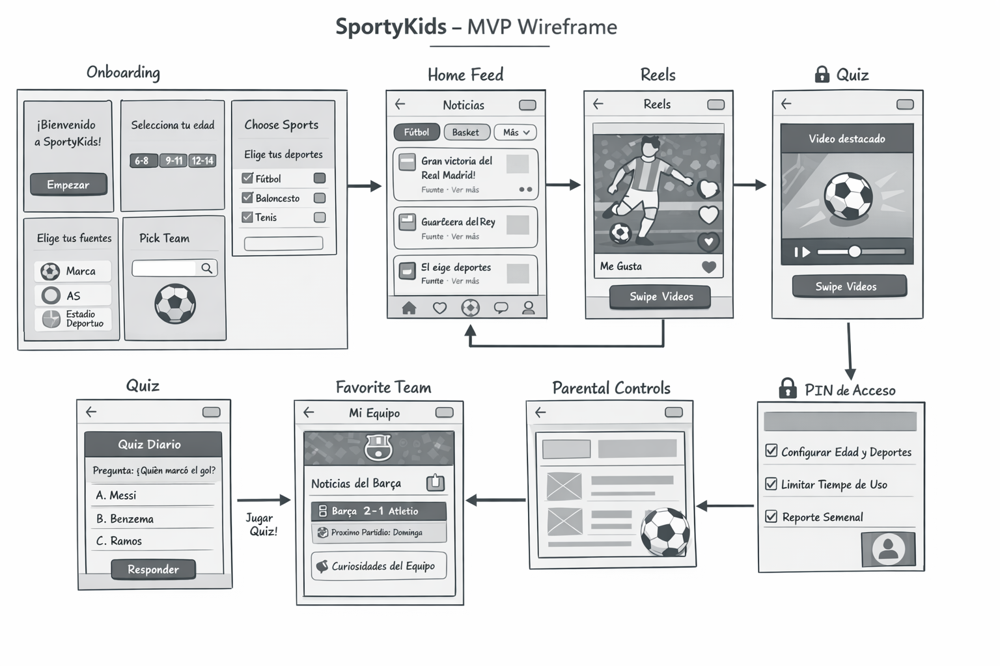

# SportyKids ⚽🏀🎾

Personalized sports news app for kids (6-14) with parental controls, short videos, and interactive quizzes.



## What is SportyKids?

SportyKids aggregates real sports news from trusted sources (AS, Mundo Deportivo, Marca), filters them by age and preferences, and presents them in a kid-friendly interface. Parents can control what content their children see and monitor their activity.

### Features

- **News Feed** — Real sports news from RSS feeds, filtered by sport, team, and age
- **Reels** — Short sports video feed with vertical scroll
- **Quiz** — Sports trivia with points system (15+ questions)
- **Favorite Team** — Dedicated section for your team's news
- **Onboarding** — 4-step wizard to personalize the experience
- **Parental Controls** — PIN-protected settings, format toggles, weekly activity summary
- **i18n** — Spanish and English support

## Tech Stack

| Layer | Technology |
|-------|-----------|
| Monorepo | npm workspaces |
| API | Express 5 + TypeScript + Prisma 6 + SQLite |
| Webapp | Next.js 16 + Tailwind CSS 4 |
| Mobile | React Native + Expo |
| Shared | TypeScript types, constants, utils, i18n |
| Validation | Zod 4 |
| RSS | rss-parser + node-cron (every 30 min) |

## Quick Start

```bash
# Prerequisites: Node.js >= 20

# Install dependencies
npm install

# Set up the database
cd apps/api
cp .env.example .env  # or create with: DATABASE_URL="file:./dev.db"
npx prisma migrate dev
npx tsx prisma/seed.ts
cd ../..

# Start development (two terminals)
npm run dev:api    # API at http://localhost:3001
npm run dev:web    # Webapp at http://localhost:3000
```

## Project Structure

```
sportykids/
├── packages/shared/     # @sportykids/shared — types, constants, utils, i18n
├── apps/
│   ├── api/             # Express REST API + Prisma + RSS aggregator
│   ├── web/             # Next.js webapp (7 pages)
│   └── mobile/          # React Native + Expo app (6 screens, 5 tabs)
└── docs/
    ├── es/              # Documentation in Spanish (10 docs)
    └── en/              # Documentation in English (10 docs)
```

## API Endpoints

| Method | Route | Description |
|--------|-------|-------------|
| GET | `/api/news` | News feed with filters (sport, team, age, pagination) |
| GET | `/api/reels` | Short video feed |
| GET | `/api/quiz/questions` | Random quiz questions |
| POST | `/api/quiz/answer` | Submit answer, earn points |
| POST | `/api/users` | Create user (onboarding) |
| POST | `/api/parents/setup` | Set parental PIN |
| POST | `/api/parents/verify-pin` | Verify parental access |
| GET | `/api/parents/activity/:userId` | Weekly activity summary |

See [full API reference](docs/en/03-api-reference.md) for all endpoints.

## Documentation

Comprehensive documentation available in two languages:

- [English docs](docs/en/README.md) — Architecture, API reference, deployment guide, and more
- [Documentacion en espanol](docs/es/README.md) — Arquitectura, referencia API, guia de despliegue, y mas

## MVP Status

| Phase | Status | Focus |
|-------|--------|-------|
| 0 | Done | Features, wireframes, flows |
| 1 | Done | Home Feed + RSS aggregator |
| 2 | Done | Onboarding + Favorite Team |
| 3 | Done | Reels + Quiz |
| 4 | Done | Parental Controls + Activity Tracking |
| 5 | Next | Internal testing + closed beta (5-10 families) |

## License

Private — All rights reserved.
