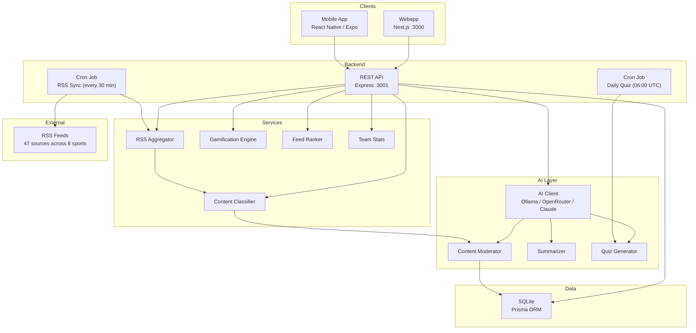
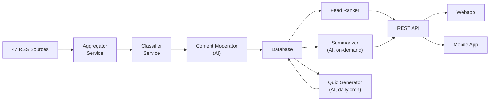

# System Architecture

## Overview

SportyKids is a TypeScript monorepo that groups a backend API, a webapp, and a mobile app, sharing types and utilities through a common package. Since Phase 5 (Differentiators), the platform includes AI-powered content moderation, age-adapted summaries, dynamic quiz generation, gamification, robust parental controls, and smart feed ranking.



## Monorepo Structure

```
sportykids/
├── packages/
│   └── shared/              # @sportykids/shared
│       └── src/
│           ├── types/       # Shared TypeScript interfaces
│           ├── constants/   # SPORTS, TEAMS, COLORS, AGE_RANGES
│           ├── utils/       # formatDate, sportToColor, truncateText
│           └── i18n/        # Internationalization (es.json, en.json, t())
├── apps/
│   ├── api/                 # @sportykids/api (Express + Prisma)
│   │   ├── prisma/          # Schema, migrations, and seed
│   │   └── src/
│   │       ├── routes/      # REST endpoints (news, users, parents, quiz, reels,
│   │       │                #   gamification, teams)
│   │       ├── services/    # Business logic (aggregator, classifier, ai-client,
│   │       │                #   content-moderator, summarizer, quiz-generator,
│   │       │                #   gamification, feed-ranker, team-stats)
│   │       ├── middleware/  # Auth, errors, parental-guard
│   │       ├── jobs/        # Cron jobs (sync-feeds, generate-daily-quiz)
│   │       └── config/      # DB connection
│   ├── web/                 # @sportykids/web (Next.js)
│   │   └── src/
│   │       ├── app/         # Pages: /, /onboarding, /reels, /quiz, /team,
│   │       │                #   /parents, /collection
│   │       ├── components/  # NewsCard, FiltersBar, ParentalPanel, ReelCard,
│   │       │                #   QuizGame, AgeAdaptedSummary, CollectionGrid,
│   │       │                #   StickerCard, AchievementCard
│   │       └── lib/         # API client, user-context
│   └── mobile/              # @sportykids/mobile (Expo)
│       └── src/
│           ├── screens/     # HomeFeed, Reels, Quiz, FavoriteTeam, Onboarding,
│           │                #   ParentalControl, Collection
│           ├── components/  # NewsCard, FiltersBar
│           ├── navigation/  # React Navigation (bottom tabs)
│           └── lib/         # API client (27 functions), user-context
└── docs/                    # Documentation (en/ and es/)
```

## Technology Stack

| Layer | Technology | Version |
|-------|-----------|---------|
| Runtime | Node.js | >= 20 |
| Language | TypeScript | 5.x |
| API | Express | 5.x |
| ORM | Prisma | 6.x |
| Database | SQLite | (dev) / PostgreSQL (prod) |
| Webapp | Next.js | 16.x |
| Styles | Tailwind CSS | 4.x |
| Mobile App | React Native + Expo | SDK 54 / RN 0.81 |
| Mobile Navigation | React Navigation | 7.x |
| Validation | Zod | 4.x |
| RSS | rss-parser | 3.x |
| Cron | node-cron | 4.x |
| AI (default) | Ollama | local, free |
| AI (cloud) | OpenRouter / Anthropic Claude | optional |

## Architectural Patterns

### Monorepo with npm workspaces
The three projects (API, web, mobile) share the `@sportykids/shared` package which contains types, constants, utilities, and i18n translations. This ensures type consistency between frontend and backend.

### Content Aggregation + AI Pipeline

The backend acts as an aggregator: it consumes external RSS feeds, parses, classifies, moderates via AI, and stores them. Clients never access external sources directly.



### Content Classification
The classifier labels each article with:
- **Sport**: inherited from the RSS source (values: `football`, `basketball`, `tennis`, `swimming`, `athletics`, `cycling`, `formula1`, `padel`)
- **Team**: keyword detection in title/summary (20+ teams/athletes)
- **Age range**: 6-14 years
- **Safety status**: AI-based moderation (`pending`, `approved`, `rejected`) with fail-open policy

### AI Infrastructure (Multi-Provider)
The AI client (`ai-client.ts`) abstracts LLM access behind a unified interface:
- **Ollama** (default): free, local inference, no API key needed
- **OpenRouter**: cloud-based, multi-model access
- **Anthropic Claude**: high-quality, cloud-based
- Health check endpoint to verify provider availability
- All AI features degrade gracefully if the provider is unavailable

### Feed Ranking
The feed ranker (`feed-ranker.ts`) scores and orders articles for personalized feeds:
- +5 points for matching favorite team
- +3 points for matching favorite sport
- Filters out unfollowed sources
- Three display modes: Headlines, Cards, Explain

### User State
- **Web**: `localStorage` to persist the user ID + `React Context` (`user-context`) for global state
- **Mobile**: `AsyncStorage` + `React Context` (`user-context`)
- **API**: the user is identified by ID in each request (no JWT in MVP)

### Parental Control (Robust)
- 4-digit PIN hashed with **bcrypt** (transparent migration from legacy SHA-256)
- **Session tokens** with 5-minute TTL for authenticated parental sessions
- Parental profile (`ParentalProfile`) separate from the user (`User`) -- 1:1 relationship
- **Parental guard middleware** enforces restrictions server-side on news, reels, and quiz routes (format, sport, and time-of-day enforcement)
- Activity log (`ActivityLog`) with duration tracking (`durationSeconds`, `contentId`, `sport`)
- Activity types: `news_viewed`, `reels_viewed`, `quizzes_played`

### Gamification
- **Stickers**: 36 collectible stickers across sports, awarded on activity milestones
- **Achievements**: 20 achievements (e.g., streaks, perfect quiz scores, exploration)
- **Points system**: +5 news, +3 reels, +10 quiz correct, +50 perfect quiz (5/5), +2 daily login
- **Daily check-in**: awards login streak points on app start

### Internationalization (i18n)
- Translation files in `packages/shared/src/i18n/` (`es.json`, `en.json`)
- `t(key, locale)` function for localized strings
- All code identifiers use English; user-facing text is translatable
