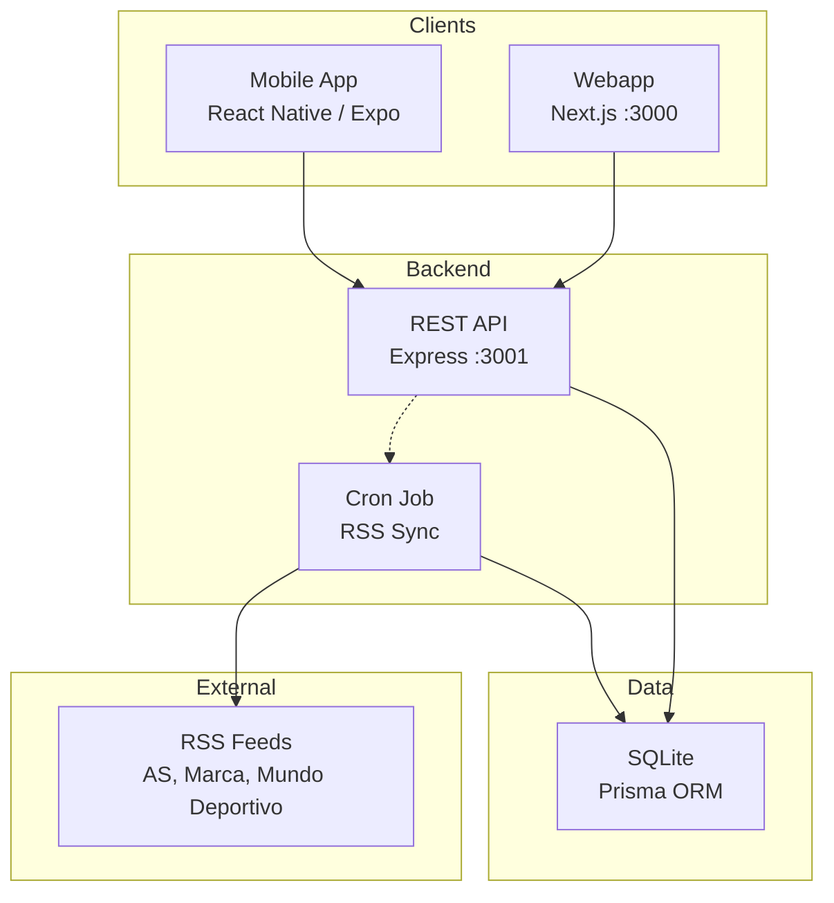
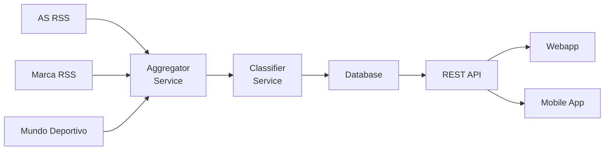

# System Architecture

## Overview

SportyKids is a TypeScript monorepo that groups a backend API, a webapp, and a mobile app, sharing types and utilities through a common package.



## Monorepo Structure

```
sportykids/
├── packages/
│   └── shared/              # @sportykids/shared
│       └── src/
│           ├── types/       # Shared TypeScript interfaces
│           ├── constants/   # SPORTS, TEAMS, COLORS, AGE_RANGES
│           ├── utils/       # formatDate, sportToColor, truncateText
│           └── i18n/        # Internationalization (es.json, en.json, t())
├── apps/
│   ├── api/                 # @sportykids/api (Express + Prisma)
│   │   ├── prisma/          # Schema, migrations, and seed
│   │   └── src/
│   │       ├── routes/      # REST endpoints (news.ts, users.ts, parents.ts)
│   │       ├── services/    # Business logic (aggregator.ts, classifier.ts)
│   │       ├── middleware/  # Auth, errors
│   │       ├── jobs/        # Sync cron jobs (sync-feeds.ts)
│   │       └── config/      # DB connection
│   ├── web/                 # @sportykids/web (Next.js)
│   │   └── src/
│   │       ├── app/         # Pages: /, /onboarding, /reels, /quiz, /team, /parents
│   │       ├── components/  # NewsCard, FiltersBar, ParentalPanel
│   │       └── lib/         # API client, user-context
│   └── mobile/              # @sportykids/mobile (Expo)
│       └── src/
│           ├── screens/     # FavoriteTeam, ParentalControl
│           ├── components/  # NewsCard, FiltersBar
│           ├── navigation/  # React Navigation
│           └── lib/         # API client, user-context
└── docs/                    # Documentation
```

## Technology Stack

| Layer | Technology | Version |
|-------|-----------|---------|
| Runtime | Node.js | >= 20 |
| Language | TypeScript | 5.x |
| API | Express | 5.x |
| ORM | Prisma | 6.x |
| Database | SQLite | (dev) / PostgreSQL (prod) |
| Webapp | Next.js | 16.x |
| Styles | Tailwind CSS | 4.x |
| Mobile App | React Native + Expo | Latest |
| Mobile Navigation | React Navigation | 7.x |
| Validation | Zod | 4.x |
| RSS | rss-parser | 3.x |
| Cron | node-cron | 4.x |

## Architectural Patterns

### Monorepo with npm workspaces
The three projects (API, web, mobile) share the `@sportykids/shared` package which contains types, constants, utilities, and i18n translations. This ensures type consistency between frontend and backend.

### Content Aggregation
The backend acts as an aggregator: it consumes external RSS feeds, parses, classifies, and stores them. Clients never access external sources directly.



### Content Classification
The classifier labels each article with:
- **Sport**: inherited from the RSS source (values: `football`, `basketball`, `tennis`, `swimming`, `athletics`, `cycling`)
- **Team**: keyword detection in title/summary
- **Age range**: 6-14 years (Phase 1, simple)

### User State
- **Web**: `localStorage` to persist the user ID + `React Context` (`user-context`) for global state
- **Mobile**: `AsyncStorage` + `React Context` (`user-context`)
- **API**: the user is identified by ID in each request (no JWT in MVP)

### Parental Control
- 4-digit PIN hashed with SHA-256
- Parental profile (`ParentalProfile`) separate from the user (`User`) — 1:1 relationship
- Restrictions applied on the frontend (hide blocked tabs)
- Activity log (`ActivityLog`) for weekly summary with types: `news_viewed`, `reels_viewed`, `quizzes_played`

### Internationalization (i18n)
- Translation files in `packages/shared/src/i18n/` (`es.json`, `en.json`)
- `t(key, locale)` function for localized strings
- All code identifiers use English; user-facing text is translatable
