# Data Model

## Entity-Relationship Diagram

```mermaid
erDiagram
    User ||--o| ParentalProfile : "has"
    User ||--o{ ActivityLog : "generates"
    User ||--o{ UserSticker : "collects"
    User ||--o{ UserAchievement : "earns"
    Sticker ||--o{ UserSticker : "awarded as"
    Achievement ||--o{ UserAchievement : "unlocked as"
    NewsItem ||--o{ NewsSummary : "has summaries"

    User {
        string id PK
        string name
        int age
        string favoriteSports "JSON array"
        string favoriteTeam "nullable"
        string selectedFeeds "JSON array"
        int totalPoints
        int loginStreak
        datetime lastLoginDate "nullable"
        string notificationPreferences "JSON, nullable"
        datetime createdAt
        datetime updatedAt
    }

    NewsItem {
        string id PK
        string title
        string summary
        string imageUrl
        string source
        string sourceUrl
        string sport
        string team "nullable"
        int minAge
        int maxAge
        datetime publishedAt
        datetime createdAt
        string rssGuid UK
        string safetyStatus "pending | approved | rejected"
    }

    NewsSummary {
        string id PK
        string newsItemId FK
        string ageRange "6-8 | 9-11 | 12-14"
        string locale "es | en"
        string summary
        datetime createdAt
    }

    Reel {
        string id PK
        string title
        string videoUrl
        string thumbnailUrl
        string source
        string sport
        string team "nullable"
        int minAge
        int maxAge
        int durationSeconds
        string videoType "youtube | native"
        string aspectRatio "9:16 | 16:9"
        string previewGifUrl "nullable"
        datetime createdAt
    }

    QuizQuestion {
        string id PK
        string question
        string options "JSON array"
        int correctAnswer
        string sport
        int points
        string relatedArticleId "nullable"
        boolean isDaily
        string ageRange "nullable"
        datetime generatedAt "nullable"
        datetime expiresAt "nullable"
    }

    Sticker {
        string id PK
        string name
        string description
        string imageUrl
        string sport
        string rarity "common | rare | epic | legendary"
        datetime createdAt
    }

    UserSticker {
        string id PK
        string userId FK
        string stickerId FK
        datetime awardedAt
    }

    Achievement {
        string id PK
        string name
        string description
        string iconUrl
        string category
        string condition "JSON"
        datetime createdAt
    }

    UserAchievement {
        string id PK
        string userId FK
        string achievementId FK
        datetime unlockedAt
    }

    TeamStats {
        string id PK
        string teamName UK
        string sport
        int wins
        int draws
        int losses
        int position "nullable"
        string topScorer "nullable"
        string nextMatch "nullable"
        datetime updatedAt
    }

    ParentalProfile {
        string id PK
        string userId UK "FK -> User"
        string pin "bcrypt hash"
        string allowedSports "JSON array"
        string allowedFeeds "JSON array"
        string allowedFormats "JSON array"
        int maxDailyTimeMinutes
    }

    ActivityLog {
        string id PK
        string userId "FK -> User"
        string type "news_viewed | reels_viewed | quizzes_played"
        int durationSeconds "nullable"
        string contentId "nullable"
        string sport "nullable"
        datetime date
    }

    RssSource {
        string id PK
        string name
        string url UK
        string sport
        boolean active
        boolean isCustom
        string addedBy "nullable"
        string metadata "JSON, nullable"
        datetime lastSync "nullable"
    }
```

## Model Descriptions

### User
Child's profile. The `favoriteSports` and `selectedFeeds` fields are stored as JSON strings in SQLite (Prisma does not support native arrays in SQLite).

**Phase 5 additions:**
- `loginStreak` / `lastLoginDate` -- track consecutive daily logins for gamification
- `totalPoints` -- accumulated from news views, reels, quiz answers, daily check-ins
- `notificationPreferences` -- JSON storing notification settings (MVP: stored but not sent)

### NewsItem
Article aggregated from an RSS feed. The `rssGuid` field is unique and is used to prevent duplicates during re-synchronization. The sport comes from the source; the team is detected by keywords.

**Phase 5 additions:**
- `safetyStatus` -- AI content moderation result: `pending` (not yet checked), `approved` (safe for kids), `rejected` (flagged as inappropriate). The moderator uses a fail-open policy: if AI is unavailable, content defaults to `approved`.

### NewsSummary
Age-adapted summary of a news article, generated on-demand by the AI summarizer. Each combination of `newsItemId` + `ageRange` + `locale` is unique.

- **Age profiles**: `6-8` (simple vocabulary, short sentences), `9-11` (moderate detail), `12-14` (fuller context)
- **Locales**: `es`, `en`
- Accessed via `GET /api/news/:id/resumen?age=&locale=`

### Reel
Short sports video. In the MVP, they are loaded from a seed with embedded YouTube URLs. The `videoUrl` field contains the embed URL.

**Phase 5 additions:**
- `videoType` -- `youtube` (embed) or `native` (future direct video)
- `aspectRatio` -- `9:16` (vertical/portrait) or `16:9` (landscape)
- `previewGifUrl` -- animated preview thumbnail (nullable)

### QuizQuestion
Sports trivia question with 4 options. `correctAnswer` is the index (0-3) of the correct option. `options` is a JSON array of strings.

**Phase 5 additions:**
- `isDaily` -- whether this is a daily quiz question (generated by the AI cron job)
- `ageRange` -- target age range for difficulty calibration (nullable for seed questions)
- `generatedAt` -- when the question was AI-generated (null for seed questions)
- `expiresAt` -- expiration date for daily questions (null for permanent seed questions)

Seed questions (15) serve as fallback when AI generation is unavailable.

### Sticker
Collectible digital sticker. 36 stickers across all sports with four rarity tiers.

- **Rarities**: `common`, `rare`, `epic`, `legendary`
- Awarded by the gamification service based on activity milestones

### UserSticker
Join table linking users to their collected stickers. Tracks when each sticker was awarded.

### Achievement
Unlockable achievement/badge. 20 achievements covering streaks, quiz performance, exploration, and collection milestones.

- `condition` -- JSON describing the unlock criteria (evaluated by the gamification service)
- `category` -- groups achievements (e.g., "streak", "quiz", "explorer", "collector")

### UserAchievement
Join table linking users to their unlocked achievements.

### TeamStats
Sports team statistics. 15 teams seeded with data.

- `wins`, `draws`, `losses` -- season record
- `position` -- league standing
- `topScorer` -- current top scorer name
- `nextMatch` -- upcoming match description
- Accessed via `GET /api/teams/:name/stats`

### ParentalProfile
Parental control settings, linked 1:1 with User.

**Phase 5 changes:**
- PIN is now stored as a **bcrypt hash** (transparent migration from legacy SHA-256 hashes on first successful verification)
- Session tokens with 5-minute TTL for authenticated parental access
- `allowedFormats` controls which sections of the app are visible and is now **enforced server-side** via parental guard middleware

### ActivityLog
Tracking event. Each time the child views an article, a reel, or plays a quiz, a log entry is created. Used for the weekly summary in the parental dashboard.

**Phase 5 additions:**
- `durationSeconds` -- how long the user spent on the content (tracked via `sendBeacon`)
- `contentId` -- the specific article/reel/quiz ID viewed
- `sport` -- the sport of the content viewed

Activity types:
- `news_viewed` -- child viewed an article
- `reels_viewed` -- child watched a reel
- `quizzes_played` -- child played a quiz

### RssSource
RSS feed that the aggregator consumes periodically. It can be enabled/disabled without deletion.

**Phase 5 additions:**
- `isCustom` -- whether this source was added by a user (vs. built-in)
- `addedBy` -- user ID who added the custom source (nullable)
- `metadata` -- JSON for additional source metadata
- 47 total sources across 8 sports (up from 4 in MVP)
- Custom sources can be added/removed via API (`POST/DELETE /api/news/fuentes/custom`)

## Notes on SQLite

- Array-type fields are stored as `String` with serialized JSON
- The API automatically parses/serializes in responses
- For production, migrate to PostgreSQL and use native Prisma arrays

## Sport Values

Sport identifiers are in English:

| Value | Description |
|-------|-------------|
| `football` | Football/Soccer |
| `basketball` | Basketball |
| `tennis` | Tennis |
| `swimming` | Swimming |
| `athletics` | Athletics/Track & field |
| `cycling` | Cycling |
| `formula1` | Formula 1 |
| `padel` | Padel |
