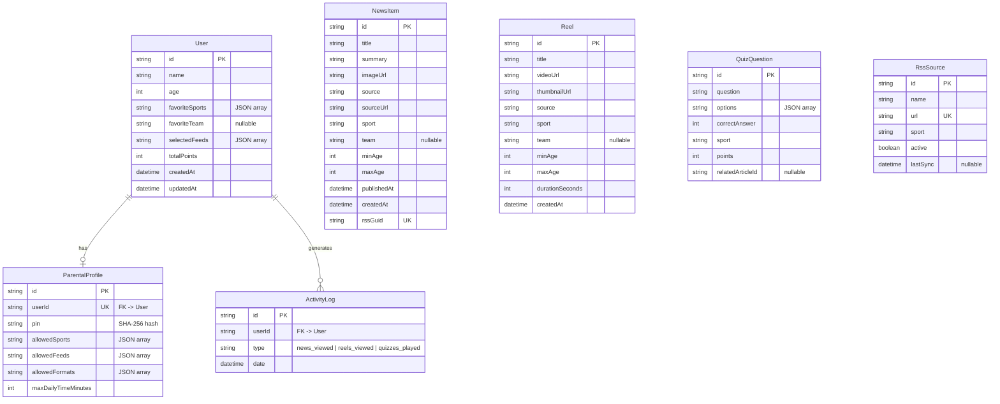

# Data Model

## Entity-Relationship Diagram

## Model Descriptions

### User
Child's profile. The `favoriteSports` and `selectedFeeds` fields are stored as JSON strings in SQLite (Prisma does not support native arrays in SQLite).

### NewsItem
Article aggregated from an RSS feed. The `rssGuid` field is unique and is used to prevent duplicates during re-synchronization. The sport comes from the source; the team is detected by keywords.

> **Prisma model name**: `NewsItem` (previously `Noticia` before the English refactor)

### Reel
Short sports video. In the MVP, they are loaded from a seed with embedded YouTube URLs. The `videoUrl` field contains the embed URL.

### QuizQuestion
Sports trivia question with 4 options. `correctAnswer` is the index (0-3) of the correct option. `options` is a JSON array of strings.

> **Prisma model name**: `QuizQuestion` (previously `PreguntaQuiz`)

### ParentalProfile
Parental control settings, linked 1:1 with User. The PIN is stored as a SHA-256 hash. `allowedFormats` controls which sections of the app are visible.

> **Prisma model name**: `ParentalProfile` (previously `PerfilParental`)

### ActivityLog
Tracking event. Each time the child views an article, a reel, or plays a quiz, a log entry is created. Used for the weekly summary in the parental dashboard.

Activity types:
- `news_viewed` — child viewed an article
- `reels_viewed` — child watched a reel
- `quizzes_played` — child played a quiz

> **Prisma model name**: `ActivityLog` (previously `RegistroActividad`)

### RssSource
RSS feed that the aggregator consumes periodically. It can be enabled/disabled without deletion.

> **Prisma model name**: `RssSource` (previously `FuenteRss`)

## Notes on SQLite

- Array-type fields are stored as `String` with serialized JSON
- The API automatically parses/serializes in responses
- For production, migrate to PostgreSQL and use native Prisma arrays

## Sport Values

Sport identifiers are now in English:

| Value | Description |
|-------|-------------|
| `football` | Football/Soccer |
| `basketball` | Basketball |
| `tennis` | Tennis |
| `swimming` | Swimming |
| `athletics` | Athletics/Track & field |
| `cycling` | Cycling |
