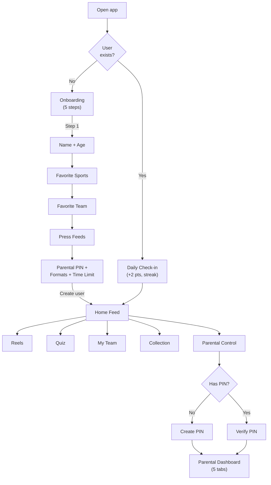
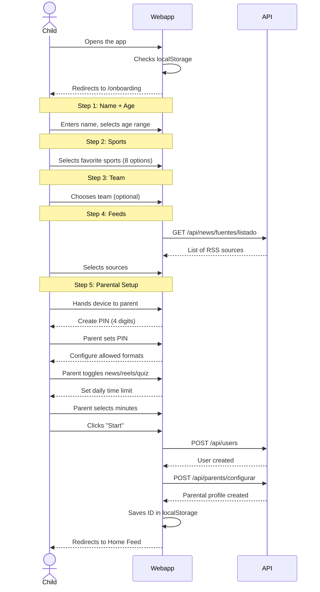
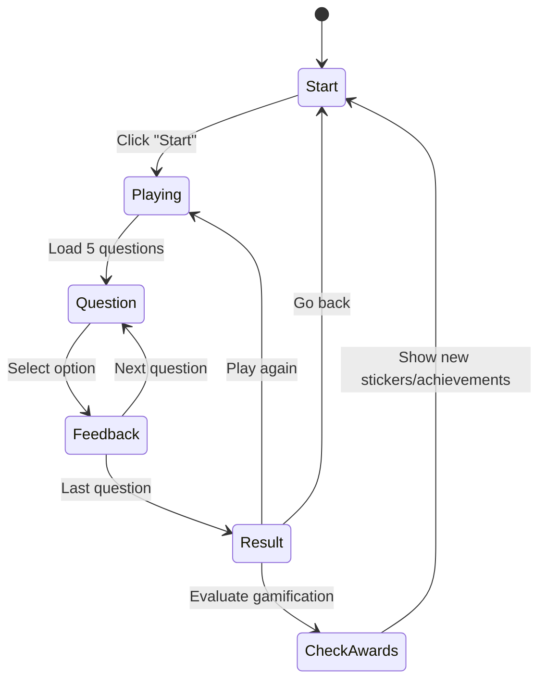
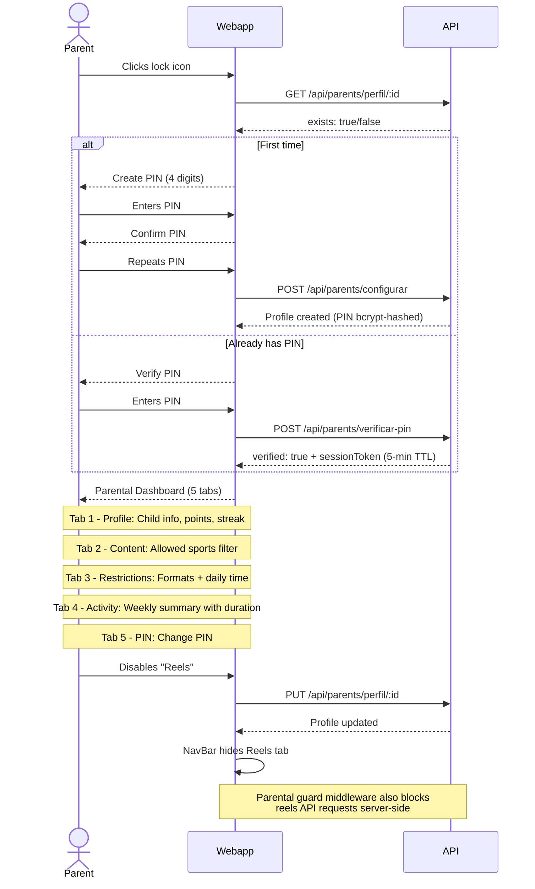
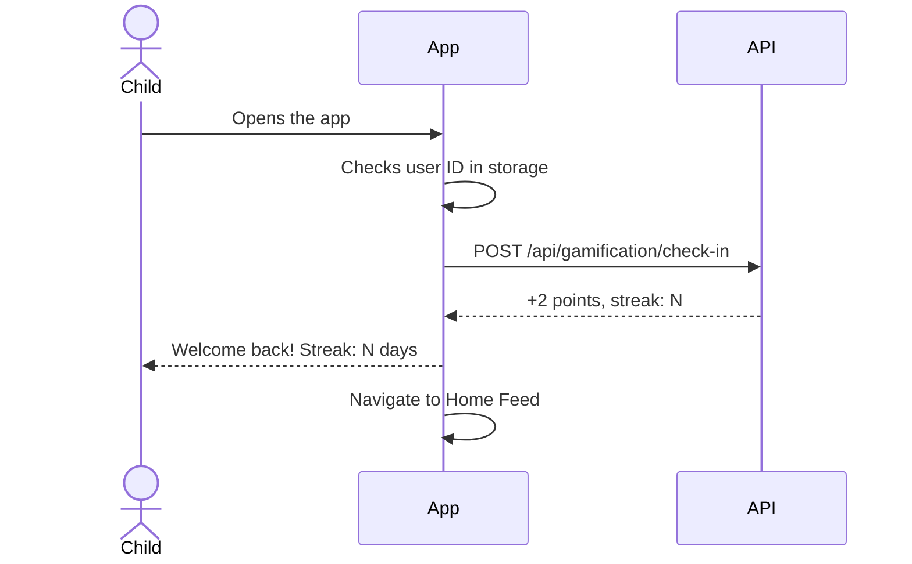

# User Flows

## General Navigation Diagram

## 1. Onboarding

The onboarding is a **5-step wizard** shown the first time the app is opened (expanded from 4 steps in the MVP to include parental setup).

## 2. Home Feed

The main feed displays real sports news filtered by preferences and ranked by the feed ranker.

- **Feed modes**: Headlines (compact list), Cards (image + summary), Explain (with "Explain it Easy" button)
- **Filters**: sport chips + age range selector
- **Cards**: image, headline, summary, source, date, sport/team badge
- **"Explain it Easy" button**: triggers age-adapted AI summary via `GET /api/news/:id/resumen`
- **Pagination**: "Load more" button at the bottom
- **Personalization**: automatically filters by the user's age, ranks by team/sport affinity
- **Activity tracking**: viewing a news item logs `news_viewed` with duration via `sendBeacon`

### Key components
- `NewsCard` -- displays a single article card with optional "Explain it Easy" button
- `AgeAdaptedSummary` -- displays the AI-generated summary for the user's age range
- `FiltersBar` -- sport chip filters and feed mode selector

### Feed Ranking
When a user is logged in, the feed ranker scores articles:
- +5 for articles about the user's favorite team
- +3 for articles about a favorite sport
- Unfollowed sources are filtered out

## 3. Reels

Grid layout with YouTube thumbnails, like/share actions.

- **Format**: grid of video thumbnails (tappable to expand)
- **Filters**: sport chips
- **Info**: title, sport, team, duration, source
- **Playback**: embedded YouTube iframe
- **Interactions**: like and share buttons
- **Activity tracking**: viewing a reel logs `reels_viewed` with duration

## 4. Quiz

Sports trivia game with a points system, now including AI-generated daily questions.

- **Start screen**: total score + daily quiz indicator + start button
- **Daily quiz**: AI-generated questions refreshed at 06:00 UTC, tied to recent news
- **Game**: 5 random questions (or 5 daily), 4 options each, age-appropriate difficulty
- **Feedback**: immediate (green = correct, red = incorrect)
- **Result**: points earned + accumulated total score
- **Gamification**: +10 per correct answer, +50 bonus for perfect 5/5 round
- **Fallback**: if AI is unavailable, seed questions (15 static) are used

## 5. My Team

Section dedicated to the user's favorite team, now with stats.

- **Team stats card**: wins/draws/losses, league position, top scorer, next match
- **Filtered feed**: articles mentioning the team (ranked by relevance)
- **Change team**: selector with a list of known teams (15 seeded)
- **No team**: shows a selector to choose one
- **Route**: `/team` (web), `FavoriteTeam` screen (mobile)

## 6. Collection

New section for viewing collected stickers and unlocked achievements.

- **Sticker grid**: 36 stickers across 8 sports, filterable by sport
- **Rarity tiers**: common, rare, epic, legendary (visual distinction)
- **Achievements**: 20 achievements shown as cards (locked/unlocked state)
- **Progress indicators**: sticker count, achievement count, completion percentage
- **Route**: `/collection` (web), `Collection` screen (mobile)

### Sticker awards
Stickers are awarded automatically by the gamification service based on activity milestones (e.g., viewing 10 football articles awards a football sticker).

### Achievement evaluation
Achievements unlock when conditions are met (e.g., 7-day login streak, first perfect quiz, viewing content in all 8 sports).

## 7. Parental Control

PIN-protected access for parents with robust server-side enforcement.

### Key components
- Web: `ParentalPanel` component at `/parents` (5-tab layout)
- Mobile: `ParentalControl` screen

### Parental dashboard includes:

| Tab | Section | Description |
|-----|---------|-------------|
| 1 | **Profile** | Child's name, age, points, login streak |
| 2 | **Content** | Allowed sports toggles (8 sports) |
| 3 | **Restrictions** | Allowed formats (news/reels/quiz toggles), maximum daily time (15-120 min) |
| 4 | **Activity** | Weekly summary: articles read, reels viewed, quizzes played, total duration in minutes, points earned |
| 5 | **PIN** | Change parental PIN |

### Server-side enforcement (Parental Guard)
The `parental-guard` middleware runs on news, reels, and quiz routes. It checks:
- **Format restrictions**: blocks access to disabled content types (e.g., if reels are disabled, `GET /api/reels` returns 403)
- **Sport restrictions**: filters out content from blocked sports
- **Time enforcement**: checks if the child has exceeded their daily time limit

## 8. Daily Check-in

Automatic flow on app start for returning users.

- Awards +2 points per daily login
- Increments `loginStreak` counter
- Resets streak if a day is skipped
- May trigger sticker/achievement awards
