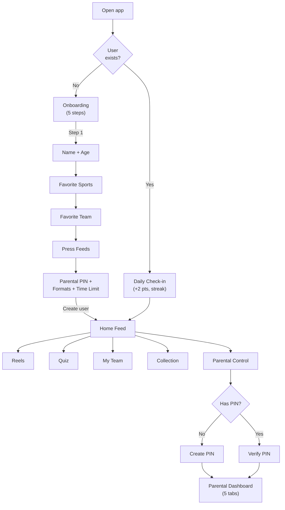
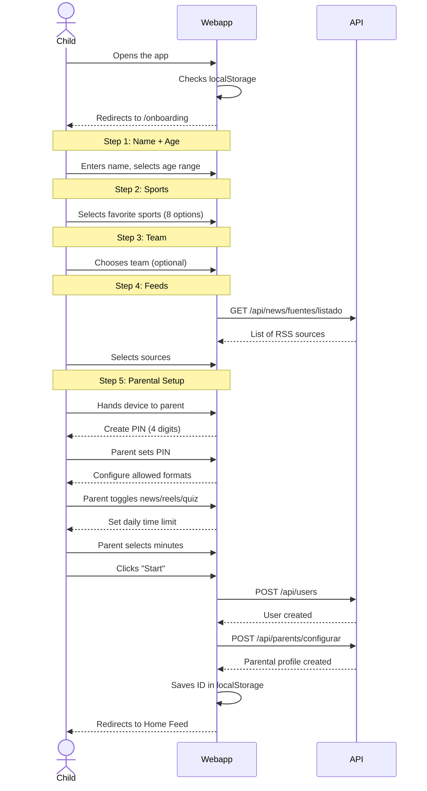
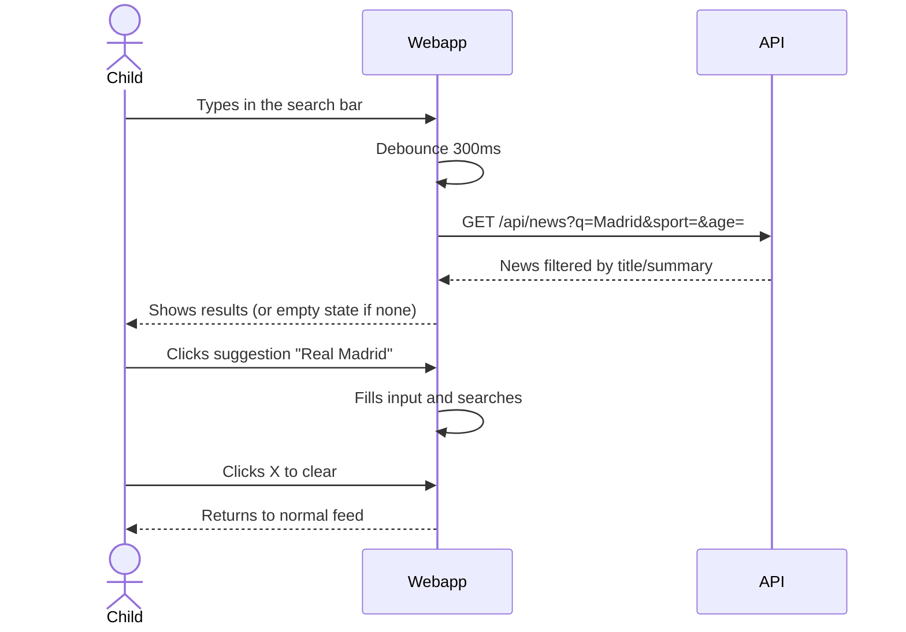
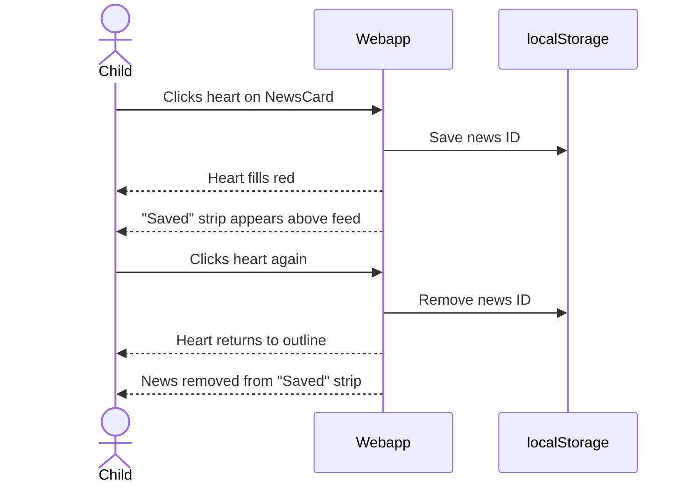
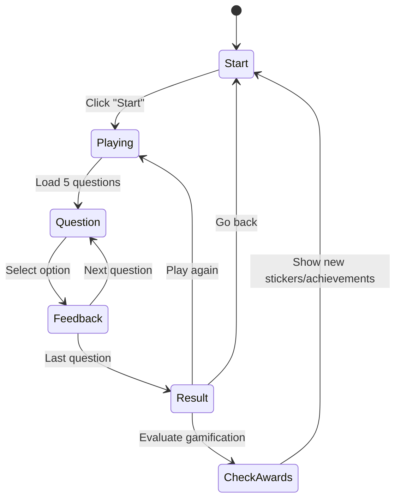
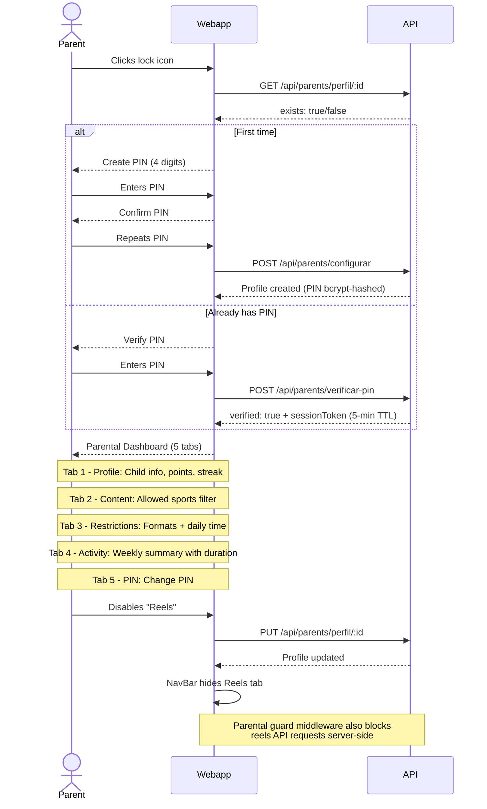
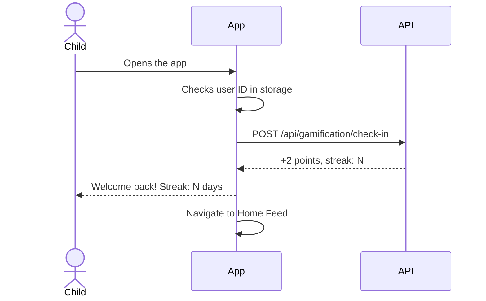
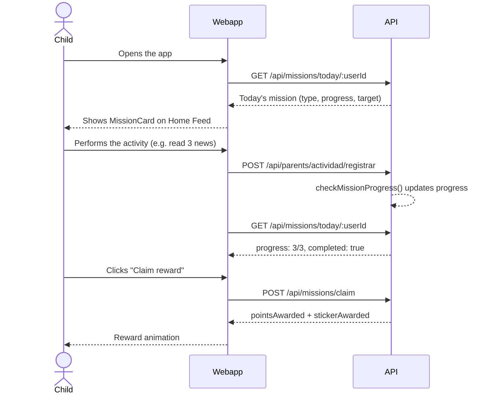
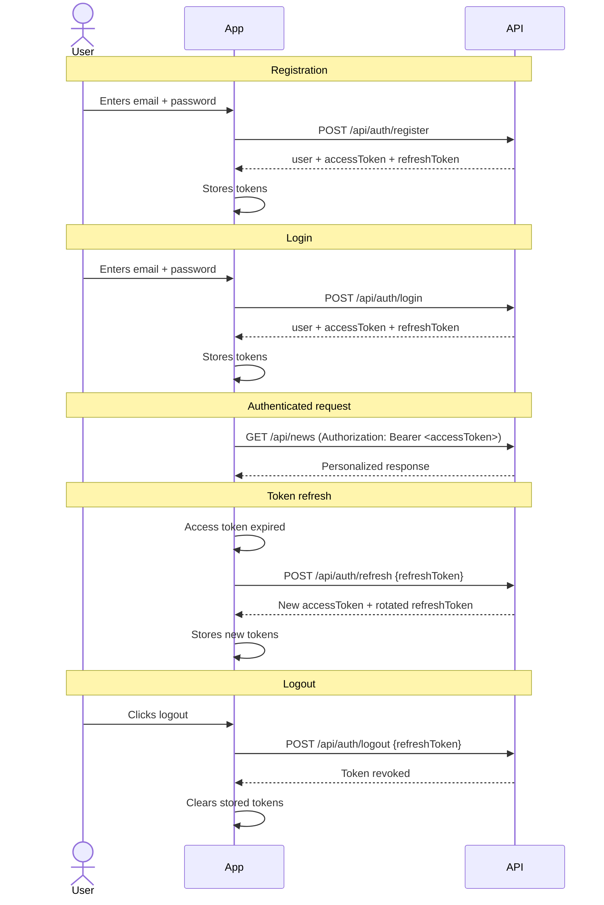
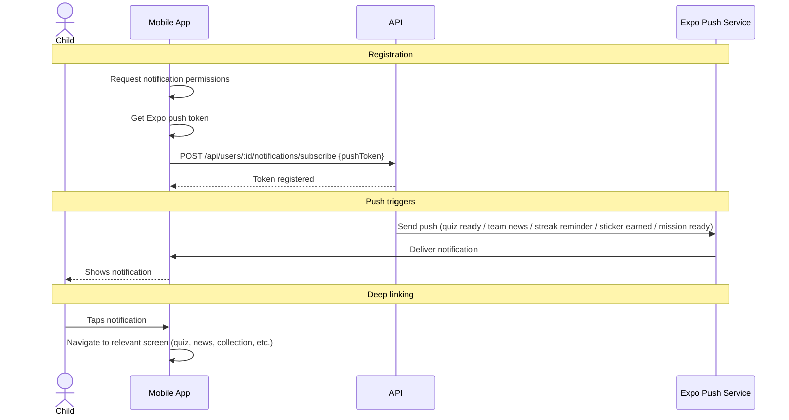

# User Flows

## General Navigation Diagram

## 1. Onboarding

The onboarding is a **5-step wizard** shown the first time the app is opened (expanded from 4 steps in the MVP to include parental setup).

## 2. Home Feed

The main feed displays real sports news filtered by preferences and ranked by the feed ranker.

- **Search**: debounced text search (300ms) across title and summary via `q` query parameter
- **Feed modes**: Headlines (compact list), Cards (image + summary), Explain (with "Explain it Easy" button). Feed mode toggle is hidden during search.
- **Filters**: sport chips + age range selector
- **Cards**: image, headline, summary, source, date, sport/team badge
- **"Explain it Easy" button**: triggers age-adapted AI summary via `GET /api/news/:id/resumen`
- **Pagination**: "Load more" button at the bottom
- **Personalization**: automatically filters by the user's age, ranks by team/sport affinity
- **Favorites**: heart button on each card to bookmark news. Favorites are persisted in localStorage (web) / AsyncStorage (mobile). Saved news appear in a "Saved" strip above the feed.
- **Trending**: news with more than 5 views in the last 24h display an orange "Trending" pill badge
- **Activity tracking**: viewing a news item logs `news_viewed` with duration via `sendBeacon`

### Key components
- `SearchBar` -- debounced search input with suggested searches (popular teams/leagues) and clear button
- `NewsCard` -- displays a single article card with optional "Explain it Easy" button
- `AgeAdaptedSummary` -- displays the AI-generated summary for the user's age range
- `FiltersBar` -- sport chip filters and feed mode selector

### Feed Ranking
When a user is logged in, the feed ranker scores articles:
- +5 for articles about the user's favorite team
- +3 for articles about a favorite sport
- Unfollowed sources are filtered out

### Search flow

- While typing, the feed mode selector is hidden
- Suggestions include popular teams and leagues
- If no results, an empty state with SVG illustration is shown

### Favorites flow

- Favorites persist across sessions (localStorage web, AsyncStorage mobile)
- No authentication required — client-side local storage

## 3. Reels

Grid layout with YouTube thumbnails, like/share actions.

- **Format**: grid of video thumbnails (tappable to expand)
- **Filters**: sport chips
- **Info**: title, sport, team, duration, source
- **Playback**: embedded YouTube iframe
- **Interactions**: like and share buttons
- **Activity tracking**: viewing a reel logs `reels_viewed` with duration

## 4. Quiz

Sports trivia game with a points system, now including AI-generated daily questions.

- **Start screen**: total score + daily quiz indicator + start button
- **Daily quiz**: AI-generated questions refreshed at 06:00 UTC, tied to recent news
- **Game**: 5 random questions (or 5 daily), 4 options each, age-appropriate difficulty
- **Feedback**: immediate (green = correct, red = incorrect)
- **Result**: points earned + accumulated total score
- **Gamification**: +10 per correct answer, +50 bonus for perfect 5/5 round
- **Fallback**: if AI is unavailable, seed questions (15 static) are used

## 5. My Team

Section dedicated to the user's favorite team, now with stats.

- **Team stats card**: wins/draws/losses, league position, top scorer, next match
- **Filtered feed**: articles mentioning the team (ranked by relevance)
- **Change team**: selector with a list of known teams (15 seeded)
- **No team**: shows a selector to choose one
- **Route**: `/team` (web), `FavoriteTeam` screen (mobile)

## 6. Collection

New section for viewing collected stickers and unlocked achievements.

- **Sticker grid**: 36 stickers across 8 sports, filterable by sport
- **Rarity tiers**: common, rare, epic, legendary (visual distinction)
- **Achievements**: 20 achievements shown as cards (locked/unlocked state)
- **Progress indicators**: sticker count, achievement count, completion percentage
- **Route**: `/collection` (web), `Collection` screen (mobile)

### Sticker awards
Stickers are awarded automatically by the gamification service based on activity milestones (e.g., viewing 10 football articles awards a football sticker).

### Achievement evaluation
Achievements unlock when conditions are met (e.g., 7-day login streak, first perfect quiz, viewing content in all 8 sports).

## 7. Parental Control

PIN-protected access for parents with robust server-side enforcement.

### Key components
- Web: `ParentalPanel` component at `/parents` (5-tab layout)
- Mobile: `ParentalControl` screen

### Parental dashboard includes:

| Tab | Section | Description |
|-----|---------|-------------|
| 1 | **Profile** | Child's name, age, points, login streak |
| 2 | **Content** | Allowed sports toggles (8 sports) |
| 3 | **Restrictions** | Allowed formats (news/reels/quiz toggles), maximum daily time (15-120 min) |
| 4 | **Activity** | Weekly summary: articles read, reels viewed, quizzes played, total duration in minutes, points earned |
| 5 | **PIN** | Change parental PIN |

### Server-side enforcement (Parental Guard)
The `parental-guard` middleware runs on news, reels, and quiz routes. It checks:
- **Format restrictions**: blocks access to disabled content types (e.g., if reels are disabled, `GET /api/reels` returns 403)
- **Sport restrictions**: filters out content from blocked sports
- **Time enforcement**: checks if the child has exceeded their daily time limit

### Content reporting

Children can flag any news article or reel as inappropriate directly from the content card:

1. The child taps the report button (flag icon) on a NewsCard or ReelCard
2. Selects a reason from the dropdown (inappropriate, not sports, other)
3. Optionally adds a comment
4. The report is sent to `POST /api/reports`
5. The parent sees pending reports in the Activity tab of the parental panel (`GET /api/reports/parent/:userId`)
6. The parent can mark the report as reviewed or take action

### Feed preview

Parents can see exactly what their child sees:

1. From the parental panel, the parent clicks "Preview child's feed"
2. A modal (`FeedPreviewModal`) opens showing news and reels with the child's filters applied
3. The preview includes active format, sport, and time limit restrictions
4. Data via `GET /api/parents/preview/:userId`

## 8. Daily Check-in

Automatic flow on app start for returning users.

- Awards +2 points per daily login
- Increments `loginStreak` counter
- Resets streak if a day is skipped
- May trigger sticker/achievement awards

## 9. Weekly Digest

Parents can enable an automatic weekly summary of their child's activity.

1. From the parental panel, "Digest" tab, the parent enables the weekly digest
2. Configures destination email and send day (Monday by default)
3. A cron job (08:00 UTC daily) checks which users are due for a digest
4. The digest includes: weekly activity, top sports, unlocked achievements, streak info
5. Can be previewed as JSON (`GET /api/parents/digest/:userId/preview`) or downloaded as PDF (`GET /api/parents/digest/:userId/download`)

## 10. Daily Mission

Each day the child receives a personalized mission that incentivizes app usage.

- **Generation**: daily cron at 05:00 UTC or on-demand when queried
- **Types**: `read_news`, `watch_reels`, `play_quiz`, `check_in`, `explore_sports`
- **Rewards**: points + possible sticker (rarity varies by difficulty)
- **3 states**: in-progress, completed (unclaimed), claimed

## 11. Authentication (JWT)

Users can optionally register with email and password to secure their account. Anonymous access remains supported for backward compatibility.

### Key details
- Access tokens have a 15-minute TTL
- Refresh tokens have a 7-day TTL and are rotated on each use
- Anonymous users can upgrade to authenticated accounts via `POST /api/auth/upgrade`
- Parents can link child accounts via `POST /api/auth/link-child`
- The auth middleware is non-blocking: requests without a token proceed as anonymous

## 12. Push Notifications

Push notifications keep children engaged and informed about new content.

### Push notification triggers

| Trigger | When | Content |
|---------|------|---------|
| Quiz ready | Daily quiz generated (06:00 UTC) | "New daily quiz is ready!" |
| Team news | New article about favorite team | "New news about {team}!" |
| Streak reminder | 20:00 UTC daily | "Don't lose your streak! Log in today." |
| Sticker earned | Sticker awarded via gamification | "You earned a new sticker!" |
| Mission ready | Daily mission generated (05:00 UTC) | "Your daily mission is ready!" |

- Push delivery uses `expo-server-sdk` for Expo push tokens
- A cron job at 20:00 UTC sends streak reminders to users who haven't checked in
- The `User.locale` field is used for per-user notification localization

## 13. Dark Mode

The user can toggle between light, dark, or system (automatic) theme.

1. The toggle is in the NavBar (web), cycling: system -> dark -> light
2. The preference is saved in `localStorage` (`sportykids-theme`)
3. An inline script in `<head>` applies the `.dark` class before render to prevent flash
4. If the theme is `system`, it listens for changes to `prefers-color-scheme`
5. All CSS variables adapt automatically (background, text, surface, border, muted)
