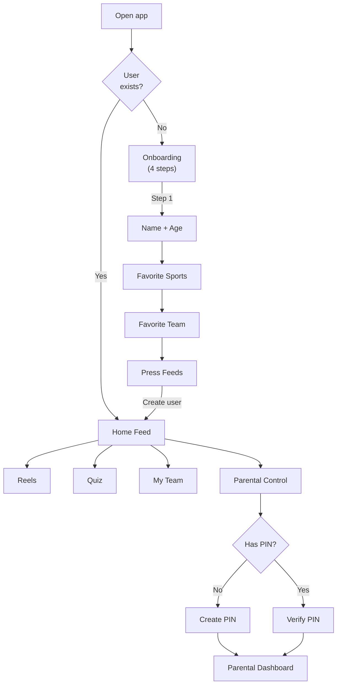
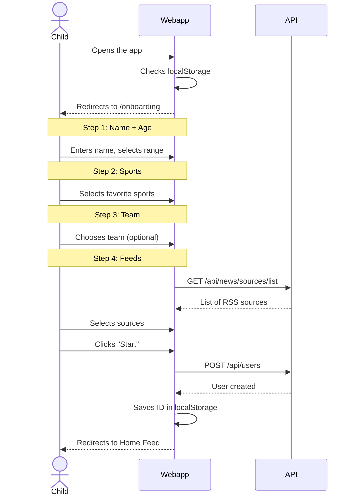
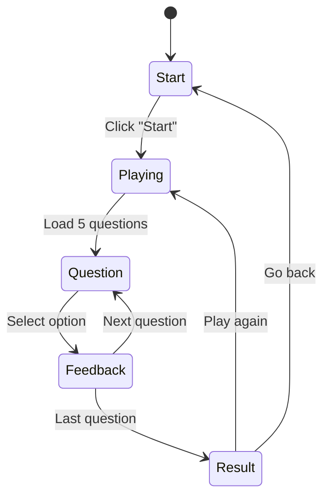
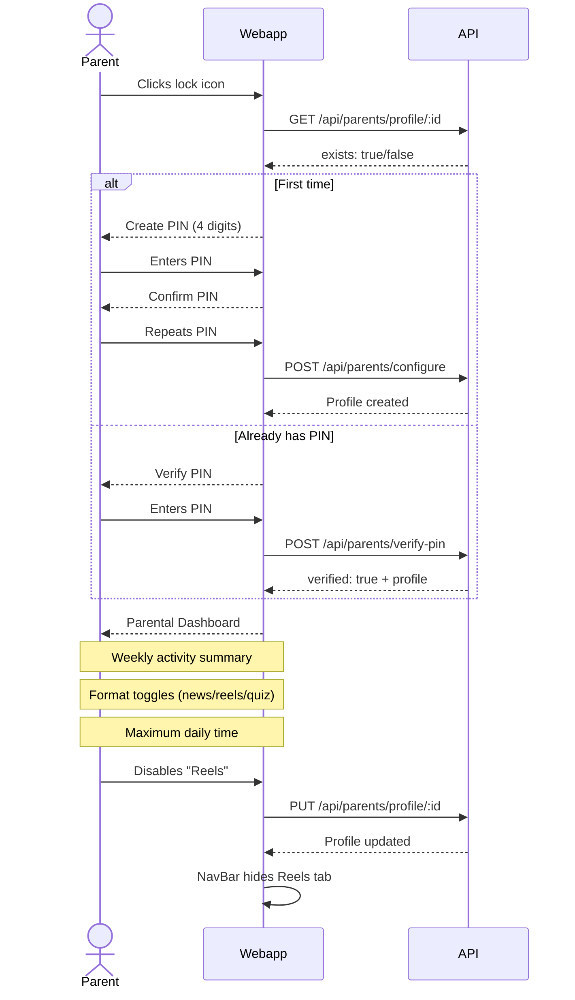

# User Flows

## General Navigation Diagram

## 1. Onboarding

The onboarding is a 4-step wizard shown the first time the app is opened.

## 2. Home Feed

The main feed displays real sports news filtered by preferences.

- **Filters**: sport chips + age range selector
- **Cards**: image, headline, summary, source, date, sport/team badge
- **Pagination**: "Load more" button at the bottom
- **Personalization**: automatically filters by the user's age

### Key components
- `NewsCard` — displays a single article card
- `FiltersBar` — sport chip filters and controls

## 3. Reels

Vertical short video feed with scroll snap.

- **Format**: one video per screen (TikTok/Instagram Reels style)
- **Filters**: sport chips
- **Info**: title, sport, team, duration, source
- **Playback**: embedded YouTube iframe

## 4. Quiz

Sports trivia game with a points system.

- **Start screen**: total score + start button
- **Game**: 5 random questions, 4 options each
- **Feedback**: immediate (green = correct, red = incorrect)
- **Result**: points earned + accumulated total score

## 5. My Team

Section dedicated to the user's favorite team.

- **Filtered feed**: articles mentioning the team
- **Change team**: selector with a list of known teams
- **No team**: shows a selector to choose one
- **Route**: `/team` (web), `FavoriteTeam` screen (mobile)

## 6. Parental Control

PIN-protected access for parents.

### Key components
- Web: `ParentalPanel` component at `/parents`
- Mobile: `ParentalControl` screen

### Parental dashboard includes:

| Section | Description |
|---------|-------------|
| **Weekly activity** | Counters: articles read (`news_viewed`), reels viewed (`reels_viewed`), quizzes played (`quizzes_played`), points |
| **Allowed formats** | Toggles to enable/disable news, reels, quiz |
| **Maximum time** | Minutes per day selector (15, 30, 45, 60, 90, 120) |
