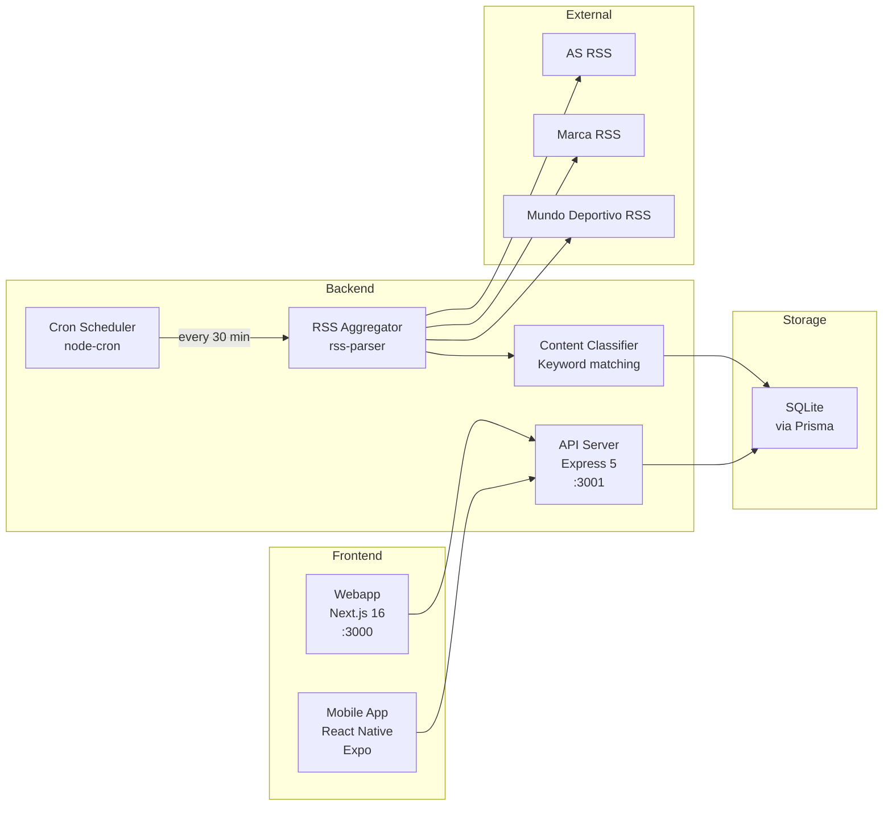

# Service Overview

## System services

## Service descriptions

### API Server (`apps/api/src/index.ts`)
Express server that exposes the REST API. Single entry point for all clients.

- **Port**: 3001 (configurable via `PORT`)
- **Middleware**: CORS, JSON parser, global error handler
- **Routes**: `/api/news`, `/api/reels`, `/api/quiz`, `/api/users`, `/api/parents`
- **Health check**: `GET /api/health`

### RSS Aggregator (`apps/api/src/services/aggregator.ts`)
Service that consumes external RSS feeds and converts them into database records.

- **Input**: RSS feed URLs from the `RssSource` table
- **Process**: parses XML, extracts fields, cleans HTML, extracts images
- **Output**: `NewsItem` records in the DB (upsert by `rssGuid` to avoid duplicates)
- **Resilience**: if a feed fails, continues with the next one

### Content Classifier (`apps/api/src/services/classifier.ts`)
Labels each news item with the detected team and age range.

- **Team detection**: keyword search in title + summary
- **20+ teams/athletes**: Real Madrid, Barcelona, Alcaraz, Nadal, Alonso...
- **Age range**: 6-14 years (simplified in MVP)

### Cron Scheduler (`apps/api/src/jobs/sync-feeds.ts`)
Scheduled job that runs feed synchronization.

- **Frequency**: every 30 minutes (`*/30 * * * *`)
- **First run**: on server startup
- **Manual trigger**: available via `POST /api/news/sync`

### Webapp (`apps/web`)
Next.js web application with App Router.

- **7 pages**: Home (`/`), Onboarding (`/onboarding`), Reels (`/reels`), Quiz (`/quiz`), Team (`/team`), Parents (`/parents`), 404
- **Styles**: Tailwind CSS with custom design tokens
- **State**: React Context with localStorage persistence
- **Fonts**: Poppins (headings), Inter (body)

### Mobile App (`apps/mobile`)
React Native application with Expo.

- **5 tabs**: News, Reels, Quiz, My Team, Parents
- **Navigation**: React Navigation (bottom tabs + stack)
- **State**: React Context with AsyncStorage

## Data flow

```mermaid
flowchart TB
    subgraph "Ingestion (every 30 min)"
        A["Cron trigger"] --> B["Get active sources"]
        B --> C["Download RSS"]
        C --> D["Parse items"]
        D --> E["Classify content"]
        E --> F["Upsert into DB"]
    end

    subgraph "Serving (per request)"
        G["Client request"] --> H["Validate params (Zod)"]
        H --> I["Prisma query with filters"]
        I --> J["Format response"]
        J --> K["Return JSON"]
    end

    subgraph "Parental control"
        L["Parent accesses"] --> M["Verify PIN"]
        M --> N["Load profile"]
        N --> O["Update restrictions"]
        O --> P["Frontend hides blocked tabs"]
    end
```

## Internationalization (i18n)

The shared package (`packages/shared/src/i18n/`) provides a translation system used across all services:

- **Locale files**: `es.json` (Spanish), `en.json` (English)
- **Translation function**: `t(key, locale)` returns the localized string
- **Usage**: UI labels, error messages, and user-facing content can be localized
- All code identifiers, model names, and API routes use English internally

## Key metrics

| Metric | Current value |
|--------|--------------|
| Active RSS sources | 4 (AS Football, AS Basketball, Mundo Deportivo, Marca) |
| News per sync | ~160 |
| Reels in seed | 10 |
| Quiz questions | 15 |
| Sync frequency | 30 min |
| API startup time | < 2s |
| Webapp build time | < 5s |

## Environment variables

| Variable | Service | Description | Default |
|----------|---------|-------------|---------|
| `DATABASE_URL` | API | SQLite/PostgreSQL connection URL | `file:./dev.db` |
| `PORT` | API | Server port | `3001` |
| `NODE_ENV` | API | Runtime environment | `development` |
| `NEXT_PUBLIC_API_URL` | Web | API base URL | `http://localhost:3001/api` |
