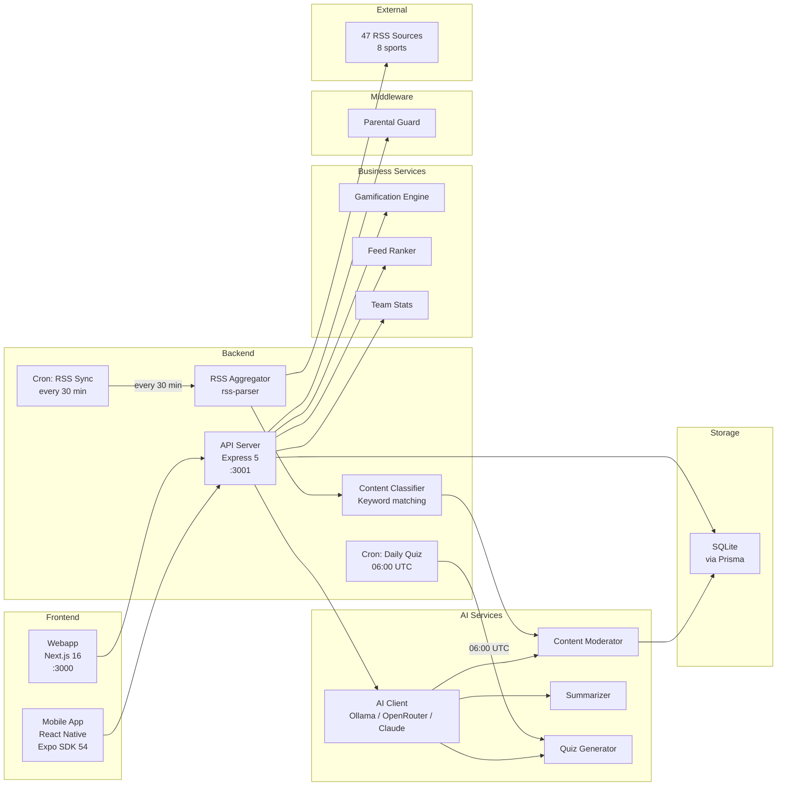

# Service Overview

## System services

## Service descriptions

### API Server (`apps/api/src/index.ts`)
Express server that exposes the REST API. Single entry point for all clients.

- **Port**: 3001 (configurable via `PORT`)
- **Middleware**: CORS, JSON parser, rate limiting (`express-rate-limit`, 5 tiers), typed error handler (`AppError` classes with Prisma/Zod mapping, Sentry 5xx only), parental guard
- **Routes**: `/api/news`, `/api/reels`, `/api/quiz`, `/api/users`, `/api/parents`, `/api/gamification`, `/api/teams`
- **Health check**: `GET /api/health` (includes AI provider status)

### AI Client (`apps/api/src/services/ai-client.ts`)
Multi-provider abstraction for LLM access. All AI-dependent services use this client.

- **Providers**:
  - **Ollama** (default): free, local inference, no API key needed
  - **OpenRouter**: cloud multi-model access, requires `OPENROUTER_API_KEY`
  - **Anthropic Claude**: high-quality cloud LLM, requires `ANTHROPIC_API_KEY`
- **Configuration**: set via `AI_PROVIDER` environment variable
- **Health check**: verifies provider availability at startup and via `/api/health`
- **Graceful degradation**: all consumers handle AI unavailability with fallback behavior

### OAuth / Social Login (`apps/api/src/services/passport.ts`)
Passport.js integration for social authentication (Google and Apple).

- **Strategies**: Google OAuth 2.0 via `passport-google-oauth20`. Apple Sign In planned.
- **Configuration**: activated only when `GOOGLE_CLIENT_ID` and `GOOGLE_CLIENT_SECRET` environment variables are set. Without them, the strategy is not registered and the OAuth endpoints return 501.
- **Flow**: Google redirects to `/api/auth/google/callback` with a profile. The strategy extracts `profile.id` (socialId) and email, then calls `findOrCreateSocialUser('google', socialId, email, name)`.
- **`findOrCreateSocialUser`** (in `auth-service.ts`): looks up an existing user by `authProvider` + `socialId` composite index. If not found, creates a new user with `authProvider='google'` and the provider's `socialId`. Returns JWT access + refresh tokens.
- **Stateless**: Passport serialization is a no-op because the app uses JWT tokens, not server sessions.
- **Account linking**: existing anonymous users can upgrade to a social account via `/api/auth/upgrade`.

### Content Moderator (`apps/api/src/services/content-moderator.ts`)
AI-powered content safety classifier for child-appropriate content.

- **Input**: news article title + summary
- **Output**: safety classification (`approved` or `rejected`) stored as `safetyStatus` on `NewsItem`
- **Fail-open policy**: if AI is unavailable, content defaults to `approved` (better to show content than block everything)
- **Integration**: called by the aggregator after classification, before DB insert

### Summarizer (`apps/api/src/services/summarizer.ts`)
Generates age-adapted summaries of news articles on demand.

- **Age profiles**:
  - `6-8`: simple vocabulary, short sentences, fun tone
  - `9-11`: moderate detail, clear explanations
  - `12-14`: fuller context, closer to original
- **Locales**: `es` (Spanish), `en` (English)
- **Caching**: summaries are stored as `NewsSummary` records (unique per newsItemId + ageRange + locale)
- **Endpoint**: `GET /api/news/:id/resumen?age=&locale=`

### Quiz Generator (`apps/api/src/services/quiz-generator.ts`)
AI-powered quiz question generation from recent news articles.

- **Daily cron**: runs at 06:00 UTC, generates questions with round-robin across sports
- **Manual trigger**: `POST /api/quiz/generate`
- **Output**: `QuizQuestion` records with `isDaily=true`, `generatedAt`, `expiresAt`
- **Age calibration**: difficulty adapts to target `ageRange`
- **Fallback**: 15 seed questions always available if AI generation fails

### RSS Aggregator (`apps/api/src/services/aggregator.ts`)
Service that consumes external RSS feeds and converts them into database records.

- **Input**: RSS feed URLs from the `RssSource` table (47 sources across 8 sports)
- **Process**: parses XML, extracts fields, cleans HTML, extracts images
- **Output**: `NewsItem` records in the DB (upsert by `rssGuid` to avoid duplicates)
- **Pipeline**: parse -> classify -> moderate -> insert
- **Resilience**: if a feed fails, continues with the next one
- **Custom sources**: users can add their own RSS sources via API

### Video Aggregator (`apps/api/src/services/video-aggregator.ts`)
Service that consumes YouTube Atom feeds and converts them into Reel records.

- **Input**: YouTube Atom feed URLs from the `VideoSource` table (40+ sources, 8 sports)
- **Process**: parses Atom XML, extracts videoId from `yt:video:...`, generates embed/thumbnail URLs
- **Output**: `Reel` records in the DB (upsert by `rssGuid` for dedup)
- **Pipeline**: prune old reels -> parse -> classify -> moderate -> insert
- **Helpers**: `buildFeedUrl`, `extractYouTubeVideoId`, `buildEmbedUrl`, `buildThumbnailUrl`
- **YouTube only**: filters sources with `platform` starting with `youtube_`
- **Resilience**: if a feed fails, continues; moderation fail-open
- **Auto-cleanup**: `pruneOldReels()` deletes reels with `publishedAt` older than 14 days before each sync to keep the pool fresh

### Cron: Sync Videos (`apps/api/src/jobs/sync-videos.ts`)
Scheduled job that syncs video sources.

- **Frequency**: every 6 hours (`0 */6 * * *`)
- **Also runs**: on server startup
- **Function**: `syncAllVideoSources()` -> prunes reels >14 days + consumes YouTube Atom feeds from active sources

### Content Classifier (`apps/api/src/services/classifier.ts`)
Labels each news item with the detected team and age range.

- **Team detection**: keyword search in title + summary
- **20+ teams/athletes**: Real Madrid, Barcelona, Alcaraz, Nadal, Alonso...
- **Age range**: 6-14 years

### Gamification Engine (`apps/api/src/services/gamification.ts`)
Manages points, stickers, achievements, and login streaks.

- **Points system**:
  - +5 for viewing a news article
  - +3 for watching a reel
  - +10 for a correct quiz answer
  - +50 bonus for a perfect quiz round (5/5)
  - +2 for daily login check-in
- **Stickers**: 36 collectible stickers across all sports, awarded on activity milestones
- **Achievements**: 20 unlockable achievements evaluated on activity events
- **Streaks**: tracks consecutive daily logins, resets on missed days
- **6 endpoints** under `/api/gamification/`

### Feed Ranker (`apps/api/src/services/feed-ranker.ts`)
Scores and orders articles for personalized feeds.

- **Base scoring**:
  - +5 for articles about the user's favorite team
  - +3 for articles about a favorite sport
  - Unfollowed sports are filtered out
- **Behavioral scoring** (when user has activity history):
  - `sportFrequencyBoost` — proportional to engagement share (0-5 scale)
  - `sourceBoost` — based on source affinity from viewed articles (0-2 scale)
  - `recencyDecay` — exponential decay curve with 12h half-life (0-3 scale)
  - `-8` penalty for already-read articles (unweighted)
  - `+2` locale/language match, `+1` country match
- **Diversity injection**: every 5th position swaps dominant sport (>40% engagement) with a non-dominant sport item to prevent filter bubbles
- **Configurable weights**: `RANKING_WEIGHTS` constant controls relative importance of each signal (all default to 1.0)
- **Cache invalidation**: `invalidateBehavioralCache(userId)` evicts stale behavioral signals on new activity (5-min TTL as fallback)
- **Feed modes**: Headlines (title only), Cards (image + summary), Explain (with AI summary button)
- **Integration**: called by the news list endpoint when `userId` is provided

### Team Stats (`apps/api/src/services/team-stats.ts`)
Manages team statistics data.

- **15 teams seeded** with current season data
- **Fields**: wins, draws, losses, position, top scorer, next match
- **Endpoint**: `GET /api/teams/:name/stats`

### Cron Scheduler: RSS Sync (`apps/api/src/jobs/sync-feeds.ts`)
Scheduled job that runs feed synchronization.

- **Frequency**: every 30 minutes (`*/30 * * * *`)
- **First run**: on server startup
- **Manual trigger**: available via `POST /api/news/sincronizar`

### Cron Scheduler: Daily Quiz (`apps/api/src/jobs/generate-daily-quiz.ts`)
Scheduled job that generates AI quiz questions from recent news.

- **Frequency**: daily at 06:00 UTC (`0 6 * * *`)
- **Strategy**: round-robin across sports to ensure variety
- **Fallback**: if AI is unavailable, no daily questions are generated; seed questions remain available

### Cron Scheduler: Mission Reminder (`apps/api/src/jobs/mission-reminder.ts`)
Sends push notifications to users who are close to completing their daily mission.

- **Frequency**: daily at 18:00 UTC (`0 18 * * *`)
- **Criteria**: missions with >50% progress and not yet completed
- **Notification**: "Almost there!" encouragement via push

### Parental Guard Middleware (`apps/api/src/middleware/parental-guard.ts`)
Server-side enforcement of parental restrictions.

- **Applied to**: news, reels, and quiz routes
- **Checks**:
  - Format restrictions (blocks disabled content types)
  - Sport restrictions (filters blocked sports)
  - Time enforcement (checks daily time limit)
- **Behavior**: returns 403 if access is denied; filters results if partially restricted

### Webapp (`apps/web`)
Next.js web application with App Router.

- **8 pages**: Home (`/`), Onboarding (`/onboarding`), Reels (`/reels`), Quiz (`/quiz`), Team (`/team`), Collection (`/collection`), Parents (`/parents`), 404
- **Styles**: Tailwind CSS with custom design tokens
- **State**: React Context with localStorage persistence
- **Fonts**: Poppins (headings), Inter (body)
- **New components**: AgeAdaptedSummary, CollectionGrid, StickerCard, AchievementCard, feed mode selector

### Mobile App (`apps/mobile`)
React Native application with Expo SDK 54.

- **6 tabs**: News, Reels, Quiz, My Team, Collection, Parents
- **Navigation**: React Navigation (bottom tabs + stack)
- **State**: React Context with AsyncStorage
- **API client**: 27 functions covering all endpoints
- **Daily check-in**: automatic on app start
- **Full parity**: all Phase 5 features implemented (collection, 5-step onboarding, etc.)

## Video Player Strategy

The mobile and web apps play reel videos using a tiered strategy based on the video source type. This section documents the current distribution, player strategies, and performance considerations.

### Video type distribution (seed data)

| Type | Count | Percentage | Source |
|------|-------|-----------|--------|
| `youtube_embed` | 10 | ~63% | YouTube RSS aggregation (primary) |
| `mp4` | 6 | ~37% | Pexels direct video links |

Video sources imported via the Video Aggregator (YouTube RSS) produce `youtube_embed` type exclusively. The MP4 seed entries come from Pexels and serve as demonstration/fallback content.

### Player strategies by platform

**Mobile (React Native)**

| Video type | Player | Strategy |
|------------|--------|----------|
| `mp4` | `expo-video` (native) | Direct native playback via `VideoView`. Best performance: hardware-accelerated, supports fullscreen and PiP. Falls back to WebView `<video>` tag if expo-video is unavailable. |
| `youtube_embed` | WebView + YouTube IFrame API | Loads the YouTube IFrame Player API inside a WebView. Uses `onError` callback to detect embed restrictions (error codes 101/150). On failure, shows a fallback "Open in YouTube" button. 8-second timeout for API load. |
| `instagram_embed` | WebView iframe | Generic iframe embed. Limited availability due to platform restrictions. |
| `tiktok_embed` | WebView iframe | Generic iframe embed. Limited availability due to platform restrictions. |

**Web (Next.js)**

| Video type | Player | Strategy |
|------------|--------|----------|
| `mp4` | HTML5 `<video>` | Native browser video element with controls. |
| `youtube_embed` | `<iframe>` | Standard YouTube iframe embed with `modestbranding` and `rel=0`. |

### Performance notes

- **expo-video** (MP4): Best performance path. Uses native hardware decoding, supports background audio, PiP, and fullscreen. Only available for direct MP4 URLs.
- **WebView YouTube**: Incurs overhead from loading the YouTube IFrame API JavaScript. First load takes 2-4 seconds. Some YouTube videos have embed restrictions (error 153 in UI, codes 101/150 in API) that prevent inline playback; the fallback opens the native YouTube app.
- **Memory**: `removeClippedSubviews={true}`, `maxToRenderPerBatch={3}`, and `windowSize={5}` on the Reels FlatList limit concurrent WebView instances to prevent memory pressure.
- **Aspect ratio**: All current content uses 16:9. The player dynamically calculates height from `aspectRatio` field (supports `9:16` for vertical video if added in the future).

### Recommendations for future improvement

1. **Prefer MP4 sources**: MP4 via expo-video offers the best user experience. Prioritize adding MP4 video sources over YouTube channels.
2. **YouTube Data API**: Consider using the YouTube Data API to pre-check embed availability and filter out restricted videos during sync rather than at playback time.
3. **Video caching**: For frequently-watched MP4 content, consider a CDN cache layer or on-device caching for offline playback.

## Data flow

```mermaid
flowchart TB
    subgraph "Ingestion (every 30 min)"
        A["Cron trigger"] --> B["Get active sources (47)"]
        B --> C["Download RSS"]
        C --> D["Parse items"]
        D --> E["Classify content"]
        E --> F["AI content moderation"]
        F --> G["Upsert into DB"]
    end

    subgraph "Daily Quiz (06:00 UTC)"
        H["Cron trigger"] --> I["Select recent news"]
        I --> J["AI generates questions"]
        J --> K["Store as daily quiz"]
    end

    subgraph "Serving (per request)"
        L["Client request"] --> M["Parental guard check"]
        M --> N["Validate params (Zod)"]
        N --> O["Feed ranker (if user)"]
        O --> P["Prisma query with filters"]
        P --> Q["Format response"]
        Q --> R["Return JSON"]
    end

    subgraph "On-demand AI"
        S["Summary request"] --> T["Check cache"]
        T -->|miss| U["AI summarizer"]
        U --> V["Store NewsSummary"]
        V --> W["Return summary"]
        T -->|hit| W
    end

    subgraph "Gamification"
        X["User action"] --> Y["Award points"]
        Y --> Z["Evaluate stickers"]
        Z --> AA["Evaluate achievements"]
        AA --> AB["Return awards"]
    end

    subgraph "Parental control"
        AC["Parent accesses"] --> AD["Verify PIN (bcrypt)"]
        AD --> AE["Issue session token (5 min)"]
        AE --> AF["Load profile"]
        AF --> AG["Update restrictions"]
        AG --> AH["Guard enforces server-side"]
    end
```

## Internationalization (i18n)

The shared package (`packages/shared/src/i18n/`) provides a translation system used across all services:

- **Locale files**: `es.json` (Spanish), `en.json` (English)
- **Translation function**: `t(key, locale)` returns the localized string
- **Usage**: UI labels, error messages, and user-facing content can be localized
- All code identifiers, model names, and API routes use English internally

## Key metrics

| Metric | Current value |
|--------|--------------|
| Active RSS sources | 182 (across 8 sports, global coverage) |
| News per sync | ~500+ |
| Reels in seed | 10 |
| Quiz questions (seed) | 15 |
| Quiz questions (daily, AI) | ~5-10/day |
| Stickers | 36 |
| Achievements | 20 |
| Teams with stats | 15 |
| Sync frequency | 30 min |
| Daily quiz generation | 06:00 UTC |
| API startup time | < 2s |
| Webapp build time | < 5s |
| Mobile API functions | 27 |

## Environment variables

| Variable | Service | Description | Default |
|----------|---------|-------------|---------|
| `DATABASE_URL` | API | SQLite/PostgreSQL connection URL | `file:./dev.db` |
| `PORT` | API | Server port | `3001` |
| `NODE_ENV` | API | Runtime environment | `development` |
| `AI_PROVIDER` | API | AI provider: `ollama`, `openrouter`, `anthropic` | `ollama` |
| `OPENROUTER_API_KEY` | API | OpenRouter API key | -- |
| `ANTHROPIC_API_KEY` | API | Anthropic Claude API key | -- |
| `RATE_LIMIT_AUTH` | API | Auth endpoint rate limit (req/min) | `5` |
| `RATE_LIMIT_PIN` | API | PIN verification rate limit (req/min) | `10` |
| `RATE_LIMIT_CONTENT` | API | Content endpoint rate limit (req/min) | `60` |
| `RATE_LIMIT_SYNC` | API | Sync endpoint rate limit (req/min) | `2` |
| `RATE_LIMIT_DEFAULT` | API | Default rate limit (req/min) | `100` |
| `CACHE_PROVIDER` | API | Cache backend: `memory` or `redis` | `memory` |
| `REDIS_URL` | API | Redis connection URL | `redis://localhost:6379` |
| `NEXT_PUBLIC_API_URL` | Web | API base URL | `http://localhost:3001/api` |
