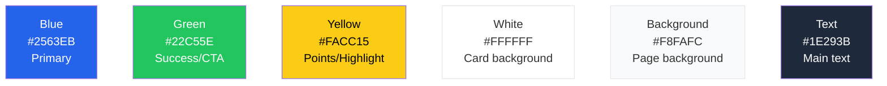

# Design and UX

## Visual identity

SportyKids has a child-friendly yet trustworthy design, created so that children enjoy it and parents trust it.

## Color palette



| Color | Hex | CSS Variable | Usage |
|-------|-----|-------------|-------|
| Blue | `#2563EB` | `--color-blue` | Primary, active links, main buttons |
| Green | `#22C55E` | `--color-green` | Success, correct answer, secondary CTA |
| Yellow | `#FACC15` | `--color-yellow` | Score, highlights, selected sources, sticker rarity |
| White | `#FFFFFF` | -- | Card and component background |
| Light background | `#F8FAFC` | `--color-background` | General page background |
| Dark text | `#1E293B` | `--color-text` | Main text and headings |

## Typography

| Font | Usage | Weights |
|------|-------|---------|
| **Poppins** | Headings, branding | 400, 500, 600, 700 |
| **Inter** | Body text, general UI | 400, 500, 600 |

## Key components

### News card (`NewsCard`)
```
+-------------------------+
|  +-------------------+  |
|  |    [Image]         |  |
|  |  +---------+      |  |
|  |  | football |     |  |
|  |  +---------+      |  |
|  +-------------------+  |
|                         |
|  News headline in       |
|  two lines maximum      |
|                         |
|  Brief summary of       |
|  the content...         |
|                         |
|  AS - 2h ago    [Team]  |
|                         |
|  +-------------------+  |
|  |   Explain it Easy  |  |  <- triggers AI summary
|  +-------------------+  |
|  +-------------------+  |
|  |     Read more      |  |
|  +-------------------+  |
+-------------------------+
```

### Age-adapted summary (`AgeAdaptedSummary`)
```
+-------------------------+
|  Age: 6-8               |
|  +-------------------+  |
|  | A simpler version |  |
|  | of the article    |  |
|  | written for young |  |
|  | readers...        |  |
|  +-------------------+  |
+-------------------------+
```

### Reel card (Grid layout)
```
+----------+  +----------+
| [Thumb]  |  | [Thumb]  |
| football |  | tennis   |
| 2:00     |  | 1:30     |
| Title... |  | Title... |
| [Like]   |  | [Like]   |
+----------+  +----------+
+----------+  +----------+
| [Thumb]  |  | [Thumb]  |
| basket   |  | swimming |
| 0:45     |  | 3:00     |
| Title... |  | Title... |
| [Like]   |  | [Like]   |
+----------+  +----------+
```

### Quiz
```
+-------------------------+
|  # # # _ _   3/5       |
+-------------------------+
|  football - 10 pts      |
|  Daily Quiz             |
|                         |
|  Question here?         |
|                         |
|  +- A ----------------+ |
|  |  Option 1           | |
|  +---------------------+ |
|  +- B ----------------+ |
|  |  Option 2  ok       | |  <- green if correct
|  +---------------------+ |
|  +- C ----------------+ |
|  |  Option 3  x        | |  <- red if incorrect
|  +---------------------+ |
|  +- D ----------------+ |
|  |  Option 4           | |
|  +---------------------+ |
|                         |
|  +- Next -------------+ |
|  +---------------------+ |
+-------------------------+
```

### Team stats card
```
+-------------------------+
|  Real Madrid            |
|  La Liga - Position: 1  |
|                         |
|  W: 22  D: 5  L: 3     |
|                         |
|  Top Scorer:            |
|  Vinicius Jr            |
|                         |
|  Next Match:            |
|  vs Barcelona - Mar 30  |
+-------------------------+
```

### Sticker card (`StickerCard`)
```
+----------+
| [Image]  |
|          |
| Name     |
| football |
| [rare]   |
+----------+
```

### Achievement card (`AchievementCard`)
```
+-------------------------+
|  [Icon]                 |
|  Achievement Name       |
|  Description of what    |
|  you need to do...      |
|  [Unlocked / Locked]    |
+-------------------------+
```

### Collection page
```
+-------------------------------------+
|  My Collection                      |
|  Stickers: 12/36  Achievements: 5/20|
|                                     |
|  [All] [Football] [Basketball] ...  |
|                                     |
|  +--------+ +--------+ +--------+  |
|  |Sticker1| |Sticker2| |Sticker3|  |
|  +--------+ +--------+ +--------+  |
|  +--------+ +--------+ +--------+  |
|  |  ???   | |  ???   | |Sticker6|  |
|  +--------+ +--------+ +--------+  |
|                                     |
|  --- Achievements ---               |
|  [Achievement1] [Achievement2] ...  |
+-------------------------------------+
```

### Filters bar (`FiltersBar`)
Horizontal scrollable chip bar for filtering content by sport. Used in Home Feed, Reels, Quiz, and Collection sections. In the Home Feed, also includes a feed mode selector (Headlines / Cards / Explain).

### Parental panel (5 tabs)
```
+-------------------------------------+
|  Parental Control                   |
|  [Profile|Content|Restrict|Activity|PIN]|
+-------------------------------------+
|  (content of selected tab)          |
|                                     |
+-------------------------------------+
```

## Navigation

### Web (Horizontal NavBar)
```
+--------------------------------------------------------------+
| SportyKids | News | Reels | Quiz | My Team | Collection | Lock  Pablo |
+--------------------------------------------------------------+
```

**Routes**: `/` (Home), `/onboarding`, `/reels`, `/quiz`, `/team`, `/collection`, `/parents`

### Mobile (Bottom Tabs)
```
+--------------------------------------------------------------+
|  News    Reels    Quiz   My Team   Collection   Parents      |
+--------------------------------------------------------------+
```

**Screens**: HomeFeed, Reels, Quiz, FavoriteTeam, Collection, ParentalControl

## Sport iconography

| Sport | Value | Emoji | Badge color |
|-------|-------|-------|-------------|
| Football | `football` | football emoji | `#22C55E` green |
| Basketball | `basketball` | basketball emoji | `#F97316` orange |
| Tennis | `tennis` | tennis emoji | `#FACC15` yellow |
| Swimming | `swimming` | swimming emoji | `#3B82F6` blue |
| Athletics | `athletics` | runner emoji | `#EF4444` red |
| Cycling | `cycling` | cyclist emoji | `#A855F7` purple |
| Formula 1 | `formula1` | race car emoji | `#DC2626` dark red |
| Padel | `padel` | paddle emoji | `#14B8A6` teal |

Sport-to-color and sport-to-emoji mappings are provided by `sportToColor()` and `sportToEmoji()` from `@sportykids/shared`.

## Sticker rarity visual treatment

| Rarity | Border / Glow | Frequency |
|--------|---------------|-----------|
| Common | Standard border | Most frequent |
| Rare | Blue glow | Moderate |
| Epic | Purple glow | Uncommon |
| Legendary | Gold glow + animation | Very rare |

## Responsive

- **Mobile-first**: base design for screens < 640px
- **Tablet**: 2-column grid (sm: 640px+)
- **Desktop**: 3-column grid (lg: 1024px+)
- **Max width**: 1152px (max-w-6xl)

## Accessibility

- WCAG AA color contrast
- Readable text: minimum 13px for body, 16px+ for headings
- Buttons with minimum touch area of 44x44px on mobile
- Semantic HTML tags (article, nav, main, h1-h3)
- Rounded corners (border-radius: 12-24px) for a friendly appearance

## Internationalization

All user-facing text in components supports i18n through the `t(key, locale)` function from `@sportykids/shared`. Labels for sports, UI buttons, headings, navigation items, achievement names, and sticker descriptions are translatable. See the Development Guide for details on adding new locales.
