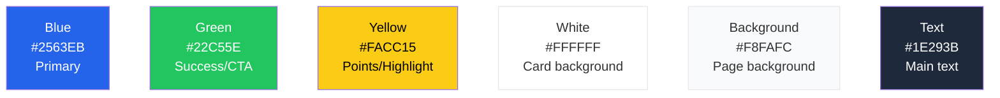

# Design and UX

## Visual identity

SportyKids has a child-friendly yet trustworthy design, created so that children enjoy it and parents trust it.

## Color palette



| Color | Hex | CSS Variable | Usage |
|-------|-----|-------------|-------|
| Blue | `#2563EB` | `--color-blue` | Primary, active links, main buttons |
| Green | `#22C55E` | `--color-green` | Success, correct answer, secondary CTA |
| Yellow | `#FACC15` | `--color-yellow` | Score, highlights, selected sources, sticker rarity |
| White | `#FFFFFF` | -- | Card and component background |
| Light background | `#F8FAFC` | `--color-background` | General page background |
| Dark text | `#1E293B` | `--color-text` | Main text and headings |

## Typography

| Font | Usage | Weights |
|------|-------|---------|
| **Poppins** | Headings, branding | 400, 500, 600, 700 |
| **Inter** | Body text, general UI | 400, 500, 600 |

## Key components

### News card (`NewsCard`)
```
+-------------------------+
|  +-------------------+  |
|  |    [Image]         |  |
|  |  +---------+      |  |
|  |  | football |     |  |
|  |  +---------+      |  |
|  +-------------------+  |
|                         |
|  News headline in       |
|  two lines maximum      |
|                         |
|  Brief summary of       |
|  the content...         |
|                         |
|  AS - 2h ago    [Team]  |
|                         |
|  +-------------------+  |
|  |   Explain it Easy  |  |  <- triggers AI summary
|  +-------------------+  |
|  +-------------------+  |
|  |     Read more      |  |
|  +-------------------+  |
+-------------------------+
```

Each card also includes:
- **Favorite (heart) button**: Top-right corner. Outline/gray when unsaved, filled/red (#EF4444) when saved. Scale animation on tap. Favorites are stored in localStorage (web) / AsyncStorage (mobile), no backend needed.
- **Trending badge**: Orange pill with fire emoji that appears next to the date if the news item has >5 views in the last 24h. Text: "Trending" (i18n).

In `headlines` mode (`HeadlineRow`), a small heart appears at the end of the row and a fire badge if trending.

On the Home screen, if there are saved news items, a **horizontal saved strip** (max 5 small cards) is shown below the search bar and above the filters, with a "See all" link if there are more than 5.

### Age-adapted summary (`AgeAdaptedSummary`)
```
+-------------------------+
|  Age: 6-8               |
|  +-------------------+  |
|  | A simpler version |  |
|  | of the article    |  |
|  | written for young |  |
|  | readers...        |  |
|  +-------------------+  |
+-------------------------+
```

### Reel card (Grid layout)
```
+----------+  +----------+
| [Thumb]  |  | [Thumb]  |
| football |  | tennis   |
| 2:00     |  | 1:30     |
| Title... |  | Title... |
| [Like]   |  | [Like]   |
+----------+  +----------+
+----------+  +----------+
| [Thumb]  |  | [Thumb]  |
| basket   |  | swimming |
| 0:45     |  | 3:00     |
| Title... |  | Title... |
| [Like]   |  | [Like]   |
+----------+  +----------+
```

### Quiz
```
+-------------------------+
|  # # # _ _   3/5       |
+-------------------------+
|  football - 10 pts      |
|  Daily Quiz             |
|                         |
|  Question here?         |
|                         |
|  +- A ----------------+ |
|  |  Option 1           | |
|  +---------------------+ |
|  +- B ----------------+ |
|  |  Option 2  ok       | |  <- green if correct
|  +---------------------+ |
|  +- C ----------------+ |
|  |  Option 3  x        | |  <- red if incorrect
|  +---------------------+ |
|  +- D ----------------+ |
|  |  Option 4           | |
|  +---------------------+ |
|                         |
|  +- Next -------------+ |
|  +---------------------+ |
+-------------------------+
```

### Team stats card
```
+-------------------------+
|  Real Madrid            |
|  La Liga - Position: 1  |
|                         |
|  W: 22  D: 5  L: 3     |
|                         |
|  Top Scorer:            |
|  Vinicius Jr            |
|                         |
|  Next Match:            |
|  vs Barcelona - Mar 30  |
+-------------------------+
```

### Sticker card (`StickerCard`)
```
+----------+
| [Image]  |
|          |
| Name     |
| football |
| [rare]   |
+----------+
```

### Achievement card (`AchievementCard`)
```
+-------------------------+
|  [Icon]                 |
|  Achievement Name       |
|  Description of what    |
|  you need to do...      |
|  [Unlocked / Locked]    |
+-------------------------+
```

### Collection page
```
+-------------------------------------+
|  My Collection                      |
|  Stickers: 12/36  Achievements: 5/20|
|                                     |
|  [All] [Football] [Basketball] ...  |
|                                     |
|  +--------+ +--------+ +--------+  |
|  |Sticker1| |Sticker2| |Sticker3|  |
|  +--------+ +--------+ +--------+  |
|  +--------+ +--------+ +--------+  |
|  |  ???   | |  ???   | |Sticker6|  |
|  +--------+ +--------+ +--------+  |
|                                     |
|  --- Achievements ---               |
|  [Achievement1] [Achievement2] ...  |
+-------------------------------------+
```

### Filters bar (`FiltersBar`)
Horizontal scrollable chip bar for filtering content by sport. Used in Home Feed, Reels, Quiz, and Collection sections. In the Home Feed, also includes a feed mode selector (Headlines / Cards / Explain).

### Report button (`ReportButton`)
Inline dropdown on each NewsCard and ReelCard (flag icon). On tap, it shows a menu with predefined reasons (inappropriate, not sports, other) and an optional text field. The dropdown closes on submit or click outside.

### Content report list (`ContentReportList`)
In the Activity tab of the parental panel, lists reports submitted by the child with date, content type, reason, and status (pending/reviewed/dismissed/actioned).

### Feed preview modal (`FeedPreviewModal`)
Full-screen modal showing the child's filtered feed. Includes a top banner with active restrictions (formats, sports, per-type limits). Opened from a "Preview child's feed" button in the parental panel.

### Mission card (`MissionCard`)
```
+-------------------------------------+
|  Today's Mission                    |
|  +-------------------------------+  |
|  | Curious Reader                |  |
|  | Read 3 news articles today    |  |
|  |                               |  |
|  | ############----  2/3         |  |
|  |                               |  |
|  | Reward: rare sticker + 15 pts |  |
|  +-------------------------------+  |
|  [ Claim Reward ]                   |
+-------------------------------------+
```

3 visual states:
- **In progress**: animated progress bar, button disabled
- **Completed**: full green bar, "Claim" button enabled with glow
- **Claimed**: green check badge, reward shown, no button

### Digest tab in parental panel
In the parental panel, an additional "Digest" tab allows:
- Toggle to enable/disable weekly digest
- Email field for receiving the summary
- Send day selector (Monday by default)
- "Preview" and "Download PDF" buttons

### Per-type time limit sliders
In the Restrictions tab of the parental panel, three independent sliders to limit daily minutes for news, reels, and quiz. Each slider shows the current value and allows a range of 5-60 minutes (or disabled). These complement the global `maxDailyMinutes` limit.

### Login / Register screens (Mobile)
```
+-------------------------+
|  SportyKids             |
|                         |
|  [Email input]          |
|                         |
|  [Password input]       |
|                         |
|  +-------------------+  |
|  |      Log in       |  |
|  +-------------------+  |
|                         |
|  Don't have an account? |
|  Register here          |
+-------------------------+
```

Both screens follow the existing visual style with Poppins headings and Inter body text. The register screen adds a name field and a confirm password field. Error messages appear inline below the relevant input.

### Streak counter (`StreakCounter`)
```
+-------------------+
| fire 5-day streak |
+-------------------+
```

Displayed in the HomeFeed header (mobile). Shows the current login streak with a fire icon. Tapping it navigates to the Collection screen. The counter updates on app start after the daily check-in.

### RSS Catalog screen (Mobile: `RssCatalog`)
```
+-------------------------------------+
|  RSS Sources                        |
|  [All] [Football] [Basketball] ...  |
|                                     |
|  +-------------------------------+  |
|  | AS - Football         [ON]    |  |
|  | Spain | es                    |  |
|  +-------------------------------+  |
|  +-------------------------------+  |
|  | BBC Sport              [ON]   |  |
|  | UK | en                       |  |
|  +-------------------------------+  |
|  +-------------------------------+  |
|  | ESPN                  [OFF]   |  |
|  | US | en                       |  |
|  +-------------------------------+  |
+-------------------------------------+
```

Accessible via a gear icon on the HomeFeed header. Lists all RSS sources from the catalog, filterable by sport. Each source shows name, country, language, and a toggle switch. Uses the existing `GET /api/news/fuentes/catalogo` endpoint.

### Parental panel (5 tabs)
```
+-------------------------------------+
|  Parental Control                   |
|  [Profile|Content|Restrict|Activity|PIN]|
+-------------------------------------+
|  (content of selected tab)          |
|                                     |
+-------------------------------------+
```

## Navigation

### Web (Horizontal NavBar)
```
+--------------------------------------------------------------+
| SportyKids | News | Reels | Quiz | My Team | Collection | Lock  Pablo |
+--------------------------------------------------------------+
```

**Routes**: `/` (Home), `/onboarding`, `/reels`, `/quiz`, `/team`, `/collection`, `/parents`

### Mobile (Bottom Tabs)
```
+--------------------------------------------------------------+
|  News    Reels    Quiz   My Team   Collection   Parents      |
+--------------------------------------------------------------+
```

**Screens**: HomeFeed, Reels, Quiz, FavoriteTeam, Collection, ParentalControl, Login, Register, RssCatalog

## Sport iconography

| Sport | Value | Emoji | Badge color |
|-------|-------|-------|-------------|
| Football | `football` | football emoji | `#22C55E` green |
| Basketball | `basketball` | basketball emoji | `#F97316` orange |
| Tennis | `tennis` | tennis emoji | `#FACC15` yellow |
| Swimming | `swimming` | swimming emoji | `#3B82F6` blue |
| Athletics | `athletics` | runner emoji | `#EF4444` red |
| Cycling | `cycling` | cyclist emoji | `#A855F7` purple |
| Formula 1 | `formula1` | race car emoji | `#DC2626` dark red |
| Padel | `padel` | paddle emoji | `#14B8A6` teal |

Sport-to-color and sport-to-emoji mappings are provided by `sportToColor()` and `sportToEmoji()` from `@sportykids/shared`.

## Sticker rarity visual treatment

| Rarity | Border / Glow | Frequency |
|--------|---------------|-----------|
| Common | Standard border | Most frequent |
| Rare | Blue glow | Moderate |
| Epic | Purple glow | Uncommon |
| Legendary | Gold glow + animation | Very rare |

## Celebration animations

Gamification events trigger confetti animations via `canvas-confetti` (utility: `apps/web/src/lib/celebrations.ts`). All animations respect `prefers-reduced-motion`.

| Event | Animation | Trigger |
|-------|-----------|---------|
| Sticker earned | Confetti burst (blue/green/yellow) | `RewardToast` mount with type `sticker` |
| Achievement unlocked | Two-sided confetti burst | `RewardToast` mount with type `achievement` |
| Streak milestone (7/14/30 days) | Fire-colored confetti | Daily check-in in `UserProvider` |
| Perfect quiz score | Sustained star burst (1.5s) | All questions answered correctly in `QuizGame` |

The `RewardToast` component also includes CSS animations:
- **toast-enter**: slide-in from the bottom (0.4s)
- **toast-glow**: pulsing box-shadow for sticker toasts (1s, plays twice)
- **toast-shake**: horizontal shake for achievement toasts (0.4s)

## Responsive

- **Mobile-first**: base design for screens < 640px
- **Tablet**: 2-column grid (sm: 640px+)
- **Desktop**: 3-column grid (lg: 1024px+)
- **Max width**: 1152px (max-w-6xl)

## Accessibility

- WCAG AA color contrast
- Readable text: minimum 13px for body, 16px+ for headings
- Buttons with minimum touch area of 44x44px on mobile
- Semantic HTML tags (article, nav, main, h1-h3)
- Rounded corners (border-radius: 12-24px) for a friendly appearance

## Internationalization

All user-facing text in components supports i18n through the `t(key, locale)` function from `@sportykids/shared`. Labels for sports, UI buttons, headings, navigation items, achievement names, and sticker descriptions are translatable. See the Development Guide for details on adding new locales.

## Dark mode

The webapp supports 3 theme modes: `system` (default), `light`, `dark`.

### CSS variables

| Variable | Light | Dark |
|----------|-------|------|
| `--color-background` | `#F8FAFC` | `#0F172A` |
| `--color-text` | `#1E293B` | `#F1F5F9` |
| `--color-surface` | `#FFFFFF` | `#1E293B` |
| `--color-border` | `#E5E7EB` | `#334155` |
| `--color-muted` | `#6B7280` | `#94A3B8` |

### Implementation
- The `.dark` class on `<html>` activates dark tokens
- Toggle in NavBar: sun/moon icon cycling system -> dark -> light
- Preference stored in `localStorage` (`sportykids-theme`)
- Inline script in `layout.tsx` prevents theme flash on load
- `UserContext` exposes `theme`, `setTheme`, `resolvedTheme`
- Listens for `prefers-color-scheme` changes in system mode
