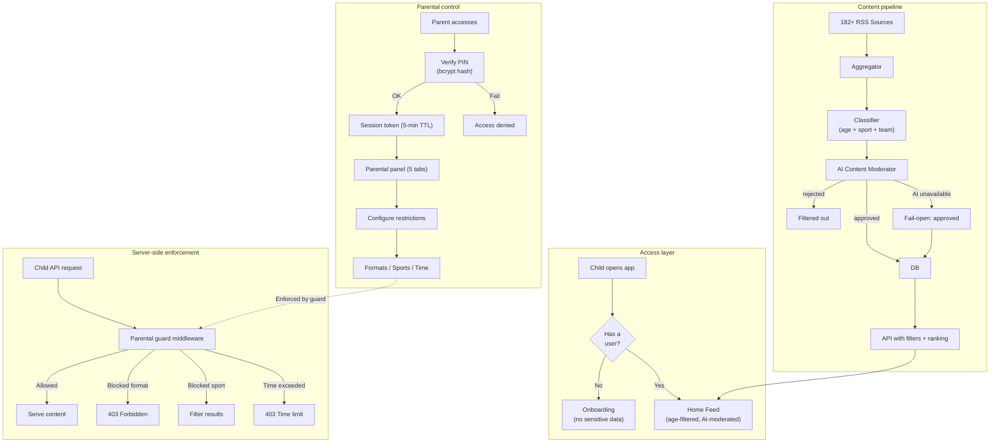

# Security and privacy

## Target audience

SportyKids is aimed at children aged 6 to 14. Content security and privacy are **fundamental requirements**, not optional.

## Implemented measures

### Content filtering by age
- Each news item and reel has an age range (`minAge`, `maxAge`)
- The API automatically filters based on the user's age
- AI content moderation classifies articles as `approved` or `rejected` (see below)

### AI Content Moderation (M1)
- The content moderator (`content-moderator.ts`) uses AI to classify every ingested news article
- Articles receive a `safetyStatus`: `pending` (not yet checked), `approved` (safe), or `rejected` (inappropriate)
- **Fail-closed in production**: if the AI provider is unavailable, content stays `pending` (not auto-approved). Override with `MODERATION_FAIL_OPEN=true`. Dev mode remains fail-open.
- **Stale pending alert**: the sync cron job warns when content has been pending for over 24 hours
- **Admin endpoint**: `GET /api/admin/moderation/pending` returns all pending items (requires `admin` role)
- Only articles from verified sports press sources are ingested -- no user-generated content

### Parental control (Robust -- M5)
- Access protected by a 4-digit PIN
- **PIN stored as bcrypt hash** (upgraded from SHA-256; transparent migration on first successful verification of legacy hashes)
- **PIN lockout**: after 5 consecutive failed attempts, the account is locked for 15 minutes. The `ParentalProfile` model tracks `failedAttempts` (Int, default 0) and `lockedUntil` (DateTime, nullable). Failed attempts return 401 with `attemptsRemaining`; locked accounts return 423 with `lockedUntil` and `remainingSeconds`.
- **Session tokens**: DB-backed (`ParentalSession` model) with 5-minute TTL issued after PIN verification, required for parental dashboard operations. Sessions persist across server restarts. Automatic cleanup of expired sessions.
- **Schedule lock (bedtime)**: Parents can set allowed hours (`allowedHoursStart`/`allowedHoursEnd`, default 0-24 = no restriction) with timezone support (`timezone` field, default `Europe/Madrid`). Enforced server-side by the parental guard middleware -- requests outside allowed hours return 403.
- Parents control:
  - Allowed formats (news, reels, quiz)
  - Allowed sports (8 sports individually toggleable)
  - Maximum daily screen time
- **Server-side enforcement** via parental guard middleware:
  - Format restrictions: blocks API access to disabled content types (returns 403)
  - Sport restrictions: filters out content from blocked sports
  - Time enforcement: checks if daily time limit has been exceeded
- Restrictions are also enforced on the frontend (tabs disappear for blocked formats)

### SSRF Prevention (Custom RSS Sources)
- Custom RSS sources added by users (`POST /api/news/fuentes/custom`) are validated
- URL validation prevents internal network access (localhost, private IPs, etc.)
- Only HTTP/HTTPS protocols are allowed
- Source URLs are stored and fetched server-side only

### OAuth Security
- **Google OAuth 2.0**: CSRF protection via `state` parameter validated on callback. ID tokens verified against Google's public keys.
- **Apple Sign In**: CSRF `state` validation, `id_token` verified against Apple's JWKS endpoint, `nonce` verification to prevent replay attacks. Apple callback uses POST (per Apple's specification).
- **Mobile flows**: Dedicated `/token` endpoints for native SDKs (Google ID token / Apple identity token verification server-side).
- **Account linking**: OAuth accounts are linked by email. Existing email/password users who sign in via OAuth are merged (not duplicated).

### Mobile App Security

#### Error Boundary
- The mobile app wraps the entire UI in an `ErrorBoundary` (class component) that catches unhandled JS errors
- Shows a kid-friendly crash screen with stadium emoji and restart button
- Reports errors to Sentry via dynamic import (no hard dependency)
- Dev mode shows the full stack trace
- i18n supported (`kid_errors.crash_title`, `kid_errors.crash_message`, `kid_errors.restart`)

#### Secure JWT Storage
- JWT tokens (access and refresh) are stored in `expo-secure-store` (iOS keychain / Android keystore, encrypted)
- Automatic fallback to `AsyncStorage` if SecureStore is unavailable
- Transparent migration: on app startup, existing AsyncStorage tokens are moved to SecureStore
- User preferences (non-sensitive) remain in AsyncStorage

#### YouTube Embed Sandbox
- Child-safe parameters centralized in `packages/shared/src/utils/youtube.ts`: `modestbranding=1`, `rel=0`, `iv_load_policy=3`, `playsinline=1`
- Web: `fs=0` (disable fullscreen) + `sandbox="allow-scripts allow-same-origin allow-presentation"` on all iframes
- Mobile: same parameters applied via YouTube IFrame Player API (`playerVars`)

### JWT Authentication
- **Access tokens**: 15-minute TTL, signed with `JWT_SECRET`. Included in `Authorization: Bearer <token>` header.
- **Refresh tokens**: 7-day TTL, rotated on each use (old token deleted, new token issued). Stored in `RefreshToken` model in the database.
- **Non-blocking middleware**: Anonymous users (without a token) can still access the API for backward compatibility. Authenticated requests include the user in `req.user`.
- **Token revocation**: `POST /api/auth/logout` revokes the refresh token. Access tokens expire naturally (no server-side revocation list).

### Rate limiting
All API endpoints are protected by `express-rate-limit` middleware with 5 tiers:

| Tier | Routes | Limit | Env var |
|------|--------|-------|---------|
| Auth | `/api/auth/login`, `/api/auth/register` | 5 req/min | `RATE_LIMIT_AUTH` |
| PIN | `/api/parents/verify-pin` | 10 req/min | `RATE_LIMIT_PIN` |
| Content | `/api/news/*`, `/api/reels/*`, `/api/quiz/*` | 60 req/min | `RATE_LIMIT_CONTENT` |
| Sync | `/api/news/sync`, `/api/reels/sync`, `/api/teams/sync` | 2 req/min | `RATE_LIMIT_SYNC` |
| Default | All other `/api/*` | 100 req/min | `RATE_LIMIT_DEFAULT` |

All limits are configurable via environment variables. Exceeded limits return `429 Too Many Requests` with standard rate-limit headers.

### User data
- Email and password are collected only for authenticated accounts (optional; anonymous users remain supported)
- Profile is created with: name, age, sports preferences
- Data is stored locally (localStorage / AsyncStorage) + server DB
- Push notifications delivered via `expo-server-sdk` with 5 triggers (quiz ready, team news, streak reminder, sticker earned, mission ready)

### External content
- News comes from 182 verified sports press RSS sources across 8 sports with global coverage
- Reels are manually curated (seed)
- No user-generated content
- No chat or interaction between users
- AI-generated content (summaries, quiz questions) is derived from verified sources only

## Security diagram

## Activity tracking

User activity is recorded with detailed tracking:

| Activity type | Description | Additional fields |
|---------------|-------------|-------------------|
| `news_viewed` | Child viewed an article | `durationSeconds`, `contentId`, `sport` |
| `reels_viewed` | Child watched a reel | `durationSeconds`, `contentId`, `sport` |
| `quizzes_played` | Child played a quiz round | `durationSeconds`, `contentId`, `sport` |

Duration tracking uses `sendBeacon` for reliable reporting even when the user navigates away. These are stored in the `ActivityLog` model and used for the weekly parental summary with total duration calculations.

## Recommended improvements for production

### Authentication
- ~~Implement JWT with refresh tokens~~ -- **Implemented**: JWT access tokens (15 min) + refresh tokens (7 days, rotated). Non-blocking middleware for backward compatibility.
- ~~OAuth social login~~ -- **Implemented**: Google OAuth 2.0 + Apple Sign In with CSRF/JWKS/nonce validation. Mobile token endpoints for native SDKs.
- Biometric authentication (TouchID/FaceID) for parental control on mobile

### PIN lockout
- ~~Implement lockout after 5 failed PIN verification attempts~~ -- **Implemented**: 5 failed attempts = 15-minute lockout with `failedAttempts` and `lockedUntil` fields on `ParentalProfile`
- PIN recovery option via parent's email

### HTTPS and network
- Enforce HTTPS on all endpoints
- Configure CORS with specific domains (not `*`)
- ~~Implement rate limiting (express-rate-limit)~~ -- **Implemented**: 5 tiers (auth, PIN, content, sync, default) with configurable limits via env vars
- Security headers (Helmet.js)

### Data
- Encrypt sensitive data at rest
- Data retention policy (delete activity older than 90 days)
- GDPR / LOPD compliance (right to be forgotten)
- COPPA compliance (if launching in the US)

### AI safety
- Review AI-generated summaries for accuracy before serving to children
- Monitor content moderator false positive/negative rates
- Add human review queue for rejected content
- Rate limit AI-generated quiz questions

### Monitoring
- Alert if an RSS feed returns unusual content
- Alert if content moderator rejection rate spikes
- Parental control access logs
- Detect anomalous usage patterns

## Legal considerations

| Regulation | Applies | Status |
|-----------|---------|--------|
| **GDPR** (EU) | Yes | Partial -- explicit consent missing |
| **LOPD** (Spain) | Yes | Partial -- privacy policy missing |
| **COPPA** (US) | Yes, if launching in the US | Not implemented |
| **Age verification** | Recommended | Self-declaration only |

### Pending actions before launch
1. Draft privacy policy
2. Draft terms of use
3. Implement verifiable parental consent
4. Designate DPO (Data Protection Officer) if applicable
5. Conduct impact assessment (DPIA)
6. Review AI content generation for compliance with child safety regulations
