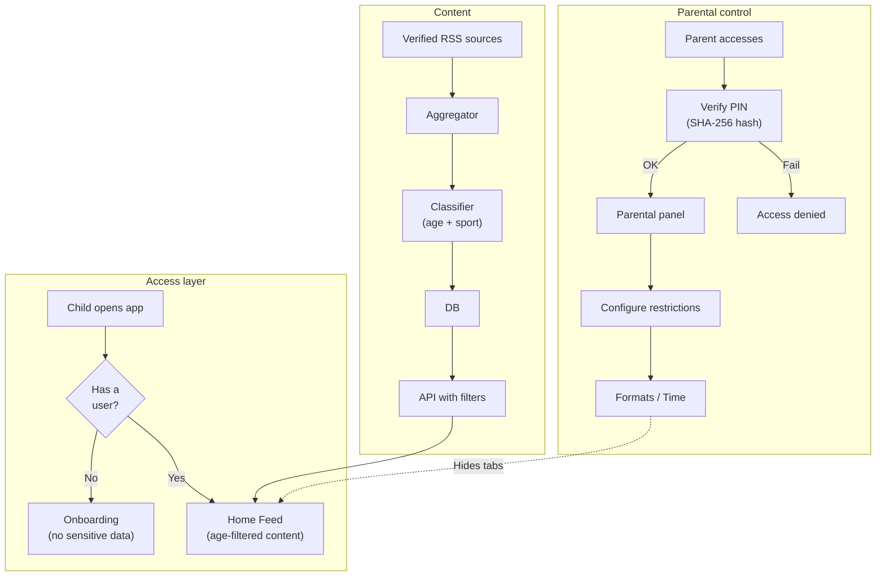

# Security and privacy

## Target audience

SportyKids is aimed at children aged 6 to 14. Content security and privacy are **fundamental requirements**, not optional.

## Implemented measures

### Content filtering by age
- Each news item and reel has an age range (`minAge`, `maxAge`)
- The API automatically filters based on the user's age
- In the MVP, all content is suitable for ages 6-14

### Parental control
- Access protected by a 4-digit PIN
- PIN stored as SHA-256 hash (upgrade to bcrypt in production)
- Parents control:
  - Allowed formats (news, reels, quiz)
  - Maximum daily screen time
- Restrictions are enforced on the frontend (tabs disappear)

### User data
- No emails or passwords are collected
- No identity verification is required
- Profile is created with: name, age, sports preferences
- Data is stored locally (localStorage / AsyncStorage) + server DB

### External content
- News comes exclusively from verified sports press sources (AS, Marca, Mundo Deportivo)
- Reels are manually curated (seed)
- No user-generated content
- No chat or interaction between users

## Recommended improvements for production

### Authentication
- Implement JWT with refresh tokens
- Biometric authentication (TouchID/FaceID) for parental control on mobile
- Sessions with expiration

### Secure PIN storage
- Migrate from SHA-256 to bcrypt with salt
- Implement lockout after 5 failed attempts
- PIN recovery option via parent's email

### HTTPS and network
- Enforce HTTPS on all endpoints
- Configure CORS with specific domains (not `*`)
- Implement rate limiting (express-rate-limit)
- Security headers (Helmet.js)

### Data
- Encrypt sensitive data at rest
- Data retention policy (delete activity older than 90 days)
- GDPR / LOPD compliance (right to be forgotten)
- COPPA compliance (if launching in the US)

### Monitoring
- Alert if an RSS feed returns unusual content
- Parental control access logs
- Detect anomalous usage patterns

## Security diagram

## Activity tracking

User activity is recorded using English activity type identifiers:

| Activity type | Description |
|---------------|-------------|
| `news_viewed` | Child viewed an article |
| `reels_viewed` | Child watched a reel |
| `quizzes_played` | Child played a quiz round |

These are stored in the `ActivityLog` model and used for the weekly parental summary.

## Legal considerations

| Regulation | Applies | Status |
|-----------|---------|--------|
| **GDPR** (EU) | Yes | Partial -- explicit consent missing |
| **LOPD** (Spain) | Yes | Partial -- privacy policy missing |
| **COPPA** (US) | Yes, if launching in the US | Not implemented |
| **Age verification** | Recommended | Self-declaration only |

### Pending actions before launch
1. Draft privacy policy
2. Draft terms of use
3. Implement verifiable parental consent
4. Designate DPO (Data Protection Officer) if applicable
5. Conduct impact assessment (DPIA)
