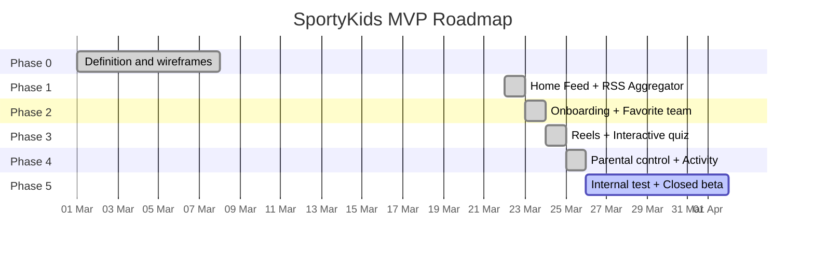

# Roadmap and technical decisions

## MVP status

## Technical decisions made

### 1. SQLite instead of PostgreSQL for development
**Context**: The MVP needs to start quickly without infrastructure.
**Decision**: Use SQLite via Prisma during development.
**Consequence**: No Docker or external database needed. Migration to PostgreSQL is trivial (change provider in schema.prisma).

### 2. Express instead of Fastify
**Context**: An HTTP server is needed for the REST API.
**Decision**: Express 5 for its ecosystem and familiarity.
**Trade-off**: Fastify would be faster in benchmarks, but Express has better documentation and more available middleware.

### 3. Next.js for the webapp
**Context**: The webapp needs to be fast and SEO-friendly.
**Decision**: Next.js 16 with App Router.
**Advantage**: SSR available when needed, same React ecosystem as the mobile app.

### 4. Expo for the mobile app
**Context**: We need to compile for iOS and Android.
**Decision**: React Native with Expo (managed workflow).
**Advantage**: Shares logic with the webapp (hooks, types, API client).

### 5. Monorepo with npm workspaces
**Context**: Three projects that share types and constants.
**Decision**: Native npm workspaces (without Turborepo/Nx).
**Trade-off**: Fewer features than Turborepo, but no additional dependency.

### 6. No real authentication in MVP
**Context**: The MVP prioritizes development speed.
**Decision**: User is identified by ID, without login/password/JWT.
**Consequence**: Anyone with the ID can access the profile. Acceptable for a closed beta with 5-10 families.

### 7. RSS feeds as content source
**Context**: We need real sports news.
**Decision**: Consume public RSS feeds from AS, Marca, and Mundo Deportivo.
**Risk**: RSS URLs may change without notice. Marca already returned 404 on some feeds.

### 8. Parental PIN with SHA-256
**Context**: Parents need to protect the configuration.
**Decision**: SHA-256 hash of the 4-digit PIN.
**Future improvement**: Migrate to bcrypt with salt for better security.

### 9. English identifiers with i18n support
**Context**: The codebase initially used Spanish identifiers, limiting contributions from non-Spanish-speaking developers and complicating internationalization.
**Decision**: Refactor all code identifiers (models, types, functions, variables, file names, API routes) to English. Add an i18n system for user-facing strings.
**Implementation**: `packages/shared/src/i18n/` with locale files (`es.json`, `en.json`) and a `t(key, locale)` function. All Prisma models, API routes, constants, and component names now use English.
**Advantage**: Consistent English codebase while supporting multiple languages for end users.

## Known technical debt

| Item | Priority | Description |
|------|----------|-------------|
| Authentication | High | Implement JWT or real sessions |
| Tests | High | No unit or integration tests |
| PIN hash | Medium | Change SHA-256 to bcrypt |
| Server-side validation | Medium | Parental restrictions are enforced only on the frontend |
| News images | Low | Many news items lack images (limited RSS feeds) |
| Reels with real videos | Low | Reels are placeholders (YouTube embeds) |
| ~~Internationalization~~ | ~~Low~~ | Resolved: i18n system implemented with `es.json` and `en.json` |

## Next steps (post-MVP)

### Short term (1-2 weeks)
- [ ] Internal test with 5-10 families
- [ ] Fix reported bugs
- [ ] Improve image detection in RSS
- [ ] Add more RSS sources (ESPN, Sport)
- [ ] Add more locales (fr, de, pt)

### Medium term (1-2 months)
- [ ] Real authentication with JWT
- [ ] Personalized push notifications
- [ ] Gamification (trading cards, badges, streaks)
- [ ] Analytics dashboard for the team

### Long term (3-6 months)
- [ ] Integration with sports APIs (live results)
- [ ] Reels with real videos (scraping or APIs)
- [ ] Automatically generated quizzes from news
- [ ] Premium version with advanced features
- [ ] Expansion to more languages/countries
