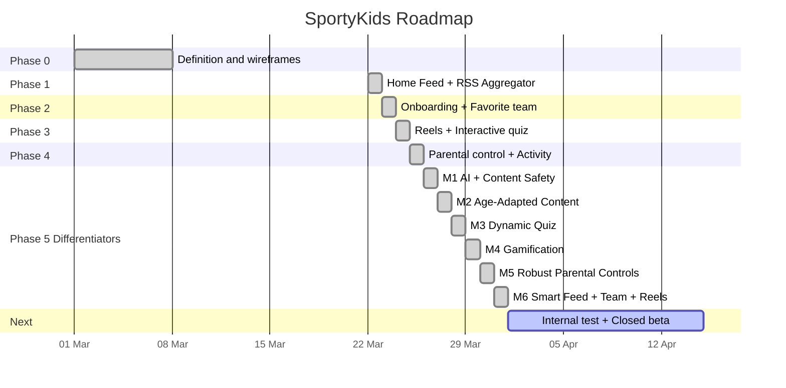

# Roadmap and technical decisions

## Project status

## Phase 5 Differentiators -- Milestones

### M1: AI Infrastructure + Content Safety
- Multi-provider AI client (`ai-client.ts`) supporting Ollama (free, default), OpenRouter, and Anthropic Claude
- Content moderator (`content-moderator.ts`) classifies news as safe/unsafe with fail-open policy
- Expanded from 4 to 47 RSS sources across 8 sports
- Custom RSS sources via API (`POST/DELETE /api/news/fuentes/custom`)
- `safetyStatus` field on NewsItem (`pending`/`approved`/`rejected`)
- Health check for AI provider availability

### M2: Age-Adapted Content
- Summarizer service (`summarizer.ts`) generates summaries for 3 age profiles (6-8, 9-11, 12-14)
- NewsSummary model (unique per newsItemId + ageRange + locale)
- `GET /api/news/:id/resumen?age=&locale=` endpoint
- "Explain it Easy" button on NewsCard + AgeAdaptedSummary component

### M3: Dynamic Quiz
- Quiz generator (`quiz-generator.ts`) creates AI-generated questions from news
- Daily quiz job (cron 06:00 UTC) with round-robin by sport
- QuizQuestion extended: `generatedAt`, `ageRange`, `expiresAt`, `isDaily`
- `POST /api/quiz/generate` manual trigger
- Age-based difficulty filtering; seed questions (15) as permanent fallback

### M4: Gamification
- 4 new models: Sticker (36), UserSticker, Achievement (20), UserAchievement
- Gamification service: streaks, sticker awards, achievement evaluation
- Points: +5 news, +3 reels, +10 quiz correct, +50 perfect (5/5), +2 daily login
- 6 endpoints under `/api/gamification/`
- Collection page with sport filters, sticker grid, achievements
- Daily check-in on app start

### M5: Robust Parental Controls
- Parental guard middleware on news/reels/quiz routes (format, sport, time enforcement server-side)
- bcrypt PIN hashing (transparent SHA-256 migration on verification)
- Session tokens (5-min TTL) for authenticated parental access
- 5-step onboarding (step 5: PIN + formats + time limit)
- Activity tracking with duration (`durationSeconds`, `contentId`, `sport`) via `sendBeacon`
- ParentalPanel with 5 tabs (Profile, Content, Restrictions, Activity, PIN)

### M6: Smart Feed + Team + Reels
- Feed ranker (score: +5 team, +3 sport, filter unfollowed sources)
- 3 feed modes: Headlines, Cards, Explain
- TeamStats model (15 teams seeded) + `GET /api/teams/:name/stats`
- Team page with stats card (W/D/L, position, top scorer, next match)
- Reels: grid layout with YouTube thumbnails, like/share actions
- Notification preferences (MVP: stored but not sent)
- Reel model extended: `videoType`, `aspectRatio`, `previewGifUrl`

### Mobile App: Full Parity
- 27 API functions in mobile client
- Daily check-in flow
- Collection screen with sticker grid and achievements
- 5-step onboarding matching web
- All M1-M6 features accessible from mobile

## Technical decisions made

### 1. SQLite instead of PostgreSQL for development
**Context**: The MVP needs to start quickly without infrastructure.
**Decision**: Use SQLite via Prisma during development.
**Consequence**: No Docker or external database needed. Migration to PostgreSQL is trivial (change provider in schema.prisma).

### 2. Express instead of Fastify
**Context**: An HTTP server is needed for the REST API.
**Decision**: Express 5 for its ecosystem and familiarity.
**Trade-off**: Fastify would be faster in benchmarks, but Express has better documentation and more available middleware.

### 3. Next.js for the webapp
**Context**: The webapp needs to be fast and SEO-friendly.
**Decision**: Next.js 16 with App Router.
**Advantage**: SSR available when needed, same React ecosystem as the mobile app.

### 4. Expo for the mobile app
**Context**: We need to compile for iOS and Android.
**Decision**: React Native with Expo (managed workflow, SDK 54).
**Advantage**: Shares logic with the webapp (hooks, types, API client).

### 5. Monorepo with npm workspaces
**Context**: Three projects that share types and constants.
**Decision**: Native npm workspaces (without Turborepo/Nx).
**Trade-off**: Fewer features than Turborepo, but no additional dependency.

### 6. No real authentication in MVP
**Context**: The MVP prioritizes development speed.
**Decision**: User is identified by ID, without login/password/JWT.
**Consequence**: Anyone with the ID can access the profile. Acceptable for a closed beta with 5-10 families.

### 7. RSS feeds as content source
**Context**: We need real sports news.
**Decision**: Consume public RSS feeds from verified sports press (47 sources across 8 sports).
**Risk**: RSS URLs may change without notice. Some feeds are intermittent.

### 8. English identifiers with i18n support
**Context**: The codebase initially used Spanish identifiers, limiting contributions from non-Spanish-speaking developers and complicating internationalization.
**Decision**: Refactor all code identifiers to English. Add an i18n system for user-facing strings.
**Implementation**: `packages/shared/src/i18n/` with locale files and `t(key, locale)` function.

### 9. Ollama as default AI provider (M1)
**Context**: AI features need to work during development without API costs.
**Decision**: Default to Ollama (free, local) with cloud providers (OpenRouter, Anthropic) as alternatives.
**Trade-off**: Local inference is slower and lower quality than cloud, but free and private.

### 10. Fail-open content moderation (M1)
**Context**: Content moderation should not block the entire app if AI is down.
**Decision**: If the AI provider is unavailable, content defaults to `approved`.
**Risk**: Some inappropriate content may slip through if AI is down. Mitigated by only ingesting from verified sports press sources.

### 11. bcrypt with transparent SHA-256 migration (M5)
**Context**: MVP used SHA-256 for PIN hashing; bcrypt is more secure.
**Decision**: New PINs use bcrypt. On verification, if a legacy SHA-256 hash is detected and the PIN is correct, it is transparently re-hashed with bcrypt.
**Advantage**: Zero-downtime migration, no data migration script needed.

### 12. Server-side parental enforcement (M5)
**Context**: MVP enforced parental restrictions only on the frontend (hiding tabs).
**Decision**: Add parental guard middleware that enforces restrictions at the API level.
**Advantage**: Cannot be bypassed by direct API calls or modified frontends.

## Known technical debt

| Item | Priority | Status | Description |
|------|----------|--------|-------------|
| Authentication | High | Pending | Implement JWT or real sessions |
| Tests | High | Pending | No unit or integration tests |
| ~~PIN hash~~ | ~~Medium~~ | Done (M5) | ~~Change SHA-256 to bcrypt~~ |
| ~~Server-side validation~~ | ~~Medium~~ | Done (M5) | ~~Parental restrictions enforced only on frontend~~ |
| News images | Low | Pending | Many news items lack images (limited RSS feeds) |
| Reels with real videos | Low | Pending | Reels are placeholders (YouTube embeds) |
| ~~Internationalization~~ | ~~Low~~ | Done | ~~i18n system implemented~~ |
| ~~Gamification~~ | ~~Medium~~ | Done (M4) | ~~Trading cards, badges, streaks~~ |
| ~~Auto-generated quizzes~~ | ~~Medium~~ | Done (M3) | ~~Quizzes generated from news~~ |
| ~~Content moderation~~ | ~~High~~ | Done (M1) | ~~AI safety classification~~ |
| PIN lockout | Medium | Pending | No lockout after failed PIN attempts |
| Rate limiting | Medium | Pending | No API rate limiting |
| Push notifications | Low | Pending | Preferences stored but notifications not sent |
| API route consistency | Low | Pending | Mix of Spanish and English route paths |

## Next steps (post-Phase 5)

### Short term (1-2 weeks)
- [ ] Internal test with 5-10 families
- [ ] Fix reported bugs
- [ ] Add automated tests (unit + integration)
- [ ] Implement PIN lockout after 5 failed attempts
- [ ] Add rate limiting to API endpoints

### Medium term (1-2 months)
- [ ] Real authentication with JWT
- [ ] Implement push notifications (use stored preferences)
- [ ] Analytics dashboard for the team
- [ ] Add more locales (fr, de, pt)
- [ ] Human review queue for AI-moderated content
- [ ] CI/CD pipeline

### Long term (3-6 months)
- [ ] Integration with sports APIs (live results, real-time team stats)
- [ ] Reels with real videos (scraping or APIs)
- [ ] Premium version with advanced features
- [ ] Expansion to more languages/countries
- [ ] Migrate to PostgreSQL for production
- [ ] COPPA/GDPR full compliance
