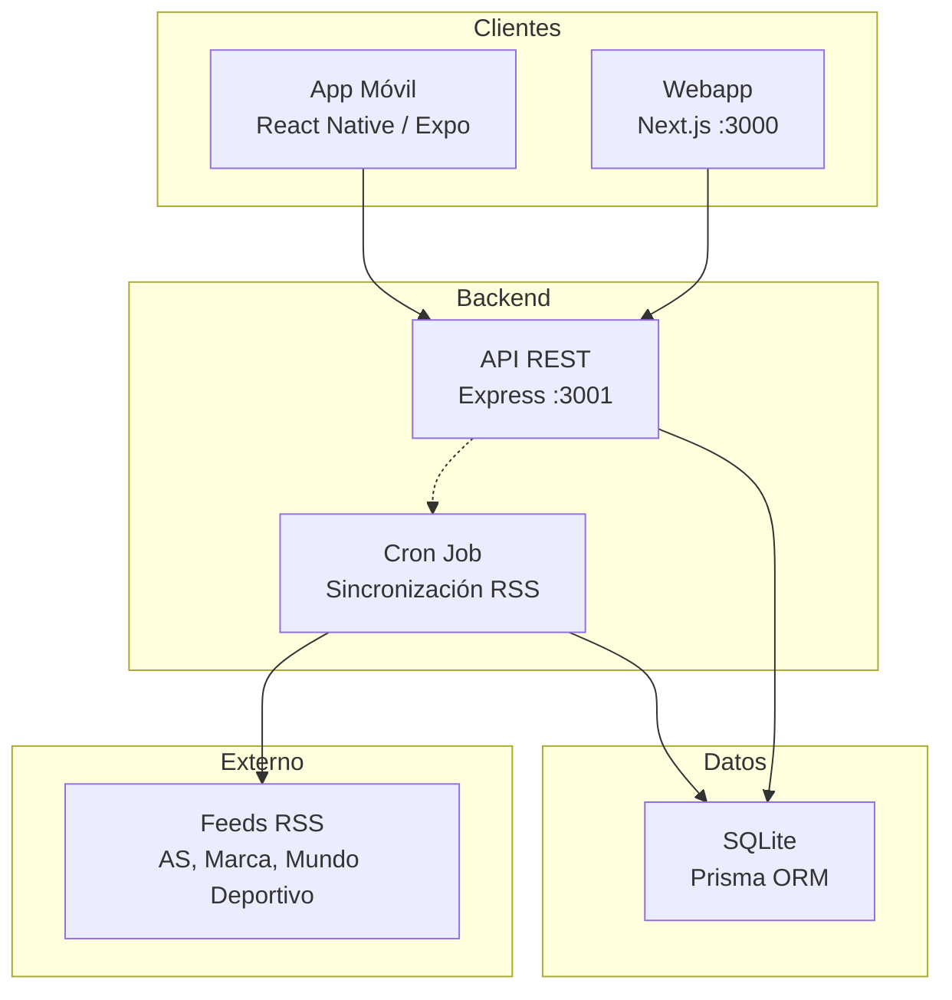
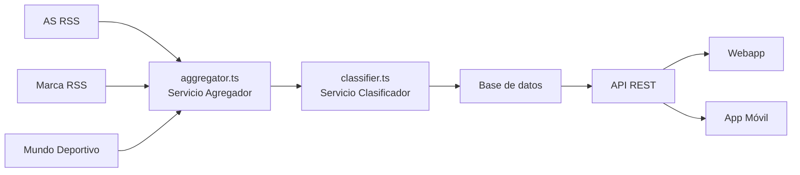

# Arquitectura del sistema

## Vista general

SportyKids es un monorepo TypeScript que agrupa una API backend, una webapp y una app móvil, compartiendo tipos y utilidades a través de un paquete común. Todos los identificadores del código (modelos, funciones, variables, nombres de ficheros) están en **inglés**, mientras que la interfaz de usuario soporta múltiples idiomas mediante un sistema de **internacionalización (i18n)**.



## Estructura del monorepo

```
sportykids/
├── packages/
│   └── shared/              # @sportykids/shared
│       └── src/
│           ├── types/       # Interfaces TypeScript compartidas
│           ├── constants/   # SPORTS, TEAMS, COLORS, AGE_RANGES
│           ├── utils/       # formatDate, sportToColor, sportToEmoji, truncateText
│           └── i18n/        # Traducciones (es.json, en.json) y función t()
├── apps/
│   ├── api/                 # @sportykids/api (Express + Prisma)
│   │   ├── prisma/          # Schema, migraciones y seed
│   │   └── src/
│   │       ├── routes/      # Endpoints REST (news.ts, users.ts, parents.ts, ...)
│   │       ├── services/    # Lógica de negocio (aggregator.ts, classifier.ts)
│   │       ├── middleware/  # Auth, errores
│   │       ├── jobs/        # Cron de sincronización (sync-feeds.ts)
│   │       └── config/      # Conexión a BD
│   ├── web/                 # @sportykids/web (Next.js)
│   │   └── src/
│   │       ├── app/         # Páginas (App Router): /, /onboarding, /reels, /quiz, /team, /parents
│   │       ├── components/  # NewsCard, FiltersBar, ParentalPanel, ...
│   │       └── lib/         # API client, user-context
│   └── mobile/              # @sportykids/mobile (Expo)
│       └── src/
│           ├── screens/     # Pantallas
│           ├── components/  # NewsCard, FiltersBar, FavoriteTeam, ParentalControl
│           ├── navigation/  # React Navigation
│           └── lib/         # API client, user-context
└── docs/                    # Documentación
```

## Stack tecnológico

| Capa | Tecnología | Versión |
|------|-----------|---------|
| Runtime | Node.js | >= 20 |
| Lenguaje | TypeScript | 5.x |
| API | Express | 5.x |
| ORM | Prisma | 6.x |
| Base de datos | SQLite | (dev) / PostgreSQL (prod) |
| Webapp | Next.js | 16.x |
| Estilos | Tailwind CSS | 4.x |
| App móvil | React Native + Expo | Latest |
| Navegación móvil | React Navigation | 7.x |
| Validación | Zod | 4.x |
| RSS | rss-parser | 3.x |
| Cron | node-cron | 4.x |
| i18n | Sistema propio | — |

## Patrones arquitectónicos

### Monorepo con npm workspaces
Los tres proyectos (API, web, mobile) comparten el paquete `@sportykids/shared` que contiene tipos, constantes, utilidades y traducciones i18n. Esto garantiza consistencia de tipos entre frontend y backend.

### Internacionalización (i18n)
El paquete compartido incluye un módulo de i18n en `packages/shared/src/i18n/` con ficheros de traducción (`es.json`, `en.json`) y una función `t(key, locale)` que permite traducir cadenas en cualquier parte de la aplicación. Los identificadores del código están en inglés, pero la UI se muestra en el idioma del usuario.

### Agregación de contenido
El backend actúa como un agregador: consume feeds RSS externos, los parsea, clasifica y almacena. Los clientes nunca acceden directamente a las fuentes externas.



### Clasificación de contenido
El clasificador etiqueta cada noticia con:
- **Deporte**: heredado de la fuente RSS (valores: `football`, `basketball`, `tennis`, `swimming`, `athletics`, `cycling`, etc.)
- **Equipo**: detección por keywords en título/resumen
- **Rango de edad**: 6-14 años (Fase 1, simple)

### Estado del usuario
- **Web**: `localStorage` para persistir el ID del usuario + `React Context` (`user-context`) para estado global
- **Móvil**: `AsyncStorage` + `React Context` (`user-context`)
- **API**: el usuario se identifica por ID en cada request (sin JWT en MVP)

### Control parental
- PIN de 4 dígitos hasheado con SHA-256
- Perfil parental separado del usuario (relación 1:1, modelo `ParentalProfile`)
- Restricciones aplicadas en frontend (ocultar tabs bloqueados)
- Registro de actividad (`ActivityLog`) para resumen semanal
