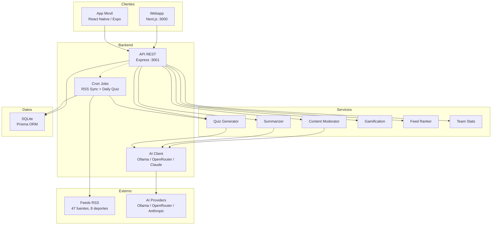
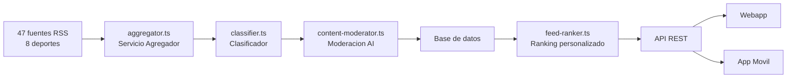

# Arquitectura del sistema

## Vista general

SportyKids es un monorepo TypeScript que agrupa una API backend, una webapp y una app movil, compartiendo tipos y utilidades a traves de un paquete comun. Todos los identificadores del codigo (modelos, funciones, variables, nombres de ficheros) estan en **ingles**, mientras que la interfaz de usuario soporta multiples idiomas mediante un sistema de **internacionalizacion (i18n)**.

El sistema incluye una capa de **inteligencia artificial** multi-proveedor para moderacion de contenido, resumenes adaptados por edad y generacion dinamica de quizzes.



## Estructura del monorepo

```
sportykids/
├── packages/
│   └── shared/              # @sportykids/shared
│       └── src/
│           ├── types/       # Interfaces TypeScript compartidas
│           ├── constants/   # SPORTS, TEAMS, COLORS, AGE_RANGES
│           ├── utils/       # formatDate, sportToColor, sportToEmoji, truncateText
│           └── i18n/        # Traducciones (es.json, en.json) y funcion t()
├── apps/
│   ├── api/                 # @sportykids/api (Express + Prisma)
│   │   ├── prisma/          # Schema, migraciones y seed
│   │   └── src/
│   │       ├── routes/      # Endpoints REST (news, users, parents, reels, quiz, gamification, teams)
│   │       ├── services/    # Logica de negocio (aggregator, classifier, ai-client,
│   │       │                #   content-moderator, summarizer, quiz-generator,
│   │       │                #   gamification, feed-ranker, team-stats)
│   │       ├── middleware/  # Auth, errores, parental-guard
│   │       ├── jobs/        # sync-feeds.ts, generate-daily-quiz.ts
│   │       └── config/      # Conexion a BD
│   ├── web/                 # @sportykids/web (Next.js)
│   │   └── src/
│   │       ├── app/         # Paginas (App Router): /, /onboarding, /reels, /quiz,
│   │       │                #   /team, /parents, /collection
│   │       ├── components/  # NewsCard, FiltersBar, ParentalPanel, AgeAdaptedSummary,
│   │       │                #   CollectionPage, StickerGrid, ...
│   │       └── lib/         # API client, user-context
│   └── mobile/              # @sportykids/mobile (Expo)
│       └── src/
│           ├── screens/     # HomeFeed, Reels, Quiz, FavoriteTeam, Onboarding,
│           │                #   ParentalControl, Collection
│           ├── components/  # NewsCard, FiltersBar, StickerGrid, ...
│           ├── navigation/  # React Navigation (6 tabs)
│           └── lib/         # API client (27 funciones), user-context
└── docs/                    # Documentacion
```

## Stack tecnologico

| Capa | Tecnologia | Version |
|------|-----------|---------|
| Runtime | Node.js | >= 20 |
| Lenguaje | TypeScript | 5.x |
| API | Express | 5.x |
| ORM | Prisma | 6.x |
| Base de datos | SQLite | (dev) / PostgreSQL (prod) |
| Webapp | Next.js | 16.x |
| Estilos | Tailwind CSS | 4.x |
| App movil | React Native + Expo | SDK 54 / RN 0.81 |
| Navegacion movil | React Navigation | 7.x |
| Validacion | Zod | 4.x |
| RSS | rss-parser | 3.x |
| Cron | node-cron | 4.x |
| AI | Ollama / OpenRouter / Anthropic | Multi-proveedor |
| i18n | Sistema propio | — |

## Patrones arquitectonicos

### Monorepo con npm workspaces
Los tres proyectos (API, web, mobile) comparten el paquete `@sportykids/shared` que contiene tipos, constantes, utilidades y traducciones i18n. Esto garantiza consistencia de tipos entre frontend y backend.

### Internacionalizacion (i18n)
El paquete compartido incluye un modulo de i18n en `packages/shared/src/i18n/` con ficheros de traduccion (`es.json`, `en.json`) y una funcion `t(key, locale)` que permite traducir cadenas en cualquier parte de la aplicacion. Los identificadores del codigo estan en ingles, pero la UI se muestra en el idioma del usuario.

### Capa de inteligencia artificial

El sistema incluye un cliente AI multi-proveedor (`ai-client.ts`) que abstrae la comunicacion con distintos modelos de lenguaje:

| Proveedor | Uso | Coste |
|-----------|-----|-------|
| **Ollama** (default) | Desarrollo local, sin coste | Gratis |
| **OpenRouter** | Produccion, multiples modelos | Pay-per-use |
| **Anthropic Claude** | Alta calidad, fallback | Pay-per-use |

El cliente AI se usa en tres servicios:
- **Content Moderator**: clasifica noticias como safe/unsafe para ninos
- **Summarizer**: genera resumenes adaptados por edad (6-8, 9-11, 12-14)
- **Quiz Generator**: crea preguntas de trivia a partir de noticias

Health check disponible en `GET /api/health` para verificar disponibilidad del proveedor AI.

### Agregacion de contenido

El backend actua como un agregador: consume feeds RSS externos, los parsea, clasifica, modera y almacena. Los clientes nunca acceden directamente a las fuentes externas.



### Clasificacion y moderacion de contenido

El pipeline de contenido etiqueta cada noticia con:
- **Deporte**: heredado de la fuente RSS (valores: `football`, `basketball`, `tennis`, `swimming`, `athletics`, `cycling`, `formula1`, `padel`)
- **Equipo**: deteccion por keywords en titulo/resumen (20+ equipos/deportistas)
- **Rango de edad**: 6-14 anos
- **Estado de seguridad** (`safetyStatus`): `pending` -> `approved` / `rejected` via moderacion AI (fail-open: si la AI no esta disponible, se aprueba)

### Feed inteligente (Feed Ranker)

El servicio `feed-ranker.ts` personaliza el orden del feed para cada usuario:
- **+5 puntos**: noticia menciona el equipo favorito del usuario
- **+3 puntos**: noticia es del deporte favorito
- **Filtro**: excluye fuentes no seguidas por el usuario
- **3 modos de vista**: Headlines (titulares), Cards (tarjetas completas), Explain (con resumen adaptado)

### Estado del usuario
- **Web**: `localStorage` para persistir el ID del usuario + `React Context` (`user-context`) para estado global
- **Movil**: `AsyncStorage` + `React Context` (`user-context`)
- **API**: el usuario se identifica por ID en cada request (sin JWT en MVP)

### Control parental robusto
- PIN de 4 digitos hasheado con **bcrypt** (migracion transparente desde SHA-256)
- **Sesiones con token** (TTL 5 minutos) para evitar re-verificacion constante
- Perfil parental separado del usuario (relacion 1:1, modelo `ParentalProfile`)
- **Middleware `parental-guard.ts`**: enforcement server-side en rutas de news, reels y quiz (formatos, deportes, tiempo)
- Restricciones aplicadas tanto en frontend (ocultar tabs) como en **backend** (middleware)
- Registro de actividad (`ActivityLog`) con duracion y detalles del contenido

### Gamificacion
- Sistema de puntos: +5 noticias, +3 reels, +10 quiz correcto, +50 quiz perfecto (5/5), +2 login diario
- **36 cromos** (stickers) por deporte, desbloqueables al alcanzar hitos
- **20 logros** (achievements) con criterios automaticos (rachas, puntuacion, diversidad)
- Servicio `gamification.ts` evalua logros y otorga cromos automaticamente
- Check-in diario al abrir la app
