# Modelo de datos

## Diagrama entidad-relacion

```mermaid
erDiagram
    User ||--o| ParentalProfile : "tiene"
    User ||--o{ ActivityLog : "genera"
    User ||--o{ UserSticker : "colecciona"
    User ||--o{ UserAchievement : "desbloquea"
    NewsItem ||--o{ NewsSummary : "tiene resumenes"
    Sticker ||--o{ UserSticker : "asignado a"
    Achievement ||--o{ UserAchievement : "asignado a"

    User {
        string id PK
        string name
        int age
        string favoriteSports "JSON array"
        string favoriteTeam "nullable"
        string selectedFeeds "JSON array"
        int totalPoints
        int streak "dias consecutivos"
        datetime lastActiveDate "nullable"
        string notificationPreferences "JSON, nullable"
        string locale "es|en, default es"
        string country "ES|GB|US|FR|IT|DE, default ES"
        string email "unique, nullable"
        string passwordHash "nullable"
        string authProvider "anonymous|email|google|apple"
        string socialId "nullable, ID del proveedor"
        string role "child|parent"
        string parentUserId "nullable, FK -> User"
        datetime createdAt
        datetime updatedAt
    }

    NewsItem {
        string id PK
        string title
        string summary
        string imageUrl
        string source
        string sourceUrl
        string sport
        string team "nullable"
        int minAge
        int maxAge
        string safetyStatus "pending|approved|rejected"
        datetime publishedAt
        datetime createdAt
        string rssGuid UK
    }

    NewsSummary {
        string id PK
        string newsItemId "FK -> NewsItem"
        string ageRange "6-8|9-11|12-14"
        string locale "es|en"
        string summary "texto adaptado"
        datetime createdAt
    }

    Reel {
        string id PK
        string title
        string videoUrl
        string thumbnailUrl
        string source
        string sport
        string team "nullable"
        int minAge
        int maxAge
        int durationSeconds
        string videoType "youtube_embed|instagram_embed|tiktok_embed|mp4"
        string aspectRatio "16:9|9:16|1:1"
        string previewGifUrl "nullable"
        string rssGuid "unique, nullable"
        string videoSourceId "nullable"
        string safetyStatus "approved|rejected|pending"
        string safetyReason "nullable"
        datetime moderatedAt "nullable"
        datetime publishedAt "nullable"
        datetime createdAt
    }

    VideoSource {
        string id PK
        string name
        string platform "youtube_channel|youtube_playlist"
        string feedUrl "unique"
        string channelId "nullable"
        string playlistId "nullable"
        string sport
        boolean active
        boolean isCustom
        string addedBy "nullable"
        datetime lastSyncedAt "nullable"
        datetime createdAt
    }

    QuizQuestion {
        string id PK
        string question
        string options "JSON array"
        int correctAnswer "indice 0-3"
        string sport
        int points
        string relatedNewsItemId "nullable"
        boolean isDaily "false"
        string ageRange "nullable: 6-8|9-11|12-14"
        datetime generatedAt "nullable"
        datetime expiresAt "nullable"
    }

    ParentalProfile {
        string id PK
        string userId UK "FK -> User"
        string pin "bcrypt hash"
        string allowedSports "JSON array"
        string allowedFeeds "JSON array"
        string allowedFormats "JSON array"
        int maxDailyMinutes
        string sessionToken "nullable"
        datetime sessionExpiresAt "nullable"
        int failedAttempts "default 0"
        datetime lockedUntil "nullable"
    }

    ActivityLog {
        string id PK
        string userId "FK -> User"
        string type "news_viewed|reels_viewed|quizzes_played"
        int durationSeconds "nullable"
        string contentId "nullable"
        string sport "nullable"
        datetime date
    }

    RssSource {
        string id PK
        string name
        string url UK
        string sport
        boolean active
        boolean isCustom "false"
        string addedByUserId "nullable"
        string language "nullable"
        string country "nullable"
        datetime lastSync "nullable"
    }

    Sticker {
        string id PK
        string name
        string description
        string sport
        string imageUrl
        string rarity "common|rare|epic|legendary"
        datetime createdAt
    }

    UserSticker {
        string id PK
        string userId "FK -> User"
        string stickerId "FK -> Sticker"
        datetime earnedAt
    }

    Achievement {
        string id PK
        string name
        string description
        string icon
        string criteria "JSON"
        string category "streak|points|quiz|diversity|collection"
        datetime createdAt
    }

    UserAchievement {
        string id PK
        string userId "FK -> User"
        string achievementId "FK -> Achievement"
        datetime unlockedAt
    }

    TeamStats {
        string id PK
        string teamName UK
        string sport
        int wins
        int draws
        int losses
        int position "nullable"
        string topScorer "nullable"
        string nextMatch "nullable"
        datetime updatedAt
    }
```

## Descripcion de modelos

### User
Perfil del nino. Los campos `favoriteSports` y `selectedFeeds` son arrays nativos PostgreSQL `String[]`. `pushPreferences` es tipo nativo `Json?`. Incluye campos de gamificacion (`totalPoints`, `streak`, `lastActiveDate`).

**Campos de autenticacion:**
- `email` (unique, nullable) -- para login con email/password y login social
- `passwordHash` (nullable) -- hash bcrypt para autenticacion por email
- `authProvider` -- metodo de login: `anonymous` (default), `email`, `google`, `apple`
- `socialId` (nullable) -- identificador unico del proveedor social (e.g., Google sub, Apple sub). Se usa junto con `authProvider` para localizar cuentas sociales existentes via el indice compuesto `@@index([authProvider, socialId])`.
- `role` -- `child` (default) o `parent`
- `parentUserId` (nullable) -- FK al User padre para cuentas de hijos vinculadas

### NewsItem
Articulo agregado desde un feed RSS. El campo `rssGuid` es unico y se usa para evitar duplicados al re-sincronizar. El campo `safetyStatus` indica si el contenido ha sido moderado por IA (`pending`, `approved`, `rejected`).

### NewsSummary
Resumen adaptado por edad de una noticia. Unico por combinacion de `newsItemId` + `ageRange` + `locale`. Generado por el servicio `summarizer.ts` usando IA.

| Rango de edad | Estilo del resumen |
|---------------|-------------------|
| `6-8` | Vocabulario simple, frases cortas, tono entusiasta |
| `9-11` | Lenguaje intermedio, contexto basico |
| `12-14` | Lenguaje completo, datos y estadisticas |

### Reel
Video corto deportivo. Campos extendidos para soporte de distintos formatos:
- `videoType`: `youtube_embed`, `instagram_embed`, `tiktok_embed`, `mp4`
- `aspectRatio`: `16:9`, `9:16` (vertical/stories), `1:1` (cuadrado)
- `previewGifUrl`: miniatura animada opcional
- `rssGuid`: identificador unico del video en el feed RSS (para deduplicacion)
- `videoSourceId`: referencia a la fuente VideoSource que importo el reel
- `safetyStatus`: estado de moderacion (`approved`, `rejected`, `pending`)
- `publishedAt`: fecha de publicacion del video original

### VideoSource
Fuente de video (canales o playlists de YouTube). Se sincronizan cada 6 horas via cron job.
- `platform`: `youtube_channel` o `youtube_playlist`
- `feedUrl`: URL del feed Atom de YouTube (unique)
- `channelId`/`playlistId`: identificadores de YouTube
- `isCustom`: si fue anadida por un usuario (vs. catalogo predefinido)
- 182 fuentes predefinidas cubriendo los 8 deportes (45 RSS directas + 10 Google News outlets + 127 team/athlete news)

### QuizQuestion
Pregunta de trivia deportiva con 4 opciones. Soporta tanto preguntas estaticas (seed) como generadas dinamicamente por IA:
- `isDaily`: marca preguntas del quiz diario
- `ageRange`: dificultad adaptada por edad
- `generatedAt`: timestamp de generacion por IA
- `expiresAt`: caducidad de preguntas diarias

### ParentalProfile
Configuracion del control parental, vinculada 1:1 con User.
- **PIN**: almacenado como hash **bcrypt** (migracion transparente desde SHA-256 para usuarios existentes)
- **Bloqueo por intentos fallidos**: `failedAttempts` (Int, default 0) cuenta intentos consecutivos incorrectos; `lockedUntil` (DateTime, nullable) almacena cuando expira el bloqueo. Tras 5 intentos fallidos, la cuenta se bloquea 15 minutos.
- **Sesiones**: `sessionToken` + `sessionExpiresAt` (TTL 5 minutos) para evitar re-verificacion constante del PIN
- `allowedFormats`: controla que secciones de la app son visibles
- `allowedSports`: filtra deportes permitidos

### ActivityLog
Evento de tracking extendido. Registra acciones del nino con informacion detallada:
- `durationSeconds`: tiempo dedicado a la actividad (enviado via `sendBeacon` al cerrar)
- `contentId`: ID de la noticia, reel o quiz consultado
- `sport`: deporte del contenido para filtrado en panel parental

### RssSource
Feed RSS configurable. 55 fuentes totales en el seed, incluyendo 10 fuentes Google News RSS para medios espanoles sin RSS nativo (Estadio Deportivo, Mucho Deporte, El Desmarque, El Correo de Andalucia). Extendido con soporte para fuentes personalizadas:
- `isCustom`: indica si fue anadida por un usuario
- `addedByUserId`: quien anadio la fuente
- `language` / `country`: metadatos para clasificacion
- `category`: tipo de fuente (`general`, `league`, `official`, `google_news`)

### Sticker
Cromo coleccionable. 36 stickers en el seed, distribuidos por deporte y rareza:

| Rareza | Cantidad | Criterio |
|--------|----------|----------|
| `common` | ~16 | Hitos basicos |
| `rare` | ~10 | Logros intermedios |
| `epic` | ~6 | Logros avanzados |
| `legendary` | ~4 | Logros excepcionales |

### UserSticker
Relacion muchos-a-muchos entre User y Sticker. Registra cuando se obtuvo cada cromo.

### Achievement
Logro desbloqueable. 20 logros en el seed, categorizados por tipo:

| Categoria | Ejemplos |
|-----------|----------|
| `streak` | 3, 7, 30 dias consecutivos |
| `points` | 100, 500, 1000 puntos |
| `quiz` | 10 respuestas correctas, quiz perfecto |
| `diversity` | Leer noticias de 5 deportes distintos |
| `collection` | Coleccionar 10, 20 stickers |

### UserAchievement
Relacion muchos-a-muchos entre User y Achievement. Registra cuando se desbloqueo cada logro.

### TeamStats
Estadisticas de equipos deportivos. 15 equipos en el seed. Campos:
- `wins`, `draws`, `losses`: resultados de la temporada
- `position`: posicion en la clasificacion
- `topScorer`: maximo goleador/anotador
- `nextMatch`: proximo partido (texto)

## Valores de deporte

Los valores de deporte en la base de datos son en ingles:

| Valor | Descripcion |
|-------|-------------|
| `football` | Futbol |
| `basketball` | Baloncesto |
| `tennis` | Tenis |
| `swimming` | Natacion |
| `athletics` | Atletismo |
| `cycling` | Ciclismo |
| `formula1` | Formula 1 |
| `padel` | Padel |

## Notas sobre i18n

Los nombres de modelos y campos estan en ingles en el codigo y la base de datos. Para mostrar textos al usuario en su idioma, se usa la funcion `t(key, locale)` del modulo `@sportykids/shared/i18n`. Por ejemplo, el valor `football` se traduce a "Futbol" en espanol mediante `t('sports.football', 'es')`.

## Notas sobre PostgreSQL

- Los campos array (`favoriteSports`, `selectedFeeds`, `options`, `allowedSports`, `allowedFeeds`, `allowedFormats`) usan arrays nativos `String[]`
- Los campos JSON (`recentResults`, `nextMatch`, `pushPreferences`) usan tipos nativos `Json`/`Json?`
- No se usa `JSON.parse`/`JSON.stringify` para estos campos
- Indices compuestos en `NewsItem`, `Reel` y `ActivityLog` para rendimiento de consultas
- El endpoint trending usa `groupBy` nativo con clausula `having`
- El campo `NewsSummary` tiene un indice unico compuesto en (`newsItemId`, `ageRange`, `locale`)
