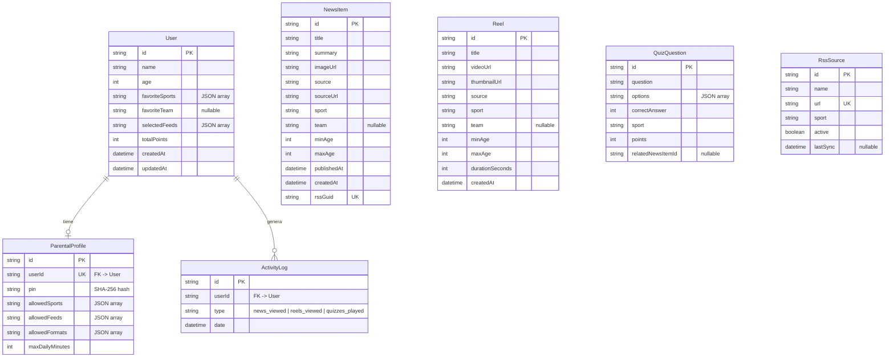

# Modelo de datos

## Diagrama entidad-relación

## Descripción de modelos

### User
Perfil del niño. Los campos `favoriteSports` y `selectedFeeds` se almacenan como JSON strings en SQLite (Prisma no soporta arrays nativos en SQLite).

### NewsItem
Artículo agregado desde un feed RSS. El campo `rssGuid` es único y se usa para evitar duplicados al re-sincronizar. El deporte viene de la fuente, el equipo se detecta por keywords.

### Reel
Vídeo corto deportivo. En el MVP se cargan desde un seed con URLs de YouTube embebidas. El campo `videoUrl` contiene la URL de embed.

### QuizQuestion
Pregunta de trivia deportiva con 4 opciones. `correctAnswer` es el índice (0-3) de la opción correcta. `options` es un JSON array de strings.

### ParentalProfile
Configuración del control parental, vinculada 1:1 con User. El PIN se almacena como hash SHA-256. `allowedFormats` controla qué secciones de la app son visibles.

### ActivityLog
Evento de tracking. Cada vez que el niño ve una noticia, un reel o juega un quiz, se crea un registro con el tipo correspondiente (`news_viewed`, `reels_viewed`, `quizzes_played`). Se usa para el resumen semanal del panel parental.

### RssSource
Feed RSS que el agregador consume periódicamente. Se puede activar/desactivar sin borrar.

## Valores de deporte

Los valores de deporte en la base de datos son en inglés:

| Valor | Descripción |
|-------|-------------|
| `football` | Fútbol |
| `basketball` | Baloncesto |
| `tennis` | Tenis |
| `swimming` | Natación |
| `athletics` | Atletismo |
| `cycling` | Ciclismo |
| `formula1` | Fórmula 1 |
| `padel` | Pádel |

## Notas sobre i18n

Los nombres de modelos y campos están en inglés en el código y la base de datos. Para mostrar textos al usuario en su idioma, se usa la función `t(key, locale)` del módulo `@sportykids/shared/i18n`. Por ejemplo, el valor `football` se traduce a "Fútbol" en español mediante `t('sports.football', 'es')`.

## Notas sobre SQLite

- Los campos tipo array se almacenan como `String` con JSON serializado
- La API parsea/serializa automáticamente en las respuestas
- Para producción, migrar a PostgreSQL y usar arrays nativos de Prisma
