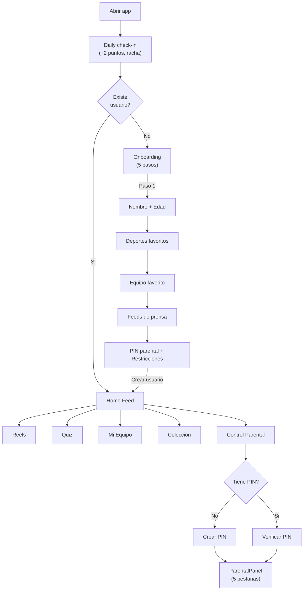
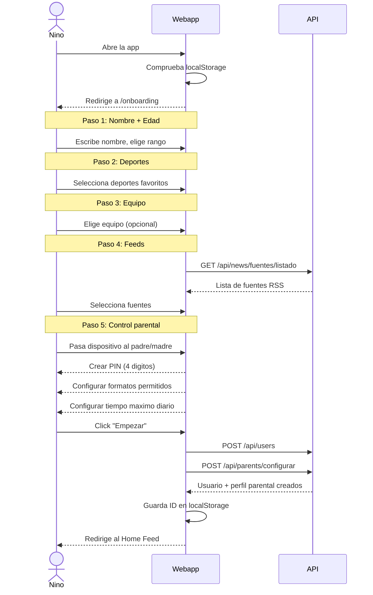
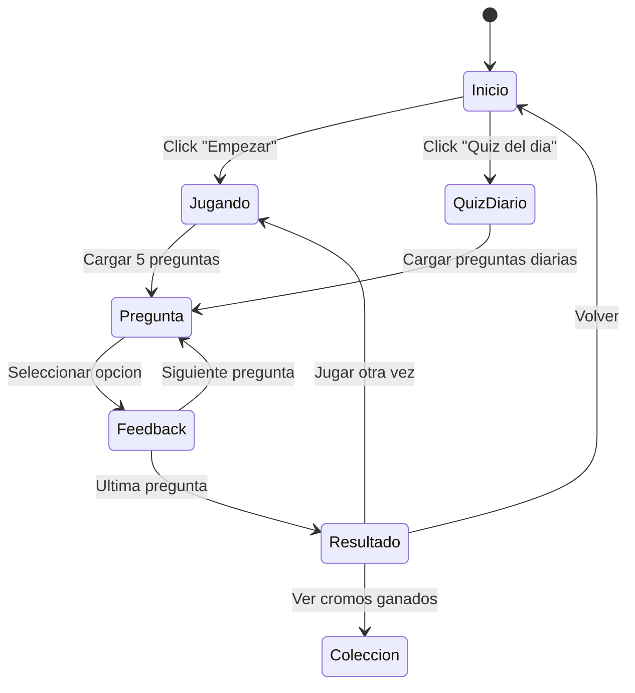
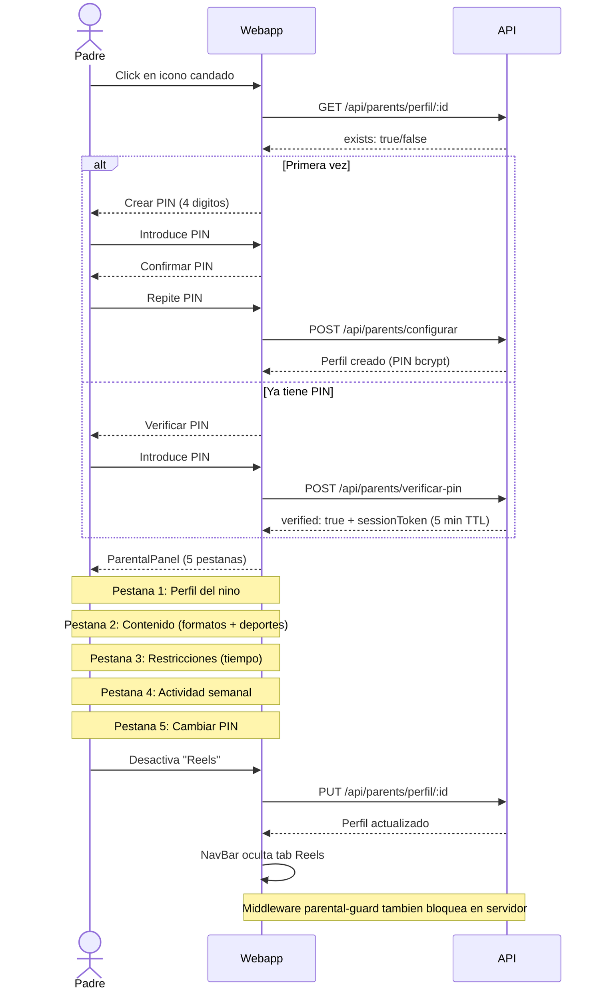

# Flujos de usuario

## Diagrama general de navegacion



## 1. Onboarding (5 pasos)

El onboarding es un wizard de 5 pasos que se muestra la primera vez que se abre la app.



### Paso 5 detallado (Control parental en onboarding)

El quinto paso permite a los padres configurar las restricciones desde el inicio:
- Introducir PIN de 4 digitos + confirmacion
- Seleccionar formatos permitidos (noticias, reels, quiz)
- Seleccionar deportes permitidos
- Establecer tiempo maximo diario (15-120 minutos)
- Este paso es opcional: se puede omitir y configurar despues

## 2. Home Feed

El feed principal muestra noticias deportivas reales filtradas y ordenadas por el **feed ranker**.

- **Ranking personalizado**: noticias del equipo favorito aparecen primero (+5), seguidas por deportes favoritos (+3)
- **3 modos de vista**:
  - **Headlines**: solo titulares compactos
  - **Cards**: tarjeta completa con imagen, resumen, fuente
  - **Explain**: tarjeta + boton "Explica facil" para resumen adaptado por edad
- **Filtros**: chips de deportes (componente `FiltersBar`) + selector de rango de edad
- **Tarjetas**: imagen, titular, resumen, fuente, fecha, badge de deporte/equipo (componente `NewsCard`)
- **Boton "Explica facil"**: abre `AgeAdaptedSummary` con resumen generado por IA para la edad del nino
- **Paginacion**: boton "Cargar mas" al final
- **Personalizacion**: filtra automaticamente por la edad del usuario
- **Gamificacion**: +5 puntos al ver una noticia

## 3. Reels

Feed de videos cortos con layout de grid y miniaturas de YouTube.

- **Layout grid**: miniaturas con preview, titulo y deporte
- **Formato**: video embebido (YouTube) o nativo
- **Filtros**: chips de deportes (`FiltersBar`)
- **Info**: titulo, deporte, equipo, duracion, fuente
- **Interacciones**: like y share (iconos)
- **Gamificacion**: +3 puntos al ver un reel

## 4. Quiz

Juego de trivia deportiva con quiz diario generado por IA.



- **Pantalla de inicio**: puntuacion total + boton empezar + boton quiz diario
- **Quiz diario**: generado automaticamente a las 06:00 UTC con preguntas basadas en noticias recientes
- **Juego**: 5 preguntas aleatorias (o diarias), 4 opciones cada una
- **Adaptacion por edad**: preguntas filtradas por `ageRange` del usuario
- **Feedback**: inmediato (verde = correcto, rojo = incorrecto)
- **Resultado**: puntos ganados + puntuacion total acumulada + cromos nuevos
- **Gamificacion**: +10 puntos por respuesta correcta, +50 bonus por quiz perfecto (5/5)
- **Fallback**: si la IA no esta disponible, usa preguntas del seed

## 5. Mi Equipo (`/team`)

Seccion dedicada al equipo favorito del usuario con estadisticas en vivo.

- **Tarjeta de estadisticas** (`TeamStats`): victorias, empates, derrotas, posicion, goleador, proximo partido
- **Feed filtrado**: noticias que mencionan al equipo
- **Cambiar equipo**: selector con lista de equipos conocidos (constante `TEAMS`)
- **Sin equipo**: muestra selector para elegir uno
- **Datos**: via `GET /api/teams/:name/stats` (15 equipos con datos seed)

## 6. Coleccion (`/collection`)

Pagina de cromos y logros del usuario.

```
┌─────────────────────────────────────────┐
│  Mi Coleccion          12/36 cromos     │
├─────────────────────────────────────────┤
│  [Filtros por deporte]                  │
│                                         │
│  ┌──────┐  ┌──────┐  ┌──────┐          │
│  │ ⚽   │  │ 🏀   │  │ 🎾   │          │
│  │ Bota │  │ Mate │  │ ???  │  ...      │
│  │ Oro  │  │ Epico│  │      │          │
│  └──────┘  └──────┘  └──────┘          │
│                                         │
│  Logros                    8/20         │
│  ┌─────────────────────────────────┐    │
│  │ ✓ Racha de 3 dias              │    │
│  │ ✓ 100 puntos                   │    │
│  │ □ Leer 5 deportes distintos    │    │
│  └─────────────────────────────────┘    │
└─────────────────────────────────────────┘
```

- **Grid de cromos**: filtrable por deporte, muestra desbloqueados vs bloqueados
- **Rarezas**: common, rare, epic, legendary (con indicador visual)
- **Logros**: lista con progreso, desbloqueados marcados
- **Estadisticas**: total coleccionado, racha actual, puntos

## 7. Control Parental (`/parents`)

Acceso protegido por PIN con sesiones temporales. Componente: `ParentalPanel` (web, 5 pestanas) / `ParentalControl` (mobile).



### Panel parental (5 pestanas):

| Pestana | Descripcion |
|---------|-------------|
| **Perfil** | Informacion del nino: nombre, edad, deportes favoritos |
| **Contenido** | Toggles de formatos (noticias/reels/quiz) + deportes permitidos |
| **Restricciones** | Tiempo maximo diario (15-120 min) con barra visual |
| **Actividad** | Resumen semanal: contadores, minutos por dia, desglose por deporte |
| **PIN** | Cambiar PIN de acceso |

### Enforcement server-side (parental-guard middleware)

Las restricciones parentales se aplican en **dos niveles**:
1. **Frontend**: oculta tabs y opciones bloqueadas
2. **Backend**: middleware `parental-guard.ts` en rutas de news, reels y quiz
   - Verifica formato permitido (403 si bloqueado)
   - Filtra deportes no permitidos
   - Verifica tiempo diario (429 si excedido)

### Tracking de actividad con duracion

El frontend envia la duracion de cada sesion usando `sendBeacon` al cerrar/navegar:
```
POST /api/parents/actividad/registrar
{ userId, type, durationSeconds, contentId, sport }
```

Esto permite al panel parental mostrar:
- Minutos totales por dia
- Desglose por deporte
- Contenido mas consumido
