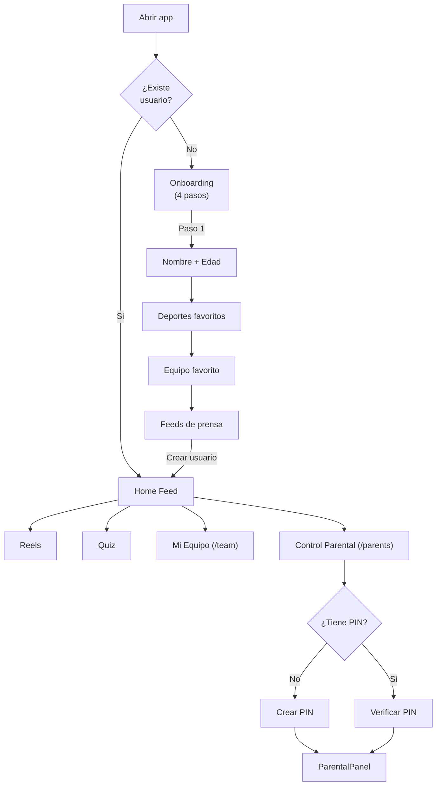
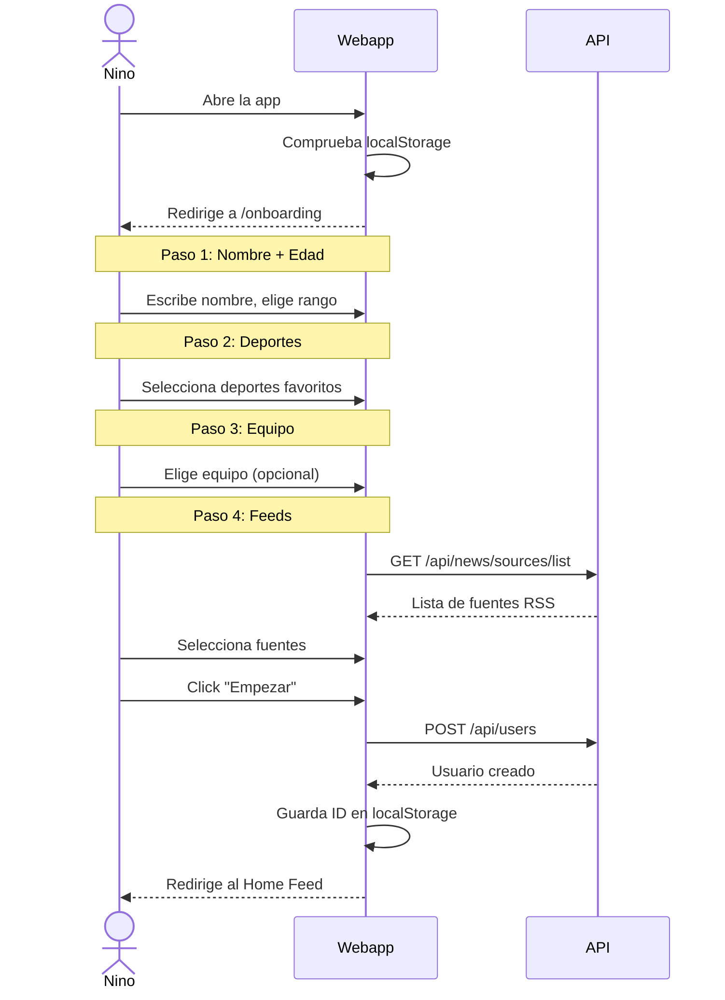
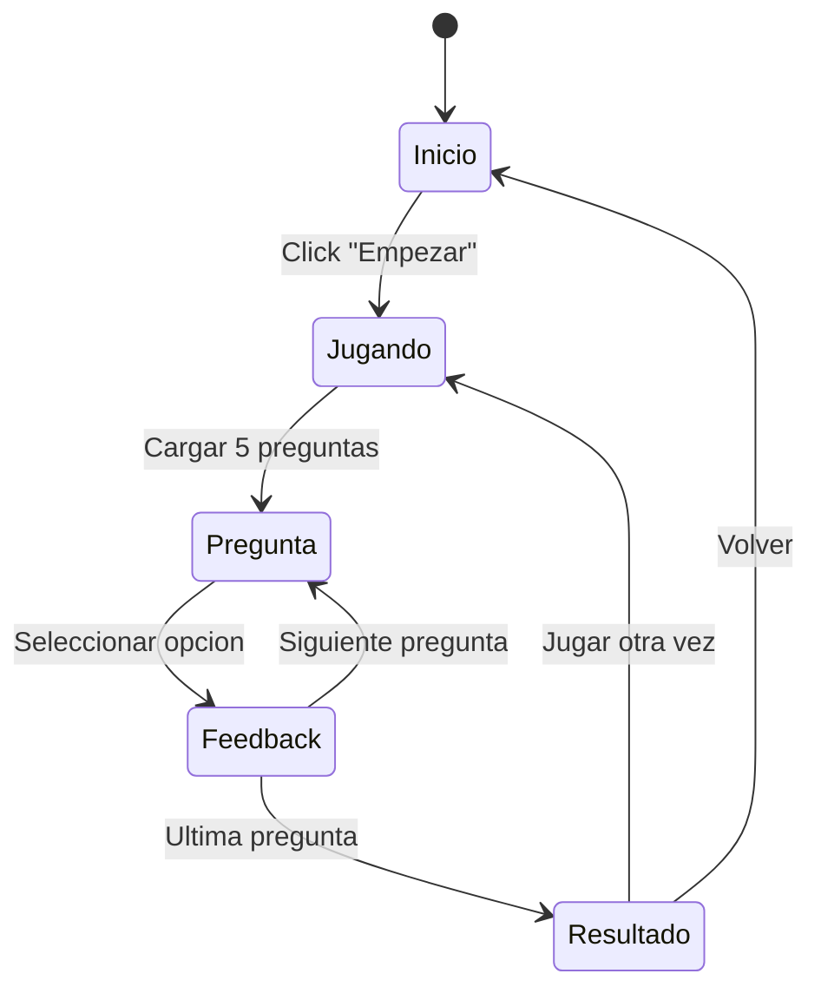
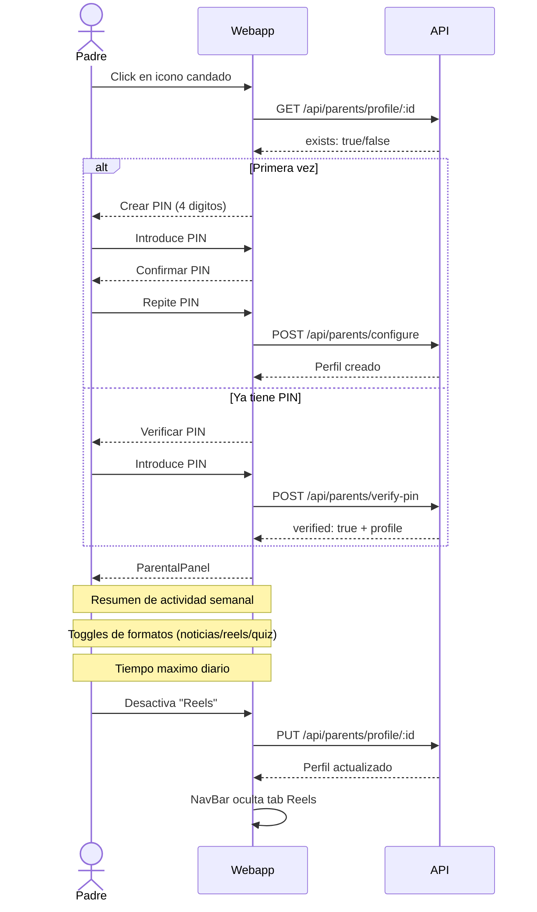

# Flujos de usuario

## Diagrama general de navegacion

## 1. Onboarding

El onboarding es un wizard de 4 pasos que se muestra la primera vez que se abre la app.

## 2. Home Feed

El feed principal muestra noticias deportivas reales filtradas por preferencias.

- **Filtros**: chips de deportes (componente `FiltersBar`) + selector de rango de edad
- **Tarjetas**: imagen, titular, resumen, fuente, fecha, badge de deporte/equipo (componente `NewsCard`)
- **Paginacion**: boton "Cargar mas" al final
- **Personalizacion**: filtra automaticamente por la edad del usuario

## 3. Reels

Feed vertical de videos cortos con scroll snap.

- **Formato**: un video por pantalla (estilo TikTok/Instagram Reels)
- **Filtros**: chips de deportes (`FiltersBar`)
- **Info**: titulo, deporte, equipo, duracion, fuente
- **Reproduccion**: iframe de YouTube embebido

## 4. Quiz

Juego de trivia deportiva con sistema de puntos.

- **Pantalla de inicio**: puntuacion total + boton empezar
- **Juego**: 5 preguntas aleatorias, 4 opciones cada una
- **Feedback**: inmediato (verde = correcto, rojo = incorrecto)
- **Resultado**: puntos ganados + puntuacion total acumulada

## 5. Mi Equipo (`/team`)

Seccion dedicada al equipo favorito del usuario. Componente: `FavoriteTeam` (mobile).

- **Feed filtrado**: noticias que mencionan al equipo
- **Cambiar equipo**: selector con lista de equipos conocidos (constante `TEAMS`)
- **Sin equipo**: muestra selector para elegir uno

## 6. Control Parental (`/parents`)

Acceso protegido por PIN para los padres. Componente: `ParentalPanel` (web) / `ParentalControl` (mobile).

### Panel parental incluye:

| Seccion | Descripcion |
|---------|-------------|
| **Actividad semanal** | Contadores: `news_viewed`, `reels_viewed`, `quizzes_played`, puntos |
| **Formatos permitidos** | Toggles para activar/desactivar noticias, reels, quiz |
| **Tiempo maximo** | Selector de minutos por dia (15, 30, 45, 60, 90, 120) |
