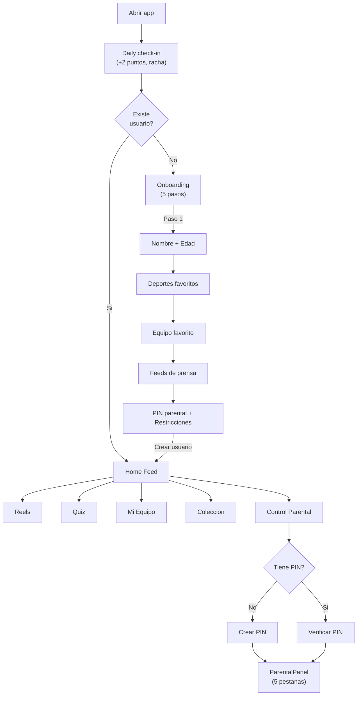
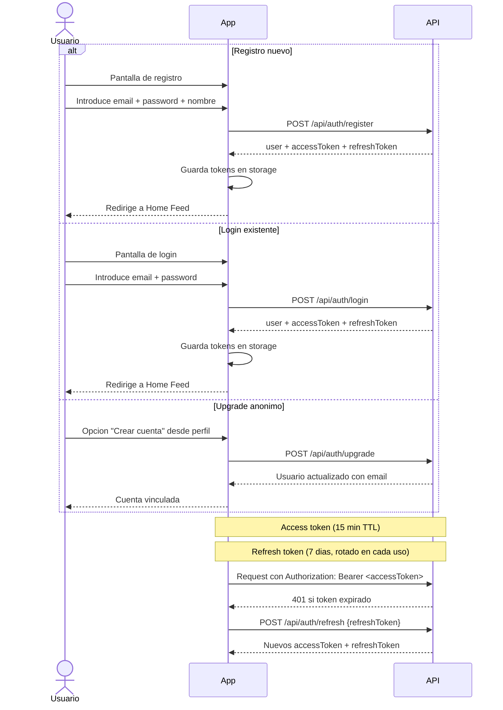
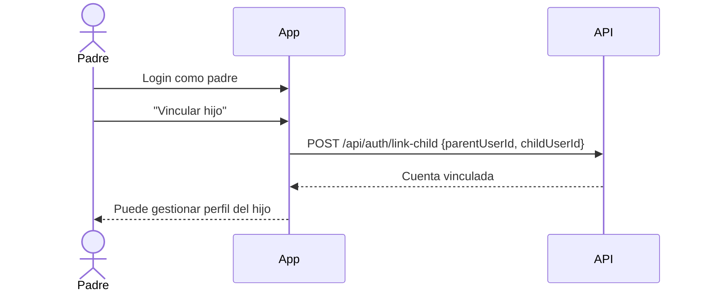
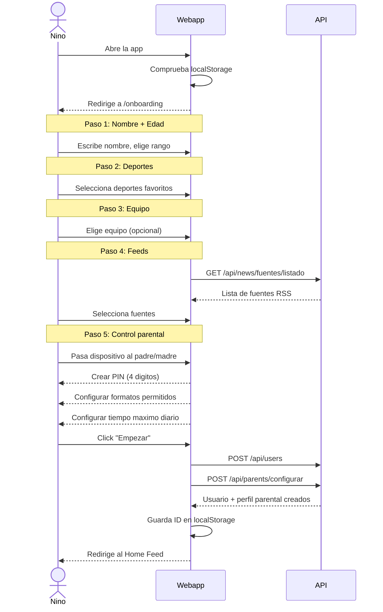
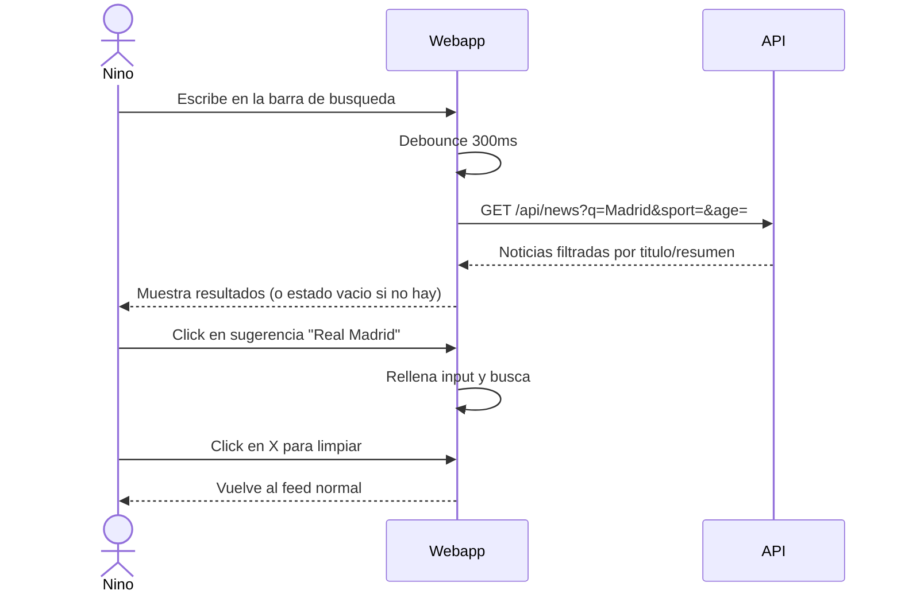
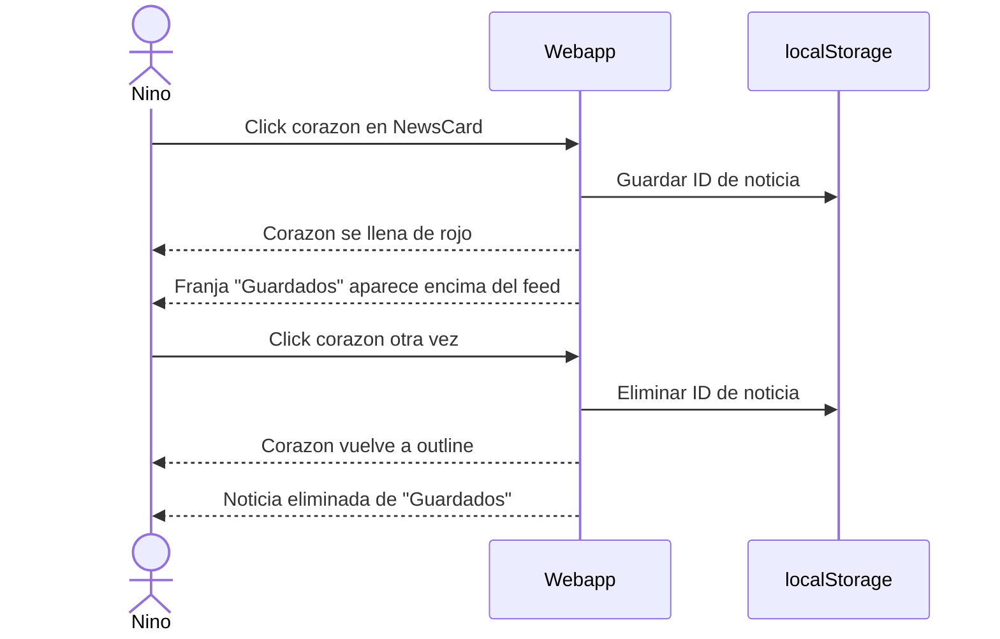
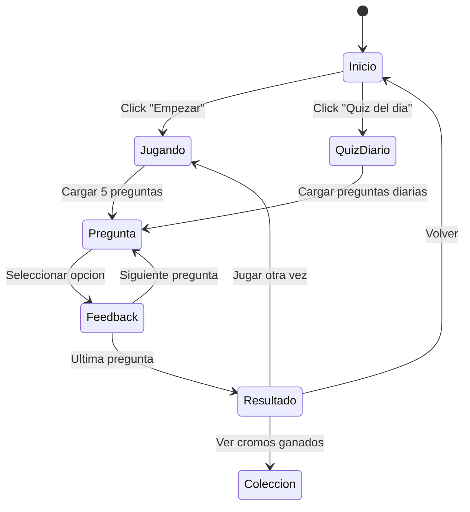
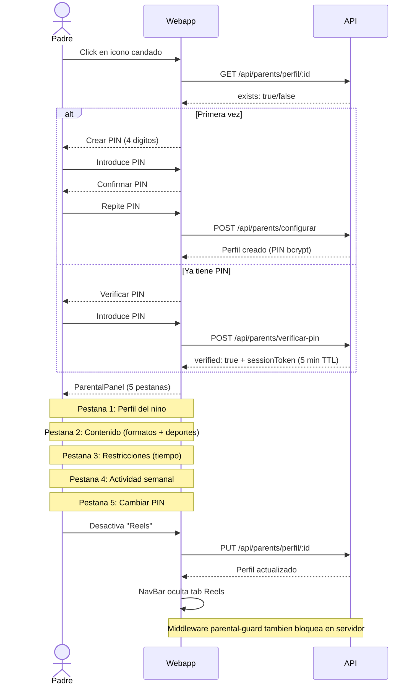
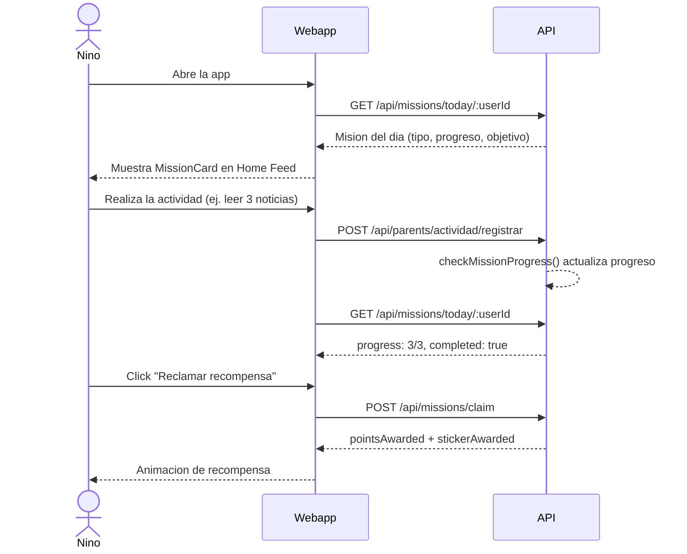
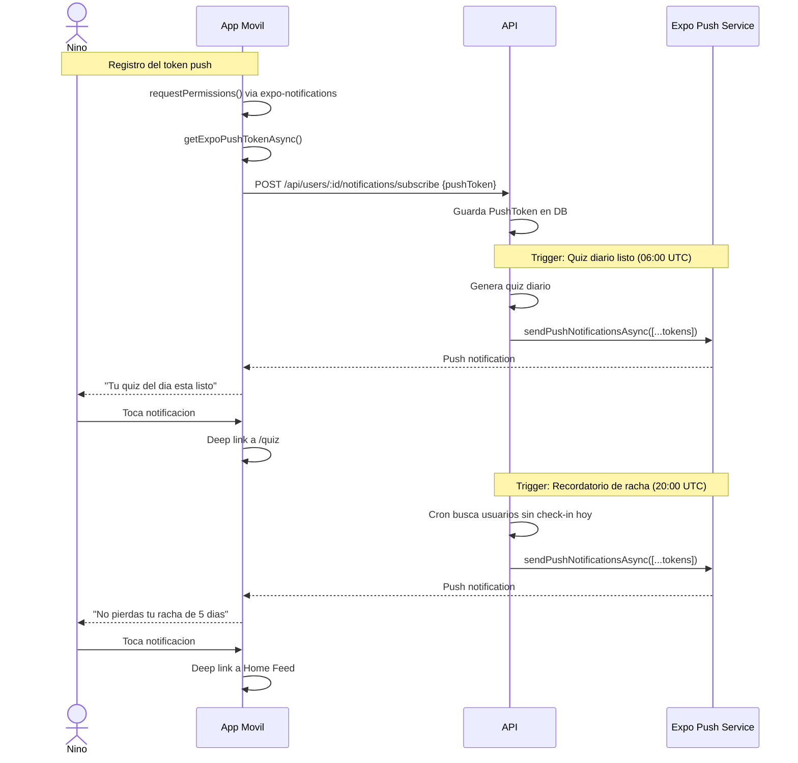

# Flujos de usuario

## Diagrama general de navegacion



## 1. Autenticacion (Login / Registro)

El sistema soporta autenticacion JWT con email/password, manteniendo compatibilidad con usuarios anonimos.



### Vinculacion padre-hijo



- Los roles disponibles son `child` y `parent`
- El middleware de auth es **no bloqueante**: las rutas funcionan con y sin token
- Los tokens se almacenan en `SecureStore` (mobile) / `localStorage` (web)

---

## 2. Onboarding (5 pasos)

El onboarding es un wizard de 5 pasos que se muestra la primera vez que se abre la app.



### Paso 5 detallado (Control parental en onboarding)

El quinto paso permite a los padres configurar las restricciones desde el inicio:
- Introducir PIN de 4 digitos + confirmacion
- Seleccionar formatos permitidos (noticias, reels, quiz)
- Seleccionar deportes permitidos
- Establecer tiempo maximo diario (15-120 minutos)
- Este paso es opcional: se puede omitir y configurar despues

## 3. Home Feed

El feed principal muestra noticias deportivas reales filtradas y ordenadas por el **feed ranker**.

- **Busqueda**: barra de busqueda con debounce (300ms) que filtra por titulo y resumen via parametro `q`. Incluye sugerencias populares (equipos/ligas) al enfocar. Durante la busqueda se oculta el selector de modo de feed.
- **Ranking personalizado**: noticias del equipo favorito aparecen primero (+5), seguidas por deportes favoritos (+3)
- **3 modos de vista**:
  - **Headlines**: solo titulares compactos
  - **Cards**: tarjeta completa con imagen, resumen, fuente
  - **Explain**: tarjeta + boton "Explica facil" para resumen adaptado por edad
- **Filtros**: chips de deportes (componente `FiltersBar`) + selector de rango de edad
- **Tarjetas**: imagen, titular, resumen, fuente, fecha, badge de deporte/equipo (componente `NewsCard`)
- **Boton "Explica facil"**: abre `AgeAdaptedSummary` con resumen generado por IA para la edad del nino
- **Paginacion**: boton "Cargar mas" al final
- **Personalizacion**: filtra automaticamente por la edad del usuario
- **Favoritos**: boton de corazon en cada tarjeta para guardar noticias. Los favoritos se persisten en localStorage (web) / AsyncStorage (mobile). Las noticias guardadas aparecen en una franja "Guardados" encima del feed.
- **Trending**: las noticias con mas de 5 visualizaciones en las ultimas 24h muestran un badge "Trending" naranja
- **Gamificacion**: +5 puntos al ver una noticia

### Flujo de busqueda



- Al escribir, se oculta el selector de modo de feed
- Las sugerencias incluyen equipos y ligas populares
- Si no hay resultados, se muestra un estado vacio con ilustracion SVG

### Flujo de favoritos



- Los favoritos se persisten entre sesiones (localStorage web, AsyncStorage mobile)
- No requiere autenticacion — almacenamiento local del cliente

## 4. Reels

Feed de videos cortos con layout de grid y miniaturas de YouTube.

- **Layout grid**: miniaturas con preview, titulo y deporte
- **Formato**: video embebido (YouTube) o nativo
- **Filtros**: chips de deportes (`FiltersBar`)
- **Info**: titulo, deporte, equipo, duracion, fuente
- **Interacciones**: like y share (iconos)
- **Gamificacion**: +3 puntos al ver un reel

## 5. Quiz

Juego de trivia deportiva con quiz diario generado por IA.



- **Pantalla de inicio**: puntuacion total + boton empezar + boton quiz diario
- **Quiz diario**: generado automaticamente a las 06:00 UTC con preguntas basadas en noticias recientes
- **Juego**: 5 preguntas aleatorias (o diarias), 4 opciones cada una
- **Adaptacion por edad**: preguntas filtradas por `ageRange` del usuario
- **Feedback**: inmediato (verde = correcto, rojo = incorrecto)
- **Resultado**: puntos ganados + puntuacion total acumulada + cromos nuevos
- **Gamificacion**: +10 puntos por respuesta correcta, +50 bonus por quiz perfecto (5/5)
- **Fallback**: si la IA no esta disponible, usa preguntas del seed

## 6. Mi Equipo (`/team`)

Seccion dedicada al equipo favorito del usuario con estadisticas en vivo.

- **Tarjeta de estadisticas** (`TeamStats`): victorias, empates, derrotas, posicion, goleador, proximo partido
- **Feed filtrado**: noticias que mencionan al equipo
- **Cambiar equipo**: selector con lista de equipos conocidos (constante `TEAMS`)
- **Sin equipo**: muestra selector para elegir uno
- **Datos**: via `GET /api/teams/:name/stats` (15 equipos con datos seed)

## 7. Coleccion (`/collection`)

Pagina de cromos y logros del usuario.

```
┌─────────────────────────────────────────┐
│  Mi Coleccion          12/36 cromos     │
├─────────────────────────────────────────┤
│  [Filtros por deporte]                  │
│                                         │
│  ┌──────┐  ┌──────┐  ┌──────┐          │
│  │ ⚽   │  │ 🏀   │  │ 🎾   │          │
│  │ Bota │  │ Mate │  │ ???  │  ...      │
│  │ Oro  │  │ Epico│  │      │          │
│  └──────┘  └──────┘  └──────┘          │
│                                         │
│  Logros                    8/20         │
│  ┌─────────────────────────────────┐    │
│  │ ✓ Racha de 3 dias              │    │
│  │ ✓ 100 puntos                   │    │
│  │ □ Leer 5 deportes distintos    │    │
│  └─────────────────────────────────┘    │
└─────────────────────────────────────────┘
```

- **Grid de cromos**: filtrable por deporte, muestra desbloqueados vs bloqueados
- **Rarezas**: common, rare, epic, legendary (con indicador visual)
- **Logros**: lista con progreso, desbloqueados marcados
- **Estadisticas**: total coleccionado, racha actual, puntos

## 8. Control Parental (`/parents`)

Acceso protegido por PIN con sesiones temporales. Componente: `ParentalPanel` (web, 5 pestanas) / `ParentalControl` (mobile).



### Panel parental (5 pestanas):

| Pestana | Descripcion |
|---------|-------------|
| **Perfil** | Informacion del nino: nombre, edad, deportes favoritos |
| **Contenido** | Toggles de formatos (noticias/reels/quiz) + deportes permitidos |
| **Restricciones** | Tiempo maximo diario (15-120 min) con barra visual |
| **Actividad** | Resumen semanal: contadores, minutos por dia, desglose por deporte |
| **PIN** | Cambiar PIN de acceso |

### Enforcement server-side (parental-guard middleware)

Las restricciones parentales se aplican en **dos niveles**:
1. **Frontend**: oculta tabs y opciones bloqueadas
2. **Backend**: middleware `parental-guard.ts` en rutas de news, reels y quiz
   - Verifica formato permitido (403 si bloqueado)
   - Filtra deportes no permitidos
   - Verifica tiempo diario (429 si excedido)

### Reporte de contenido

Los ninos pueden marcar cualquier noticia o reel como inapropiado directamente desde la tarjeta de contenido:

1. El nino pulsa el boton de reporte (icono de bandera) en una NewsCard o ReelCard
2. Selecciona una razon del dropdown (inapropiado, no es deporte, otro)
3. Opcionalmente anade un comentario
4. El reporte se envia a `POST /api/reports`
5. El padre ve los reportes pendientes en la pestana de Actividad del panel parental (`GET /api/reports/parent/:userId`)
6. El padre puede marcar el reporte como revisado o tomar accion

### Preview del feed

Los padres pueden ver exactamente lo que ve su hijo:

1. Desde el panel parental, el padre hace clic en "Ver feed del nino"
2. Se abre un modal (`FeedPreviewModal`) que muestra las noticias y reels con los filtros del hijo aplicados
3. El preview incluye las restricciones de formato, deporte y limites de tiempo vigentes
4. Datos via `GET /api/parents/preview/:userId`

### Tracking de actividad con duracion

El frontend envia la duracion de cada sesion usando `sendBeacon` al cerrar/navegar:
```
POST /api/parents/actividad/registrar
{ userId, type, durationSeconds, contentId, sport }
```

Esto permite al panel parental mostrar:
- Minutos totales por dia
- Desglose por deporte
- Contenido mas consumido

### Digest semanal

Los padres pueden activar un resumen semanal automatico con la actividad del hijo:

1. Desde el panel parental, pestana "Digest", el padre activa el digest semanal
2. Configura email de destino y dia de envio (lunes por defecto)
3. Un cron job (08:00 UTC diario) verifica que dia toca enviar a cada usuario
4. El digest incluye: actividad semanal, deportes mas vistos, logros desbloqueados, racha
5. Se puede previsualizar en JSON (`GET /api/parents/digest/:userId/preview`) o descargar como PDF (`GET /api/parents/digest/:userId/download`)

## 9. Mision diaria

Cada dia el nino recibe una mision personalizada que incentiva el uso de la app.



- **Generacion**: cron diario a las 05:00 UTC o bajo demanda al consultar
- **Tipos**: `read_news`, `watch_reels`, `play_quiz`, `check_in`, `explore_sports`
- **Recompensas**: puntos + posible sticker (rareza variable segun dificultad)
- **3 estados**: en progreso, completada (sin reclamar), reclamada

## 10. Dark mode

El usuario puede alternar entre tema claro, oscuro o automatico (sistema).

1. El toggle esta en la NavBar (web), cicla: system -> dark -> light
2. La preferencia se guarda en `localStorage` (`sportykids-theme`)
3. Un script inline en `<head>` aplica la clase `.dark` antes del render para evitar flash
4. Si el tema es `system`, escucha cambios en `prefers-color-scheme`
5. Todas las variables CSS se adaptan automaticamente (background, text, surface, border, muted)

## 11. Push Notifications

El sistema envia notificaciones push reales a dispositivos moviles mediante Expo Push Notifications.



### 5 triggers de push

| Trigger | Cuando | Deep link |
|---------|--------|-----------|
| Quiz listo | 06:00 UTC (cron quiz diario) | `/quiz` |
| Noticia del equipo | Al sincronizar feeds | Home Feed filtrado |
| Recordatorio de racha | 20:00 UTC si no hay check-in | Home Feed |
| Cromo obtenido | Al ganar sticker | `/collection` |
| Mision lista | 05:00 UTC (cron misiones) | Home Feed |

- Las notificaciones respetan las preferencias del usuario (`dailyQuiz`, `teamNews`, `newStickers`)
- Solo se envian a dispositivos fisicos (no emuladores)
- El campo `User.locale` permite localizar el texto de las notificaciones al idioma del usuario
