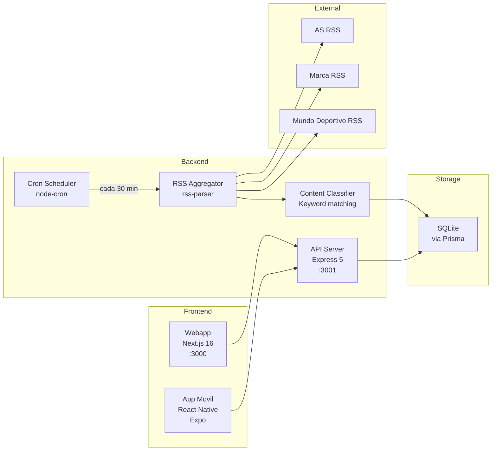

# Service Overview

## Servicios del sistema

## Descripcion de servicios

### API Server (`apps/api/src/index.ts`)
Servidor Express que expone la API REST. Punto de entrada unico para todos los clientes.

- **Puerto**: 3001 (configurable via `PORT`)
- **Middleware**: CORS, JSON parser, error handler global
- **Rutas**: `/api/news`, `/api/reels`, `/api/quiz`, `/api/users`, `/api/parents`
- **Health check**: `GET /api/health`

### Agregador RSS (`apps/api/src/services/aggregator.ts`)
Servicio que consume feeds RSS externos y los convierte en registros de la base de datos.

- **Entrada**: URLs de feeds RSS desde la tabla `RssSource`
- **Proceso**: parsea XML, extrae campos, limpia HTML, extrae imagenes
- **Salida**: registros `NewsItem` en la BD (upsert por `rssGuid` para evitar duplicados)
- **Resiliencia**: si un feed falla, continua con el siguiente

### Clasificador de contenido (`apps/api/src/services/classifier.ts`)
Etiqueta cada noticia con equipo detectado y rango de edad.

- **Deteccion de equipo**: busqueda de keywords en titulo + resumen
- **20+ equipos/deportistas**: Real Madrid, Barcelona, Alcaraz, Nadal, Alonso...
- **Rango de edad**: 6-14 anos (simplificado en MVP)

### Cron Scheduler (`apps/api/src/jobs/sync-feeds.ts`)
Job programado que ejecuta la sincronizacion de feeds.

- **Frecuencia**: cada 30 minutos (`*/30 * * * *`)
- **Primera ejecucion**: al arrancar el servidor
- **Ejecucion manual**: disponible via `POST /api/news/sync`

### Webapp (`apps/web`)
Aplicacion web Next.js con App Router.

- **Rutas**: `/` (Home), `/onboarding`, `/reels`, `/quiz`, `/team`, `/parents`, 404
- **Componentes clave**: `NewsCard`, `FiltersBar`, `ParentalPanel`
- **Estilos**: Tailwind CSS con tokens de diseno custom (variables CSS: `--color-blue`, `--color-green`, `--color-yellow`, `--color-background`, `--color-text`)
- **Estado**: React Context (`user-context`) con persistencia en localStorage
- **Tipografias**: Poppins (titulos), Inter (cuerpo)

### App Movil (`apps/mobile`)
Aplicacion React Native con Expo.

- **5 tabs**: Noticias, Reels, Quiz, Mi Equipo, Padres
- **Componentes clave**: `NewsCard`, `FiltersBar`, `FavoriteTeam`, `ParentalControl`
- **Navegacion**: React Navigation (bottom tabs + stack)
- **Estado**: React Context (`user-context`) con AsyncStorage

## Flujo de datos

```mermaid
flowchart TB
    subgraph "Ingesta (cada 30 min)"
        A["Cron trigger"] --> B["Obtener fuentes activas (RssSource)"]
        B --> C["Descargar RSS"]
        C --> D["Parsear items"]
        D --> E["Clasificar contenido (classifier.ts)"]
        E --> F["Upsert en BD (NewsItem)"]
    end

    subgraph "Servicio (por request)"
        G["Request del cliente"] --> H["Validar params (Zod)"]
        H --> I["Query Prisma con filtros"]
        I --> J["Formatear respuesta"]
        J --> K["Devolver JSON"]
    end

    subgraph "Control parental"
        L["Padre accede"] --> M["Verificar PIN"]
        M --> N["Cargar perfil (ParentalProfile)"]
        N --> O["Actualizar restricciones"]
        O --> P["Frontend oculta tabs bloqueados"]
    end
```

## Metricas clave

| Metrica | Valor actual |
|---------|-------------|
| Fuentes RSS activas | 4 (AS Football, AS Basketball, Mundo Deportivo, Marca) |
| Noticias por sincronizacion | ~160 |
| Reels en seed | 10 |
| Preguntas de quiz | 15 |
| Frecuencia de sincronizacion | 30 min |
| Tiempo de arranque API | < 2s |
| Tiempo de build webapp | < 5s |

## Variables de entorno

| Variable | Servicio | Descripcion | Default |
|----------|---------|-------------|---------|
| `DATABASE_URL` | API | URL de conexion SQLite/PostgreSQL | `file:./dev.db` |
| `PORT` | API | Puerto del servidor | `3001` |
| `NODE_ENV` | API | Entorno de ejecucion | `development` |
| `NEXT_PUBLIC_API_URL` | Web | URL base de la API | `http://localhost:3001/api` |
