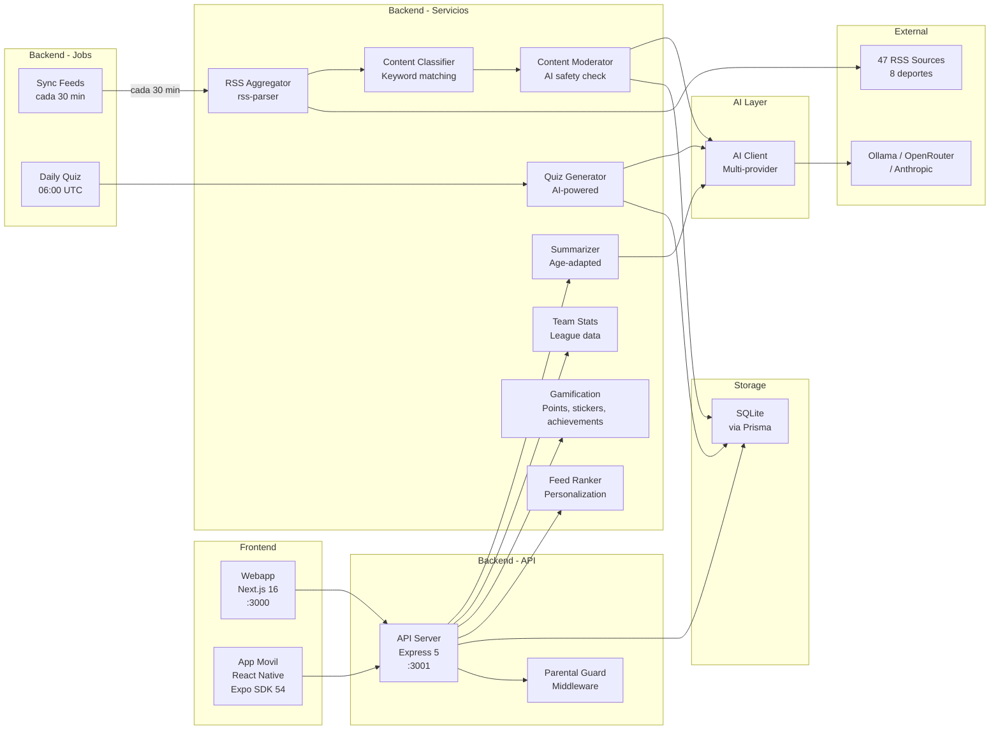

# Service Overview

## Servicios del sistema

## Descripcion de servicios

### API Server (`apps/api/src/index.ts`)
Servidor Express que expone la API REST. Punto de entrada unico para todos los clientes.

- **Puerto**: 3001 (configurable via `PORT`)
- **Middleware**: CORS, JSON parser, rate limiting (`express-rate-limit`, 5 niveles), error handler global, parental-guard
- **Rutas**: `/api/news`, `/api/reels`, `/api/quiz`, `/api/users`, `/api/parents`, `/api/gamification`, `/api/teams`
- **Health check**: `GET /api/health` (incluye estado del proveedor AI)

### AI Client (`apps/api/src/services/ai-client.ts`)
Cliente multi-proveedor que abstrae la comunicacion con modelos de lenguaje.

- **Proveedores soportados**: Ollama (default, gratis), OpenRouter, Anthropic Claude
- **Configuracion**: via variable de entorno `AI_PROVIDER`
- **Metodos**: `complete(prompt)`, `isAvailable()`, `getProviderName()`
- **Fail-open**: si el proveedor no esta disponible, los servicios dependientes operan en modo degradado
- **Health check**: `/api/health` reporta disponibilidad del proveedor

### Content Moderator (`apps/api/src/services/content-moderator.ts`)
Clasifica noticias como seguras o no seguras para ninos usando IA.

- **Entrada**: titulo y resumen de una noticia
- **Salida**: `approved` o `rejected` (campo `safetyStatus` en NewsItem)
- **Modo fail-open**: si la IA no esta disponible, aprueba automaticamente (todo el contenido viene de fuentes verificadas)
- **Ejecutado**: durante la sincronizacion de feeds (pipeline aggregator -> classifier -> moderator)

### Summarizer (`apps/api/src/services/summarizer.ts`)
Genera resumenes de noticias adaptados por edad.

- **3 perfiles de edad**:
  - `6-8`: vocabulario simple, frases cortas, tono entusiasta
  - `9-11`: lenguaje intermedio, contexto basico
  - `12-14`: lenguaje completo, datos y estadisticas
- **Entrada**: noticia + rango de edad + locale
- **Salida**: texto de resumen almacenado en modelo `NewsSummary`
- **Cache**: unico por `newsItemId` + `ageRange` + `locale` (no regenera si ya existe)
- **Endpoint**: `GET /api/news/:id/resumen?age=&locale=`

### Quiz Generator (`apps/api/src/services/quiz-generator.ts`)
Crea preguntas de trivia a partir de noticias recientes usando IA.

- **Entrada**: noticias recientes, deporte, rango de edad
- **Salida**: preguntas `QuizQuestion` con 4 opciones y respuesta correcta
- **Quiz diario**: generado automaticamente a las 06:00 UTC por `generate-daily-quiz.ts`
- **Round-robin**: alterna deportes para variedad
- **Fallback**: si la IA falla, se usan preguntas del seed
- **Endpoint manual**: `POST /api/quiz/generate`

### Gamification (`apps/api/src/services/gamification.ts`)
Gestiona puntos, rachas, cromos y logros.

- **Sistema de puntos**:
  - +5 por ver una noticia
  - +3 por ver un reel
  - +10 por respuesta correcta en quiz
  - +50 bonus por quiz perfecto (5/5)
  - +2 por check-in diario
- **Rachas**: dias consecutivos de actividad (campo `streak` en User)
- **Cromos**: 36 stickers, otorgados al alcanzar hitos (puntos, rachas, quiz)
- **Logros**: 20 achievements con evaluacion automatica de criterios
- **Evaluacion**: se ejecuta tras cada accion significativa del usuario

### Feed Ranker (`apps/api/src/services/feed-ranker.ts`)
Personaliza el orden del feed de noticias para cada usuario.

- **Scoring base**: +5 equipo favorito, +3 deporte favorito
- **Filtrado**: excluye deportes no seguidos por el usuario
- **Scoring behavioral** (cuando el usuario tiene historial de actividad):
  - `sportFrequencyBoost` — proporcional a la frecuencia de engagement (escala 0-5)
  - `sourceBoost` — afinidad con fuentes leidas (escala 0-2)
  - `recencyDecay` — curva exponencial con half-life de 12h (escala 0-3)
  - `-8` penalizacion por articulos ya leidos (sin peso configurable)
  - `+2` match de idioma/locale, `+1` match de pais
- **Diversity injection**: cada 5ta posicion intercambia deporte dominante (>40% engagement) con deporte no dominante para evitar burbujas de filtro
- **Pesos configurables**: constante `RANKING_WEIGHTS` controla la importancia relativa de cada signal (todos default 1.0)
- **Cache invalidation**: `invalidateBehavioralCache(userId)` evicta signals stale al registrar nueva actividad (TTL de 5 min como fallback)
- **3 modos de vista**: Headlines, Cards, Explain
- **Ejecutado**: al servir `GET /api/news` con `userId`

### Team Stats (`apps/api/src/services/team-stats.ts`)
Gestiona estadisticas de equipos deportivos.

- **15 equipos** en seed (Real Madrid, Barcelona, Atletico, etc.)
- **Datos**: victorias, empates, derrotas, posicion, goleador, proximo partido
- **Endpoint**: `GET /api/teams/:name/stats`

### Agregador RSS (`apps/api/src/services/aggregator.ts`)
Servicio que consume feeds RSS externos y los convierte en registros de la base de datos.

- **Entrada**: URLs de feeds RSS desde la tabla `RssSource` (47 fuentes, 8 deportes)
- **Proceso**: parsea XML, extrae campos, limpia HTML, extrae imagenes
- **Salida**: registros `NewsItem` en la BD (upsert por `rssGuid` para evitar duplicados)
- **Post-proceso**: pasa cada item por classifier y content-moderator
- **Fuentes custom**: los usuarios pueden anadir fuentes propias via API
- **Resiliencia**: si un feed falla, continua con el siguiente

### Agregador de Video (`apps/api/src/services/video-aggregator.ts`)
Servicio que consume feeds Atom de YouTube y los convierte en registros Reel.

- **Entrada**: URLs de feeds Atom desde la tabla `VideoSource` (22+ fuentes, 8 deportes)
- **Proceso**: parsea XML Atom, extrae videoId de `yt:video:...`, genera embed URL y thumbnail URL
- **Salida**: registros `Reel` en la BD (upsert por `rssGuid` para evitar duplicados)
- **Post-proceso**: pasa cada item por classifier y content-moderator
- **Helpers exportados**: `buildFeedUrl`, `extractYouTubeVideoId`, `buildEmbedUrl`, `buildThumbnailUrl`
- **Solo YouTube**: filtra fuentes cuyo `platform` empieza con `youtube_`
- **Resiliencia**: si un feed falla, continua con el siguiente; moderation fail-open

### Cron: Sync Videos (`apps/api/src/jobs/sync-videos.ts`)
Job programado que ejecuta la sincronizacion de fuentes de video.

- **Frecuencia**: cada 6 horas (`0 */6 * * *`)
- **Tambien se ejecuta**: al arrancar el servidor
- **Funcion**: `syncAllVideoSources()` -> consume feeds YouTube Atom de fuentes activas

### Clasificador de contenido (`apps/api/src/services/classifier.ts`)
Etiqueta cada noticia con equipo detectado y rango de edad.

- **Deteccion de equipo**: busqueda de keywords en titulo + resumen
- **20+ equipos/deportistas**: Real Madrid, Barcelona, Alcaraz, Nadal, Alonso...
- **Rango de edad**: 6-14 anos

### Parental Guard (`apps/api/src/middleware/parental-guard.ts`)
Middleware que enforce restricciones parentales en el servidor.

- **Rutas protegidas**: news, reels, quiz
- **Verificaciones**:
  - Formato permitido (news/reels/quiz) -> 403
  - Deporte permitido -> filtra resultados
  - Tiempo diario excedido -> 429
- **Session-aware**: valida token de sesion parental si existe

### Cron: Sync Feeds (`apps/api/src/jobs/sync-feeds.ts`)
Job programado que ejecuta la sincronizacion de feeds.

- **Frecuencia**: cada 30 minutos (`*/30 * * * *`)
- **Primera ejecucion**: al arrancar el servidor
- **Pipeline**: fetch -> parse -> classify -> moderate -> upsert
- **Ejecucion manual**: disponible via `POST /api/news/sincronizar`

### Cron: Daily Quiz (`apps/api/src/jobs/generate-daily-quiz.ts`)
Job programado que genera preguntas de quiz diarias a partir de noticias.

- **Frecuencia**: diaria a las 06:00 UTC (`0 6 * * *`)
- **Proceso**: selecciona noticias recientes, genera preguntas con IA, marca como `isDaily`
- **Round-robin**: alterna deportes para variedad
- **Fallback**: si la IA no esta disponible, no genera (se usan preguntas del seed)

### Webapp (`apps/web`)
Aplicacion web Next.js con App Router.

- **Rutas**: `/` (Home), `/onboarding`, `/reels`, `/quiz`, `/team`, `/parents`, `/collection`, 404
- **Componentes clave**: `NewsCard`, `FiltersBar`, `ParentalPanel` (5 tabs), `AgeAdaptedSummary`, `CollectionPage`, `StickerGrid`
- **Estilos**: Tailwind CSS con tokens de diseno custom
- **Estado**: React Context (`user-context`) con persistencia en localStorage
- **Tipografias**: Poppins (titulos), Inter (cuerpo)

### App Movil (`apps/mobile`)
Aplicacion React Native con Expo SDK 54.

- **6 tabs**: Noticias, Reels, Quiz, Mi Equipo, Coleccion, Padres
- **27 funciones API** en el cliente
- **Componentes clave**: `NewsCard`, `FiltersBar`, `StickerGrid`, `TeamStatsCard`
- **Daily check-in**: al abrir la app
- **5 pasos onboarding**: incluyendo PIN parental
- **Navegacion**: React Navigation (bottom tabs + stack)
- **Estado**: React Context (`user-context`) con AsyncStorage

## Flujo de datos

```mermaid
flowchart TB
    subgraph "Ingesta (cada 30 min)"
        A["Cron trigger"] --> B["Obtener fuentes activas (RssSource)"]
        B --> C["Descargar RSS (47 fuentes)"]
        C --> D["Parsear items"]
        D --> E["Clasificar contenido (classifier.ts)"]
        E --> F["Moderar contenido (content-moderator.ts)"]
        F --> G["Upsert en BD (NewsItem + safetyStatus)"]
    end

    subgraph "Quiz diario (06:00 UTC)"
        Q1["Cron trigger"] --> Q2["Seleccionar noticias recientes"]
        Q2 --> Q3["Generar preguntas (quiz-generator.ts)"]
        Q3 --> Q4["Guardar en BD (QuizQuestion, isDaily=true)"]
    end

    subgraph "Servicio (por request)"
        H["Request del cliente"] --> PG["Parental Guard middleware"]
        PG --> I["Validar params (Zod)"]
        I --> J["Feed Ranker (si userId)"]
        J --> K["Query Prisma con filtros"]
        K --> L["Formatear respuesta"]
        L --> M["Devolver JSON"]
    end

    subgraph "Gamificacion (por accion)"
        GA["Accion del usuario"] --> GB["Calcular puntos"]
        GB --> GC["Actualizar racha"]
        GC --> GD["Evaluar logros"]
        GD --> GE["Otorgar cromos"]
        GE --> GF["Devolver recompensas"]
    end

    subgraph "Control parental"
        P1["Padre accede"] --> P2["Verificar PIN (bcrypt)"]
        P2 --> P3["Crear sesion (5 min TTL)"]
        P3 --> P4["Cargar perfil (ParentalProfile)"]
        P4 --> P5["Actualizar restricciones"]
        P5 --> P6["Middleware enforce en servidor"]
    end
```

## Metricas clave

| Metrica | Valor actual |
|---------|-------------|
| Fuentes RSS activas | 47 (8 deportes) |
| Noticias por sincronizacion | ~160+ |
| Reels en seed | 10 |
| Preguntas de quiz (seed) | 15 |
| Preguntas diarias (AI) | 5/dia |
| Stickers | 36 (4 rarezas) |
| Achievements | 20 (5 categorias) |
| Equipos con stats | 15 |
| Frecuencia de sync RSS | 30 min |
| Frecuencia de quiz diario | 06:00 UTC |
| Tiempo de arranque API | < 2s |
| Tiempo de build webapp | < 5s |

## Variables de entorno

| Variable | Servicio | Descripcion | Default |
|----------|---------|-------------|---------|
| `DATABASE_URL` | API | URL de conexion SQLite/PostgreSQL | `file:./dev.db` |
| `PORT` | API | Puerto del servidor | `3001` |
| `NODE_ENV` | API | Entorno de ejecucion | `development` |
| `AI_PROVIDER` | API | Proveedor AI: `ollama`, `openrouter`, `anthropic` | `ollama` |
| `OPENROUTER_API_KEY` | API | API key de OpenRouter | — |
| `ANTHROPIC_API_KEY` | API | API key de Anthropic | — |
| `RATE_LIMIT_AUTH` | API | Limite rate auth (req/min) | `5` |
| `RATE_LIMIT_PIN` | API | Limite rate PIN (req/min) | `10` |
| `RATE_LIMIT_CONTENT` | API | Limite rate contenido (req/min) | `60` |
| `RATE_LIMIT_SYNC` | API | Limite rate sync (req/min) | `2` |
| `RATE_LIMIT_DEFAULT` | API | Limite rate default (req/min) | `100` |
| `CACHE_PROVIDER` | API | Backend de cache: `memory` o `redis` | `memory` |
| `REDIS_URL` | API | URL de conexion Redis | `redis://localhost:6379` |
| `NEXT_PUBLIC_API_URL` | Web | URL base de la API | `http://localhost:3001/api` |
