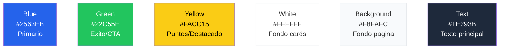

# Diseno y UX

## Identidad visual

SportyKids tiene un diseno infantil pero confiable, pensado para que los ninos lo disfruten y los padres confien. Con la incorporacion de gamificacion (cromos y logros), el diseno refuerza la motivacion y el engagement.

## Paleta de colores



| Color | Hex | Variable CSS | Uso |
|-------|-----|-------------|-----|
| Azul | `#2563EB` | `--color-blue` | Primario, enlaces activos, botones principales |
| Verde | `#22C55E` | `--color-green` | Exito, respuesta correcta, CTA secundario |
| Amarillo | `#FACC15` | `--color-yellow` | Puntuacion, destacados, cromos desbloqueados |
| Blanco | `#FFFFFF` | — | Fondo de tarjetas y componentes |
| Fondo claro | `#F8FAFC` | `--color-background` | Fondo general de la pagina |
| Texto oscuro | `#1E293B` | `--color-text` | Texto principal y titulos |

> **Nota:** Las variables CSS se renombraron de espanol a ingles (`--color-azul` -> `--color-blue`, `--color-verde` -> `--color-green`, etc.).

## Tipografia

| Fuente | Uso | Pesos |
|--------|-----|-------|
| **Poppins** | Titulos, headings, branding | 400, 500, 600, 700 |
| **Inter** | Cuerpo de texto, UI general | 400, 500, 600 |

## Componentes clave

### Pantallas de Login y Registro (mobile)

```
┌─────────────────────────────┐
│                             │
│       SportyKids            │
│       (logo)                │
│                             │
│  ┌───────────────────────┐  │
│  │  Email                │  │
│  └───────────────────────┘  │
│  ┌───────────────────────┐  │
│  │  Contrasena           │  │
│  └───────────────────────┘  │
│                             │
│  ┌─ Iniciar sesion ──────┐  │
│  └───────────────────────┘  │
│                             │
│  No tienes cuenta?          │
│  Registrate aqui            │
│                             │
│  ─── o continuar sin ───    │
│        cuenta               │
└─────────────────────────────┘
```

- Login y registro son pantallas independientes en la app movil
- Soporte para continuar como usuario anonimo (compatible con el flujo existente)
- Validacion de email y contrasena con feedback inline
- Opcion de "upgrade" desde usuario anonimo a cuenta con email

### Contador de racha en Home Feed (`StreakCounter`)

El componente `StreakCounter` se muestra en el header del Home Feed (mobile), junto al icono de configuracion.

```
┌──────────────────────────────────┐
│  SportyKids      🔥 5 dias  ⚙   │
├──────────────────────────────────┤
│  [Feed content...]               │
```

- Muestra la racha actual del usuario con icono de fuego
- Se carga al iniciar la pantalla (`GET /api/gamification/streaks/:userId`)
- Al hacer check-in, si se gana un sticker o logro, muestra un Alert nativo

### Catalogo RSS (mobile) (`RssCatalog`)

Pantalla accesible desde el icono de engranaje en el Home Feed. Permite explorar y activar/desactivar fuentes RSS por deporte.

```
┌─────────────────────────────┐
│  < Fuentes RSS               │
├─────────────────────────────┤
│  [Todos] [Futbol] [Basket]  │
│                              │
│  ┌────────────────────────┐ │
│  │ AS - Futbol        [✓] │ │
│  │ es · ES                 │ │
│  ├────────────────────────┤ │
│  │ BBC Sport          [✓] │ │
│  │ en · GB                 │ │
│  ├────────────────────────┤ │
│  │ ESPN Deportes      [ ] │ │
│  │ es · US                 │ │
│  └────────────────────────┘ │
└─────────────────────────────┘
```

- Filtros por deporte (chips horizontales)
- Toggle para activar/desactivar cada fuente
- Muestra idioma y pais de cada fuente
- Usa `GET /api/news/fuentes/catalogo` para obtener el catalogo

### Tarjeta de noticia (`NewsCard`)
```
┌─────────────────────────────┐
│  ┌───────────────────────┐  │
│  │    [Imagen]            │  │
│  │  ┌───────────┐        │  │
│  │  │ football  │        │  │
│  │  └───────────┘        │  │
│  └───────────────────────┘  │
│                             │
│  Titulo de la noticia       │
│  en dos lineas maximo       │
│                             │
│  Resumen breve del          │
│  contenido...               │
│                             │
│  AS · hace 2h  [Equipo]    │
│                             │
│  ┌────────────┐ ┌────────┐ │
│  │  Ver mas   │ │Explica │ │
│  │            │ │ facil  │ │
│  └────────────┘ └────────┘ │
└─────────────────────────────┘
```

El boton "Explica facil" abre el componente `AgeAdaptedSummary` que muestra un resumen generado por IA adaptado a la edad del nino.

Ademas, cada tarjeta incluye:
- **Boton de favorito (corazon)**: En la esquina superior derecha. Vacio/gris cuando no esta guardado, relleno/rojo (#EF4444) cuando esta guardado. Animacion de escala al pulsar. Los favoritos se guardan en localStorage (web) / AsyncStorage (mobile), sin backend.
- **Badge de tendencia**: Pill naranja con icono de fuego que aparece junto a la fecha si la noticia tiene >5 vistas en las ultimas 24h. Texto: "Tendencia" (i18n).

En el modo `headlines` (`HeadlineRow`), se muestra un corazon pequeno al final de la fila y un badge de fuego si es trending.

En la pantalla Home, si hay noticias guardadas, se muestra una **tira horizontal de guardados** (max 5 cards pequenas) debajo del buscador y encima de los filtros, con enlace "Ver todos" si hay mas de 5.

### Reel card (grid layout)
```
┌───────┐ ┌───────┐ ┌───────┐
│[thumb]│ │[thumb]│ │[thumb]│
│  ▶    │ │  ▶    │ │  ▶    │
│ 2:00  │ │ 1:30  │ │ 3:00  │
├───────┤ ├───────┤ ├───────┤
│Titulo │ │Titulo │ │Titulo │
│♥  ↗   │ │♥  ↗   │ │♥  ↗   │
└───────┘ └───────┘ └───────┘
```

Layout de grid con miniaturas de YouTube, duracion, titulo, iconos de like y share.

### Quiz
```
┌─────────────────────────────┐
│  ■ ■ ■ □ □   3/5           │
├─────────────────────────────┤
│  football · 10 pts          │
│                             │
│  Pregunta aqui?             │
│                             │
│  ┌─ A ──────────────────┐  │
│  │  Opcion 1             │  │
│  └───────────────────────┘  │
│  ┌─ B ──────────────────┐  │
│  │  Opcion 2  ✓          │  │  <- verde si correcta
│  └───────────────────────┘  │
│  ┌─ C ──────────────────┐  │
│  │  Opcion 3  ✗          │  │  <- rojo si incorrecta
│  └───────────────────────┘  │
│  ┌─ D ──────────────────┐  │
│  │  Opcion 4             │  │
│  └───────────────────────┘  │
│                             │
│  ┌─ Siguiente ──────────┐  │
│  └───────────────────────┘  │
└─────────────────────────────┘
```

### Coleccion de cromos
```
┌─────────────────────────────────┐
│  Mi Coleccion        12/36      │
├─────────────────────────────────┤
│  [Todos] [Futbol] [Basket] ... │
│                                 │
│  ┌────────┐ ┌────────┐ ┌────┐  │
│  │  ⚽    │ │  🏀    │ │ ?? │  │
│  │ Bota   │ │  Mate  │ │    │  │
│  │  Oro   │ │  Epico │ │    │  │
│  │ ★★★★  │ │ ★★★   │ │ ★  │  │
│  └────────┘ └────────┘ └────┘  │
│                                 │
│  ┌─ Logros ─────────────────┐  │
│  │ ✓ Racha de 3 dias        │  │
│  │ ✓ 100 puntos             │  │
│  │ □ 5 deportes distintos   │  │
│  │ □ Coleccionar 20 cromos  │  │
│  └───────────────────────────┘  │
└─────────────────────────────────┘
```

### Boton de reporte (`ReportButton`)
Dropdown inline en cada NewsCard y ReelCard (icono de bandera). Al pulsar, despliega un menu con razones predefinidas (inapropiado, no es deporte, otro) y un campo opcional de texto. El dropdown se cierra al enviar o al hacer clic fuera.

### Lista de reportes (`ContentReportList`)
En la pestana de Actividad del panel parental, lista los reportes enviados por el nino con fecha, tipo de contenido, razon y estado (pendiente/revisado/descartado/accionado).

### Modal de preview del feed (`FeedPreviewModal`)
Modal a pantalla completa que muestra el feed filtrado del hijo. Incluye un banner superior con las restricciones activas (formatos, deportes, limites por tipo). Se abre desde un boton "Ver feed del nino" en el panel parental.

### Tarjeta de mision diaria (`MissionCard`)
```
┌─────────────────────────────────┐
│  Mision del dia                  │
│  ┌─────────────────────────┐    │
│  │ Lector curioso           │    │
│  │ Lee 3 noticias hoy      │    │
│  │                          │    │
│  │ ██████████░░░░  2/3      │    │
│  │                          │    │
│  │ Recompensa: cromo raro   │    │
│  │ + 15 puntos              │    │
│  └─────────────────────────┘    │
│  [ Reclamar recompensa ]         │
└─────────────────────────────────┘
```

3 estados visuales:
- **En progreso**: barra de progreso animada, boton deshabilitado
- **Completada**: barra llena verde, boton "Reclamar" habilitado con brillo
- **Reclamada**: badge de check verde, recompensa mostrada, sin boton

### Pestana Digest en panel parental
En el panel parental, una pestana adicional "Digest" permite:
- Toggle para activar/desactivar el digest semanal
- Campo de email para recibir el resumen
- Selector de dia de envio (lunes por defecto)
- Boton "Previsualizar" y "Descargar PDF"

### Sliders de limites por tipo de contenido
En la pestana de Restricciones del panel parental, tres sliders independientes para limitar minutos diarios de noticias, reels y quiz. Cada slider muestra el valor actual y permite rango de 5-60 minutos (o desactivado). Se complementan con el limite global `maxDailyMinutes`.

### Panel parental (5 pestanas)
```
┌─────────────────────────────────────┐
│  Control Parental                    │
├──────┬──────┬──────┬──────┬────────┤
│Perfil│Conten│Restr.│Activ.│  PIN   │
├──────┴──────┴──────┴──────┴────────┤
│                                     │
│  Pestana activa: Actividad          │
│                                     │
│  Esta semana:                       │
│  Noticias: 12  Reels: 5  Quiz: 3   │
│  Tiempo total: 47 min               │
│                                     │
│  ┌─ Lun ─ Mar ─ Mie ─ Jue ─ Vie ┐ │
│  │  ██   ███   █    ████   ██    │ │
│  │  8m   15m   4m   20m    10m   │ │
│  └───────────────────────────────┘ │
│                                     │
│  Por deporte:                       │
│  Futbol: 60%  Basket: 25%  Tenis: 15% │
└─────────────────────────────────────┘
```

### Equipo favorito (con estadisticas)
```
┌─────────────────────────────┐
│  Real Madrid                 │
│  ┌───────────────────────┐  │
│  │  1ero en La Liga      │  │
│  │  V: 22  E: 5  D: 3   │  │
│  │  Goleador: Vinicius   │  │
│  │  Proximo: vs Barcelona│  │
│  └───────────────────────┘  │
│                             │
│  Ultimas noticias:          │
│  ┌──────────────────────┐  │
│  │ [NewsCard filtrada]   │  │
│  └──────────────────────┘  │
└─────────────────────────────┘
```

## Navegacion

### Web (NavBar horizontal)
```
┌──────────────────────────────────────────────────────────────────────┐
│ SportyKids | Noticias | Reels | Quiz | Mi Equipo | Coleccion | Padres  Pablo │
└──────────────────────────────────────────────────────────────────────┘
```

Rutas de la webapp: `/`, `/onboarding`, `/reels`, `/quiz`, `/team`, `/collection`, `/parents`

### Movil (Bottom Tabs)
```
┌──────────────────────────────────────────────────────────────┐
│  Noticias   Reels    Quiz   Mi Equipo  Coleccion   Padres    │
└──────────────────────────────────────────────────────────────┘
```

## Iconografia por deporte

| Deporte | Valor en codigo | Emoji | Color del badge |
|---------|----------------|-------|----------------|
| Futbol | `football` | ⚽ | `#22C55E` verde |
| Baloncesto | `basketball` | 🏀 | `#F97316` naranja |
| Tenis | `tennis` | 🎾 | `#FACC15` amarillo |
| Natacion | `swimming` | 🏊 | `#3B82F6` azul |
| Atletismo | `athletics` | 🏃 | `#EF4444` rojo |
| Ciclismo | `cycling` | 🚴 | `#A855F7` purpura |
| Formula 1 | `formula1` | 🏎️ | `#DC2626` rojo oscuro |
| Padel | `padel` | 🏓 | `#14B8A6` teal |

Las funciones `sportToColor()` y `sportToEmoji()` de `@sportykids/shared` devuelven el color y emoji correspondiente a cada valor de deporte.

## Modos de vista del feed

| Modo | Descripcion |
|------|-------------|
| **Headlines** | Solo titulares compactos, maximo contenido por pantalla |
| **Cards** | Tarjeta completa con imagen, resumen, fuente (default) |
| **Explain** | Cards + boton "Explica facil" para resumen adaptado por edad |

## Animaciones de celebracion

Los eventos de gamificacion disparan animaciones de confeti via `canvas-confetti` (utilidad: `apps/web/src/lib/celebrations.ts`). Todas las animaciones respetan `prefers-reduced-motion`.

| Evento | Animacion | Disparador |
|--------|-----------|------------|
| Cromo obtenido | Explosion de confeti (azul/verde/amarillo) | `RewardToast` al montar con tipo `sticker` |
| Logro desbloqueado | Explosion de confeti bilateral | `RewardToast` al montar con tipo `achievement` |
| Hito de racha (7/14/30 dias) | Confeti color fuego | Check-in diario en `UserProvider` |
| Quiz perfecto | Explosion sostenida de estrellas (1.5s) | Todas las preguntas correctas en `QuizGame` |

El componente `RewardToast` tambien incluye animaciones CSS:
- **toast-enter**: deslizamiento desde abajo (0.4s)
- **toast-glow**: brillo pulsante para toasts de cromos (1s, se repite 2 veces)
- **toast-shake**: sacudida horizontal para toasts de logros (0.4s)

## Responsive

- **Mobile-first**: diseno base para pantallas < 640px
- **Tablet**: grid de 2 columnas (sm: 640px+)
- **Desktop**: grid de 3 columnas (lg: 1024px+)
- **Max width**: 1152px (max-w-6xl)

## Accesibilidad

- Contraste de colores WCAG AA
- Textos legibles: minimo 13px para body, 16px+ para titulos
- Botones con area minima de toque de 44x44px en movil
- Etiquetas semanticas HTML (article, nav, main, h1-h3)
- Esquinas redondeadas (border-radius: 12-24px) para apariencia amigable

## Internacionalizacion

Todos los textos visibles en la UI se gestionan a traves del sistema i18n (`packages/shared/src/i18n/`). Esto incluye:

- Nombres de deportes (ej. `football` -> "Futbol" en espanol)
- Etiquetas de navegacion
- Textos de botones y formularios
- Mensajes de error y feedback
- Nombres de logros y cromos
- Descripciones de rarezas

Los valores de deporte en el codigo son en ingles (`football`, `basketball`, etc.) y se traducen al idioma del usuario mediante `t('sports.football', locale)`.

## Dark mode

La webapp soporta 3 modos de tema: `system` (por defecto), `light`, `dark`.

### Variables CSS

| Variable | Light | Dark |
|----------|-------|------|
| `--color-background` | `#F8FAFC` | `#0F172A` |
| `--color-text` | `#1E293B` | `#F1F5F9` |
| `--color-surface` | `#FFFFFF` | `#1E293B` |
| `--color-border` | `#E5E7EB` | `#334155` |
| `--color-muted` | `#6B7280` | `#94A3B8` |

### Implementacion
- La clase `.dark` en `<html>` activa los tokens oscuros
- Toggle en NavBar: icono sol/luna que cicla system -> dark -> light
- Preferencia en `localStorage` (`sportykids-theme`)
- Script inline en `layout.tsx` previene flash de tema incorrecto al cargar
- `UserContext` expone `theme`, `setTheme`, `resolvedTheme`
- Escucha cambios de `prefers-color-scheme` en modo system

## Accesibilidad (a11y)

La webapp web incluye atributos ARIA en todos los elementos interactivos para compatibilidad con lectores de pantalla:

- **Navegacion**: `aria-label` en nav principal, enlaces de control parental, toggle de tema e idioma
- **Filtros**: `role="tablist"` + `role="tab"` + `aria-selected` en filtros de deporte y edad (FiltersBar)
- **Busqueda**: `aria-label` en input de busqueda y boton de limpiar (SearchBar)
- **PIN**: Cada digito tiene `aria-label="Digit N of 4"` (PinInput)
- **Quiz**: Botones de respuesta con `aria-label` descriptivo, feedback con `role="status"` (QuizGame)
- **Panel parental**: Pestanas con `role="tablist"`/`role="tab"`/`aria-selected`, formatos con `role="switch"`/`aria-checked`, sliders con `aria-valuenow/min/max` (ParentalPanel)
- **Onboarding**: Seleccion de deportes, edades y equipos con `aria-pressed` (OnboardingWizard)
- **Feed**: Botones de modo con `aria-pressed` en grupo `role="group"` (FeedModeToggle)
- **Modales**: `role="dialog"` + `aria-modal="true"` (FeedPreviewModal)
- **Alertas**: `role="alert"` en errores (ErrorState), offline (OfflineBanner), toasts (RewardToast)
- **Contenido**: Stickers y logros con `aria-label` indicando nombre/rareza/estado
- **Progreso**: Barras de progreso con `role="progressbar"` + `aria-valuenow/min/max` (MissionCard)
- **Notificaciones**: Toggle con `role="switch"` + `aria-checked` (NotificationSettings)
- **Age gate**: Botones de opcion y checkboxes de consentimiento con `aria-label` descriptivo
- **Video**: Controles con `aria-label`, iframes con `title` (VideoPlayer, ReelCard)

Las aria-labels estan en ingles (contexto para screen readers, no UI visible). Total: ~66 atributos `aria-label` en 25+ componentes.

### Accesibilidad Movil (React Native)

La app movil (React Native + Expo) incluye props de accesibilidad en todos los elementos interactivos para VoiceOver (iOS) y TalkBack (Android):

- **Claves i18n a11y**: Namespace `a11y.*` en `packages/shared/src/i18n/{es,en}.json` con 21 subcategorias y ~100+ labels localizados
- **Pestanas de navegacion**: `tabBarAccessibilityLabel` en las 6 pestanas (Noticias, Reels, Quiz, Coleccion, Mi Equipo, Padres)
- **Toggle de idioma**: `accessibilityLabel` con nombre del idioma destino, `accessibilityRole="button"`
- **NewsCard**: Guardar/quitar con `accessibilityState.selected`, enlaces con `accessibilityRole="link"`, badge trending con label
- **FiltersBar**: Chips de deporte con `accessibilityState.selected` y nombres localizados
- **Quiz**: Opciones de respuesta con labels dinamicos correcto/incorrecto, botones start/next con role y state
- **Reels**: Botones play/like/share con labels, filtros de deporte con estado seleccionado
- **Collection**: Tabs con `accessibilityRole="tab"`, stickers con nombre/rareza, logros con estado bloqueado/desbloqueado
- **Control Parental**: Botones PIN verify/setup, pestanas con `accessibilityRole="tab"`, formatos con `accessibilityRole="switch"`
- **AgeGate**: Opciones (adulto/adolescente/menor) con labels, checkboxes con `accessibilityRole="checkbox"` y `accessibilityState.checked`
- **Onboarding**: Seleccionar/deseleccionar deporte con labels dinamicos, seleccion de equipo, navegacion con back/next
- **Auth (Login/Register)**: Campos con `accessibilityLabel`, botones sociales, seleccion de rol con estado
- **RssCatalog**: Switches de fuentes con `accessibilityRole="switch"` y nombres de fuente
- **ErrorState/ErrorBoundary**: `accessibilityRole="alert"` en contenedores de error, emojis con texto alternativo, boton reiniciar con label
- **OfflineBanner**: `accessibilityRole="alert"` para anuncio a lectores de pantalla
- **LimitReached/ScheduleLockGuard**: Roles de alerta con labels descriptivos
- **StreakCounter**: Contador con label "{days} dias de racha", emoji fuego con texto alternativo
- **Shimmer**: Label de carga via `t('a11y.common.loading')`
- **MissionCard**: Boton reclamar con role/state, progreso con label descriptivo

Todos los labels moviles usan `t('a11y.*', locale)` de `@sportykids/shared` para soporte i18n completo. Los tests verifican la presencia de atributos a11y clave.
