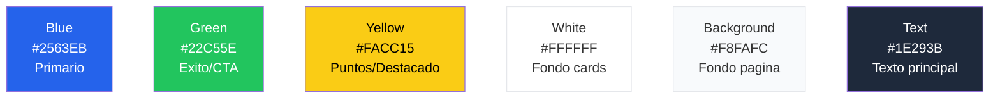

# Diseno y UX

## Identidad visual

SportyKids tiene un diseno infantil pero confiable, pensado para que los ninos lo disfruten y los padres confien.

## Paleta de colores



| Color | Hex | Variable CSS | Uso |
|-------|-----|-------------|-----|
| Azul | `#2563EB` | `--color-blue` | Primario, enlaces activos, botones principales |
| Verde | `#22C55E` | `--color-green` | Exito, respuesta correcta, CTA secundario |
| Amarillo | `#FACC15` | `--color-yellow` | Puntuacion, destacados, fuentes seleccionadas |
| Blanco | `#FFFFFF` | — | Fondo de tarjetas y componentes |
| Fondo claro | `#F8FAFC` | `--color-background` | Fondo general de la pagina |
| Texto oscuro | `#1E293B` | `--color-text` | Texto principal y titulos |

> **Nota:** Las variables CSS se renombraron de español a inglés (`--color-azul` -> `--color-blue`, `--color-verde` -> `--color-green`, etc.).

## Tipografia

| Fuente | Uso | Pesos |
|--------|-----|-------|
| **Poppins** | Titulos, headings, branding | 400, 500, 600, 700 |
| **Inter** | Cuerpo de texto, UI general | 400, 500, 600 |

## Componentes clave

### Tarjeta de noticia (`NewsCard`)
```
┌─────────────────────────┐
│  ┌───────────────────┐  │
│  │    [Imagen]        │  │
│  │  ┌───────────┐    │  │
│  │  │⚽ football │    │  │
│  │  └───────────┘    │  │
│  └───────────────────┘  │
│                         │
│  Titulo de la noticia   │
│  en dos lineas maximo   │
│                         │
│  Resumen breve del      │
│  contenido...           │
│                         │
│  AS · hace 2h  [Equipo] │
│                         │
│  ┌───────────────────┐  │
│  │     Ver mas        │  │
│  └───────────────────┘  │
└─────────────────────────┘
```

### Reel card
```
┌─────────────────────┐
│                     │
│                     │
│   [Video embed]     │
│   (YouTube iframe)  │
│                     │
│                     │
├─────────────────────┤
│ ⚽ football [Equipo]│
│ 2:00                │
│ Titulo del reel     │
│ Fuente              │
└─────────────────────┘
```

### Quiz
```
┌─────────────────────────┐
│  ■ ■ ■ □ □   3/5       │
├─────────────────────────┤
│  ⚽ football · 10 pts   │
│                         │
│  ¿Pregunta aqui?        │
│                         │
│  ┌─ A ──────────────┐  │
│  │  Opcion 1         │  │
│  └───────────────────┘  │
│  ┌─ B ──────────────┐  │
│  │  Opcion 2  ✓      │  │  <- verde si correcta
│  └───────────────────┘  │
│  ┌─ C ──────────────┐  │
│  │  Opcion 3  ✗      │  │  <- rojo si incorrecta
│  └───────────────────┘  │
│  ┌─ D ──────────────┐  │
│  │  Opcion 4         │  │
│  └───────────────────┘  │
│                         │
│  ┌─ Siguiente ──────┐  │
│  └───────────────────┘  │
└─────────────────────────┘
```

## Navegacion

### Web (NavBar horizontal)
```
┌──────────────────────────────────────────────────────────┐
│ SportyKids  | Noticias | Reels | Quiz | Mi Equipo (/team)|   Padres (/parents)  Pablo │
└──────────────────────────────────────────────────────────┘
```

Rutas de la webapp: `/`, `/onboarding`, `/reels`, `/quiz`, `/team`, `/parents`

### Movil (Bottom Tabs)
```
┌──────────────────────────────────────────────────┐
│  Noticias   Reels    Quiz   Mi Equipo  Padres    │
└──────────────────────────────────────────────────┘
```

## Iconografia por deporte

| Deporte | Valor en código | Emoji | Color del badge |
|---------|----------------|-------|----------------|
| Fútbol | `football` | ⚽ | `#22C55E` verde |
| Baloncesto | `basketball` | 🏀 | `#F97316` naranja |
| Tenis | `tennis` | 🎾 | `#FACC15` amarillo |
| Natación | `swimming` | 🏊 | `#3B82F6` azul |
| Atletismo | `athletics` | 🏃 | `#EF4444` rojo |
| Ciclismo | `cycling` | 🚴 | `#A855F7` purpura |
| Formula 1 | `formula1` | 🏎️ | `#DC2626` rojo oscuro |
| Pádel | `padel` | 🏓 | `#14B8A6` teal |

Las funciones `sportToColor()` y `sportToEmoji()` de `@sportykids/shared` devuelven el color y emoji correspondiente a cada valor de deporte.

## Responsive

- **Mobile-first**: diseno base para pantallas < 640px
- **Tablet**: grid de 2 columnas (sm: 640px+)
- **Desktop**: grid de 3 columnas (lg: 1024px+)
- **Max width**: 1152px (max-w-6xl)

## Accesibilidad

- Contraste de colores WCAG AA
- Textos legibles: minimo 13px para body, 16px+ para titulos
- Botones con area minima de toque de 44x44px en movil
- Etiquetas semanticas HTML (article, nav, main, h1-h3)
- Esquinas redondeadas (border-radius: 12-24px) para apariencia amigable

## Internacionalización

Todos los textos visibles en la UI se gestionan a través del sistema i18n (`packages/shared/src/i18n/`). Esto incluye:

- Nombres de deportes (ej. `football` -> "Fútbol" en español)
- Etiquetas de navegación
- Textos de botones y formularios
- Mensajes de error y feedback

Los valores de deporte en el código son en inglés (`football`, `basketball`, etc.) y se traducen al idioma del usuario mediante `t('sports.football', locale)`.
