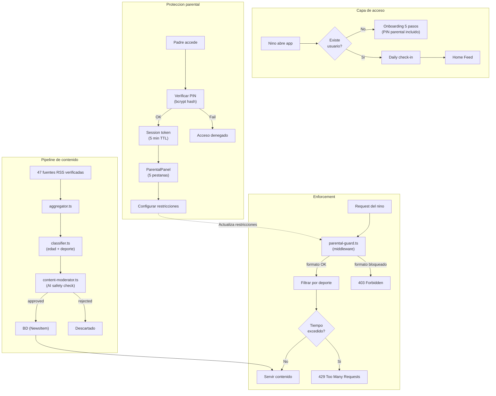

# Seguridad y privacidad

## Publico objetivo

SportyKids esta dirigida a ninos de 6 a 14 anos. La seguridad y la privacidad del contenido son **requisitos fundamentales**, no opcionales.

## Medidas implementadas

### Moderacion de contenido por IA

El servicio `content-moderator.ts` clasifica automaticamente cada noticia agregada:

- **Pipeline**: RSS -> Aggregator -> Classifier -> **Content Moderator** -> BD
- **Clasificacion**: cada noticia recibe un `safetyStatus`: `pending`, `approved` o `rejected`
- **Criterios**: evalua si el contenido es apropiado para ninos (sin violencia explicita, lenguaje inapropiado, etc.)
- **Modo fail-open**: si el proveedor AI no esta disponible, aprueba automaticamente (las fuentes son de prensa deportiva verificada)
- **Solo contenido aprobado** se muestra a los usuarios

### Filtrado de contenido por edad
- Cada noticia (`NewsItem`) y reel tiene un rango de edad (`minAge`, `maxAge`)
- La API filtra automaticamente segun la edad del usuario
- Resumenes adaptados por edad via `summarizer.ts` (3 perfiles: 6-8, 9-11, 12-14)

### Control parental robusto

#### Autenticacion con bcrypt
- PIN de 4 digitos almacenado como **hash bcrypt** con salt
- **Migracion transparente** desde SHA-256: usuarios existentes se migran automaticamente al verificar PIN
- Sesiones con **token temporal** (TTL 5 minutos) para evitar re-verificacion constante

#### Enforcement server-side (parental-guard middleware)
Las restricciones parentales se aplican en **dos niveles**:

| Nivel | Componente | Accion |
|-------|-----------|--------|
| **Frontend** | NavBar / Bottom Tabs | Oculta tabs de formatos bloqueados |
| **Backend** | `parental-guard.ts` | Bloquea requests a formatos no permitidos (403) |
| **Backend** | `parental-guard.ts` | Filtra deportes no permitidos |
| **Backend** | `parental-guard.ts` | Bloquea si se excede tiempo diario (429) |

#### Controles disponibles para padres
- Formatos permitidos (noticias, reels, quiz)
- Deportes permitidos
- Tiempo maximo diario (15-120 minutos)
- Onboarding con PIN desde el paso 5

#### Panel parental (5 pestanas)
- **Perfil**: informacion del nino
- **Contenido**: formatos y deportes permitidos
- **Restricciones**: tiempo maximo diario
- **Actividad**: resumen semanal con duraciones, desglose por dia y deporte
- **PIN**: cambiar PIN de acceso

### Datos del usuario
- No se recopilan emails ni contrasenas
- No se requiere verificacion de identidad
- El perfil (`User`) se crea con: nombre, edad, preferencias deportivas
- Los datos se almacenan localmente (localStorage / AsyncStorage) + BD del servidor
- Las preferencias de notificacion se almacenan pero no se envian (MVP)

### Contenido externo
- Las noticias provienen de **47 fuentes RSS de prensa deportiva verificada** (AS, Marca, Mundo Deportivo, etc.)
- Los usuarios pueden anadir fuentes custom via API (sujetas a moderacion)
- Los reels son curados (YouTube embeds verificados)
- No hay contenido generado por usuarios
- No hay chat ni interaccion entre usuarios

### Registro de actividad detallado
- El modelo `ActivityLog` registra las acciones del usuario con:
  - `type`: `news_viewed`, `reels_viewed`, `quizzes_played`
  - `durationSeconds`: tiempo dedicado (enviado via `sendBeacon`)
  - `contentId`: referencia al contenido consultado
  - `sport`: deporte del contenido
- Se usa para el resumen semanal en el panel parental

### Seguridad de la capa AI
- Las llamadas a proveedores AI se hacen **solo desde el backend** (nunca desde el cliente)
- Las API keys de AI se almacenan en variables de entorno del servidor
- No se envian datos personales del usuario a proveedores AI
- Solo se envian titulos y resumenes de noticias publicas

## Diagrama de seguridad

## Mejoras recomendadas para produccion

### Autenticacion
- Implementar JWT con refresh tokens
- Autenticacion biometrica (TouchID/FaceID) para control parental en movil
- Bloqueo tras 5 intentos fallidos de PIN

### HTTPS y red
- Forzar HTTPS en todos los endpoints
- Configurar CORS con dominios especificos (no `*`)
- Implementar rate limiting (express-rate-limit)
- Headers de seguridad (Helmet.js)

### Proteccion contra SSRF
- Validar URLs de fuentes RSS custom antes de fetch
- Bloquear IPs internas/privadas en requests a fuentes externas
- Limitar tamano de respuesta RSS

### Datos
- Cifrar datos sensibles en reposo
- Politica de retencion de datos (borrar actividad > 90 dias)
- Cumplimiento RGPD / LOPD (derecho al olvido)
- Cumplimiento COPPA (si se lanza en EEUU)

### Monitoring
- Alertar si un feed RSS devuelve contenido inusual
- Logs de acceso al control parental
- Detectar patrones de uso anomalos
- Monitoring de tasa de rechazo del moderador AI

### Notificaciones
- Implementar envio real de notificaciones push (actualmente solo se almacenan preferencias)
- Notificaciones al padre si el nino excede el tiempo diario

## Consideraciones legales

| Regulacion | Aplica | Estado |
|-----------|--------|--------|
| **RGPD** (UE) | Si | Parcial — falta consentimiento explicito |
| **LOPD** (Espana) | Si | Parcial — falta politica de privacidad |
| **COPPA** (EEUU) | Si, si se lanza en US | No implementado |
| **Age verification** | Recomendado | Solo auto-declaracion |

### Acciones pendientes antes de lanzamiento
1. Redactar politica de privacidad
2. Redactar terminos de uso
3. Implementar consentimiento parental verificable
4. Designar DPO (Data Protection Officer) si aplica
5. Realizar evaluacion de impacto (DPIA)
6. Auditoria de seguridad del pipeline AI
