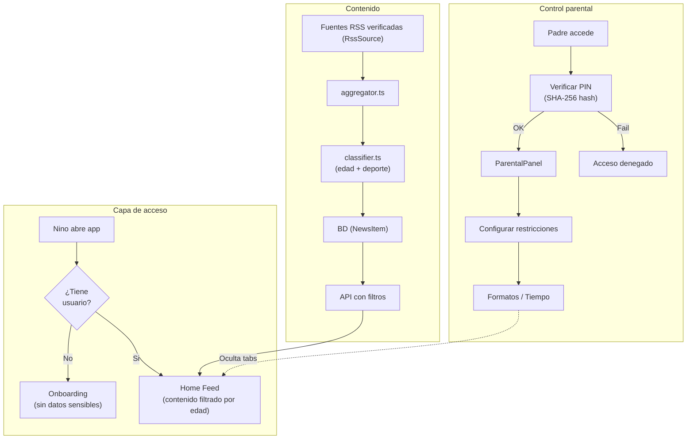

# Seguridad y privacidad

## Publico objetivo

SportyKids esta dirigida a ninos de 6 a 14 anos. La seguridad y la privacidad del contenido son **requisitos fundamentales**, no opcionales.

## Medidas implementadas

### Filtrado de contenido por edad
- Cada noticia (`NewsItem`) y reel tiene un rango de edad (`minAge`, `maxAge`)
- La API filtra automaticamente segun la edad del usuario
- En el MVP, todo el contenido es apto para 6-14 anos

### Control parental
- Acceso protegido por PIN de 4 digitos
- PIN almacenado como hash SHA-256 (mejorar a bcrypt en produccion)
- Los padres controlan:
  - Formatos permitidos (noticias, reels, quiz)
  - Tiempo maximo diario
- Las restricciones se aplican en frontend (tabs desaparecen)
- Modelo de datos: `ParentalProfile` (vinculado 1:1 con `User`)

### Datos del usuario
- No se recopilan emails ni contrasenas
- No se requiere verificacion de identidad
- El perfil (`User`) se crea con: nombre, edad, preferencias deportivas
- Los datos se almacenan localmente (localStorage / AsyncStorage) + BD del servidor

### Contenido externo
- Las noticias provienen exclusivamente de fuentes de prensa deportiva verificadas (AS, Marca, Mundo Deportivo)
- Los reels son curados manualmente (seed)
- No hay contenido generado por usuarios
- No hay chat ni interaccion entre usuarios

### Registro de actividad
- El modelo `ActivityLog` registra las acciones del usuario
- Tipos de actividad: `news_viewed`, `reels_viewed`, `quizzes_played`
- Se usa para el resumen semanal en el panel parental (`ParentalPanel` / `ParentalControl`)

## Mejoras recomendadas para produccion

### Autenticacion
- Implementar JWT con refresh tokens
- Autenticacion biometrica (TouchID/FaceID) para control parental en movil
- Sesiones con expiracion

### Almacenamiento seguro del PIN
- Migrar de SHA-256 a bcrypt con salt
- Implementar bloqueo tras 5 intentos fallidos
- Opcion de recuperacion de PIN por email del padre

### HTTPS y red
- Forzar HTTPS en todos los endpoints
- Configurar CORS con dominios especificos (no `*`)
- Implementar rate limiting (express-rate-limit)
- Headers de seguridad (Helmet.js)

### Datos
- Cifrar datos sensibles en reposo
- Politica de retencion de datos (borrar actividad > 90 dias)
- Cumplimiento RGPD / LOPD (derecho al olvido)
- Cumplimiento COPPA (si se lanza en EEUU)

### Monitoring
- Alertar si un feed RSS devuelve contenido inusual
- Logs de acceso al control parental
- Detectar patrones de uso anomalos

## Diagrama de seguridad

## Consideraciones legales

| Regulacion | Aplica | Estado |
|-----------|--------|--------|
| **RGPD** (UE) | Si | Parcial — falta consentimiento explicito |
| **LOPD** (Espana) | Si | Parcial — falta politica de privacidad |
| **COPPA** (EEUU) | Si, si se lanza en US | No implementado |
| **Age verification** | Recomendado | Solo auto-declaracion |

### Acciones pendientes antes de lanzamiento
1. Redactar politica de privacidad
2. Redactar terminos de uso
3. Implementar consentimiento parental verificable
4. Designar DPO (Data Protection Officer) si aplica
5. Realizar evaluacion de impacto (DPIA)
