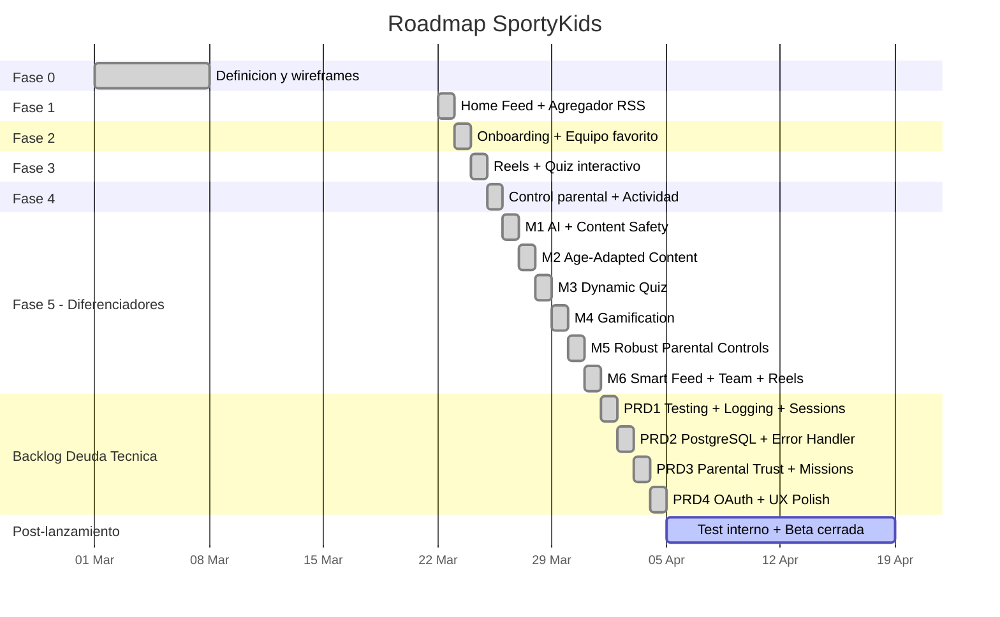

# Roadmap y decisiones tecnicas

## Estado del proyecto

## Fase 5: Diferenciadores (6 milestones completados)

### M1: Infraestructura AI + Seguridad de contenido
- Cliente AI multi-proveedor (`ai-client.ts`): Ollama (gratis, default), OpenRouter, Anthropic Claude
- Moderador de contenido (`content-moderator.ts`): clasifica noticias como safe/unsafe con fail-open
- 182+ fuentes RSS en 8 deportes con cobertura global (antes 4 fuentes)
- Campo `safetyStatus` en NewsItem (pending/approved/rejected)
- Health check para disponibilidad del proveedor AI
- Fuentes RSS custom via API

### M2: Contenido adaptado por edad
- Servicio de resumenes (`summarizer.ts`): genera resumenes para 3 perfiles de edad (6-8, 9-11, 12-14)
- Modelo `NewsSummary` (unico por newsItemId + ageRange + locale)
- Endpoint `GET /api/news/:id/resumen?age=&locale=`
- Boton "Explica facil" en NewsCard + componente `AgeAdaptedSummary`

### M3: Quiz dinamico
- Generador de quiz (`quiz-generator.ts`): preguntas AI a partir de noticias
- Job diario (cron 06:00 UTC) con round-robin por deporte
- QuizQuestion extendido: `generatedAt`, `ageRange`, `expiresAt`, `isDaily`
- Endpoint `POST /api/quiz/generate` (trigger manual)
- Filtrado por edad y preguntas diarias
- Preguntas seed como fallback

### M4: Gamificacion
- 4 modelos nuevos: Sticker (36), UserSticker, Achievement (20), UserAchievement
- Servicio de gamificacion: rachas, asignacion de cromos, evaluacion de logros
- Puntos: +5 noticias, +3 reels, +10 quiz correcto, +50 perfecto (5/5), +2 login diario
- 6 endpoints bajo `/api/gamification/`
- Pagina de coleccion con filtros por deporte, grid de cromos, logros
- Check-in diario al abrir la app

### M5: Control parental robusto
- Middleware `parental-guard.ts` en rutas de news/reels/quiz (enforcement server-side)
- bcrypt para PIN (migracion transparente desde SHA-256)
- Sesiones con token (TTL 5 minutos)
- Onboarding de 5 pasos (paso 5: PIN + formatos + tiempo)
- Tracking de actividad con duracion (`sendBeacon`)
- Panel parental con 5 pestanas (Perfil, Contenido, Restricciones, Actividad, PIN)
- ActivityLog extendido: `durationSeconds`, `contentId`, `sport`

### M6: Smart Feed + Team + Reels
- Feed ranker (score: +5 equipo, +3 deporte, filtro fuentes no seguidas)
- 3 modos de vista del feed: Headlines, Cards, Explain
- Modelo `TeamStats` (15 equipos seed) + `GET /api/teams/:name/stats`
- Pagina de equipo con tarjeta de estadisticas (V/E/D, posicion, goleador, proximo partido)
- Reels: layout grid con miniaturas YouTube, like/share
- Preferencias de notificacion (MVP: almacenadas pero no enviadas)
- Reel extendido: `videoType`, `aspectRatio`, `previewGifUrl`
- App movil con paridad completa: 27 funciones API, daily check-in, coleccion, onboarding 5 pasos

## Decisiones tecnicas tomadas

### 1. ~~SQLite~~ PostgreSQL como base de datos
**Contexto**: El MVP comenzo con SQLite para iteracion rapida; se migro a PostgreSQL 16 en Tech Debt PRD2.
**Decision**: PostgreSQL 16 con tipos nativos de array (`String[]`), JSON nativo (`Json`/`Json?`), e indices compuestos.
**Consecuencia**: Base de datos lista para produccion. Docker Compose para desarrollo local. Los tipos nativos eliminan la sobrecarga de JSON.parse/stringify.

### 2. Express en vez de Fastify
**Contexto**: Se necesita un servidor HTTP para la API REST.
**Decision**: Express 5 por su ecosistema y familiaridad.
**Trade-off**: Fastify seria mas rapido en benchmarks, pero Express tiene mejor documentacion y mas middleware disponible.

### 3. Next.js para la webapp
**Contexto**: La webapp necesita ser rapida y SEO-friendly.
**Decision**: Next.js 16 con App Router.
**Ventaja**: SSR disponible cuando se necesite, mismo ecosistema React que la app movil.

### 4. Expo para la app movil
**Contexto**: Necesitamos compilar para iOS y Android.
**Decision**: React Native con Expo SDK 54 (managed workflow).
**Ventaja**: Comparte logica con la webapp (hooks, tipos, API client).

### 5. Monorepo con npm workspaces
**Contexto**: Tres proyectos que comparten tipos y constantes.
**Decision**: npm workspaces nativo (sin Turborepo/Nx).
**Trade-off**: Menos features que Turborepo, pero sin dependencia adicional.

### 6. ~~Sin autenticacion real en MVP~~ -> JWT implementado (B-TF3)
**Contexto**: El MVP priorizaba velocidad de desarrollo, sin login/password/JWT.
**Decision actualizada**: Se implemento autenticacion JWT completa con email/password, manteniendo compatibilidad con usuarios anonimos mediante middleware no bloqueante.
**Consecuencia**: Seguridad real con access tokens (15 min) y refresh tokens (7 dias, rotados). Los usuarios anonimos existentes pueden hacer upgrade a cuenta con email.

### 7. Feeds RSS como fuente de contenido
**Contexto**: Necesitamos noticias deportivas reales.
**Decision**: Consumir 182+ feeds RSS publicos de multiples fuentes deportivas con cobertura global.
**Riesgo**: Las URLs de RSS pueden cambiar sin aviso. Algunas fuentes son intermitentes.

### 8. PIN parental con bcrypt
**Contexto**: Los padres necesitan proteger la configuracion.
**Decision**: Hash bcrypt del PIN de 4 digitos con migracion transparente desde SHA-256.
**Mejora**: Sesiones con token temporal (5 min TTL) para UX fluida.

### 9. Identificadores en ingles con i18n
**Contexto**: El codigo inicial usaba identificadores en espanol. Esto dificultaba la colaboracion internacional.
**Decision**: Refactorizar todos los identificadores a ingles e implementar sistema de i18n.
**Consecuencia**: El codigo es mas accesible. La UI soporta multiples idiomas.

### 10. AI multi-proveedor con fail-open
**Contexto**: Necesitamos IA para moderacion, resumenes y quizzes, pero no queremos depender de un solo proveedor.
**Decision**: Cliente AI abstracto que soporta Ollama (gratis/local), OpenRouter y Anthropic.
**Consecuencia**: En desarrollo se usa Ollama sin coste. En produccion se puede cambiar a OpenRouter/Anthropic. Si la IA falla, el sistema sigue funcionando (fail-open).

### 11. Enforcement parental en servidor
**Contexto**: Las restricciones parentales solo se aplicaban en frontend, facilmente evitables.
**Decision**: Middleware `parental-guard.ts` que enforce restricciones en el backend.
**Consecuencia**: Seguridad real: el servidor bloquea requests a formatos/deportes no permitidos y controla el tiempo diario.

### 12. Gamificacion con cromos y logros
**Contexto**: Necesitamos engagement y retencion para ninos.
**Decision**: Sistema de puntos, rachas, 36 cromos coleccionables y 20 logros.
**Consecuencia**: Mayor motivacion para uso diario. Check-in diario otorga puntos y mantiene racha.

### 13. JWT con refresh token rotation
**Contexto**: El MVP no tenia autenticacion real — cualquier usuario podia acceder con un ID.
**Decision**: JWT access tokens (15 min TTL) + refresh tokens (7 dias, rotados en cada uso). Middleware no bloqueante para mantener compatibilidad con usuarios anonimos.
**Consecuencia**: Seguridad real sin romper el flujo existente. Los refresh tokens se rotan para prevenir reutilizacion.

### 14. Expo Push Notifications con expo-server-sdk
**Contexto**: Las preferencias de notificacion se almacenaban pero no se enviaban.
**Decision**: Usar `expo-server-sdk` para envio de push notifications a traves del servicio de Expo.
**Ventaja**: No requiere configuracion de Firebase/APNs por separado. Funciona directamente con tokens de Expo Go y builds standalone.
**Consecuencia**: 5 triggers automaticos con deep linking. El campo `User.locale` permite localizar notificaciones por usuario.

## Product Owner Proposals — Sprint 1-2 (completado)

| ID | Item | Estado |
|----|------|--------|
| B-TF2 | Corregir issues criticos del code review | Completado — 7 fixes criticos, 8 warnings corregidos |
| B-MP2 | Centralizar API_BASE en mobile | Completado — `apps/mobile/src/config.ts` con 3 entornos |
| B-UX1 | Skeleton loading | Completado — 5 componentes web + 3 mobile |
| B-CP1 | Busqueda de noticias | Completado — parametro `?q=` en API, SearchBar web + mobile |
| B-TF1 | Infraestructura de tests | Completado — Vitest + 4 ficheros + 36 tests |
| B-UX2 | Animaciones de celebracion | Completado — canvas-confetti, 4 tipos de celebracion |
| B-UX3 | Transiciones de pagina | Completado — CSS fade-in/slide-up en 6 paginas |
| B-UX5 | Estados vacios | Completado — EmptyState con 6 ilustraciones SVG |
| B-UX6 | Feedback visual del PIN | Completado — animaciones pin-pop y pin-shake |
| B-EN2 | Favoritos/bookmarks | Completado — localStorage/AsyncStorage, corazon en NewsCard |
| B-EN3 | Badge trending | Completado — endpoint API, pill trending en NewsCard |

Nuevos ficheros y componentes clave:
- `apps/api/src/utils/safe-json-parse.ts` — Parser JSON seguro con fallback
- `apps/api/src/utils/url-validator.ts` — Prevencion SSRF, valida URLs publicas
- `apps/web/src/components/SearchBar.tsx` — Busqueda con debounce y sugerencias
- `apps/web/src/components/EmptyState.tsx` — 6 ilustraciones SVG con CTAs
- `apps/web/src/lib/celebrations.ts` — Funciones de confetti
- `apps/web/src/lib/favorites.ts` — Favoritos en localStorage
- `apps/mobile/src/config.ts` — Configuracion centralizada de API

## Product Owner Proposals — Sprint 3-4 (completado)

| ID | Item | Estado |
|----|------|--------|
| B-PT3 | Limites de tiempo granulares por tipo | Completado — sliders independientes para news/reels/quiz, campos `maxNewsMinutes`, `maxReelsMinutes`, `maxQuizMinutes` en ParentalProfile |
| B-PT2 | Feed preview para padres | Completado — `GET /api/parents/preview/:userId`, modal `FeedPreviewModal` en panel parental |
| B-PT5 | Reportes de contenido | Completado — modelo `ContentReport`, 3 endpoints (`POST /api/reports`, `GET /api/reports/parent/:userId`, `PUT /api/reports/:reportId`), componentes `ReportButton` y `ContentReportList` |

Nuevos ficheros y componentes clave:
- `apps/api/src/routes/reports.ts` — Rutas de reportes de contenido
- `apps/web/src/components/ReportButton.tsx` — Dropdown de reporte en NewsCard/ReelCard
- `apps/web/src/components/ContentReportList.tsx` — Lista de reportes en panel parental
- `apps/web/src/components/FeedPreviewModal.tsx` — Modal de preview del feed del hijo

## Product Owner Proposals — Sprint 5-6 (completado)

| ID | Item | Estado |
|----|------|--------|
| B-PT1 | Weekly Digest (resumen semanal para padres) | Completado — modelo digest en ParentalProfile, 4 endpoints (`PUT/GET /api/parents/digest/:userId`, preview JSON, download PDF), servicio `digest-generator.ts`, job cron `send-weekly-digests.ts` (08:00 UTC diario), jspdf + nodemailer |
| B-EN1 | Daily Missions (misiones diarias) | Completado — modelo `DailyMission`, 2 endpoints (`GET /api/missions/today/:userId`, `POST /api/missions/claim`), servicio `mission-generator.ts`, job cron `generate-daily-missions.ts` (05:00 UTC), progreso automatico via `checkMissionProgress()` |
| B-UX4 | Dark Mode | Completado — variables CSS `.dark`, 3 modos (system/light/dark), toggle en NavBar, script anti-flash en layout, persistencia en localStorage, `UserContext` expone `theme`/`setTheme`/`resolvedTheme` |

Nuevos ficheros y componentes clave:
- `apps/api/src/services/digest-generator.ts` — Generador de digest (datos, HTML, PDF)
- `apps/api/src/services/mission-generator.ts` — Generador y evaluador de misiones diarias
- `apps/api/src/routes/missions.ts` — Rutas de misiones diarias
- `apps/api/src/jobs/send-weekly-digests.ts` — Job cron de envio de digests
- `apps/api/src/jobs/generate-daily-missions.ts` — Job cron de generacion de misiones
- `apps/web/src/components/MissionCard.tsx` — Tarjeta de mision diaria (3 estados)

## Product Owner Proposals — Sprint 7-8 (completado)

| ID | Item | Estado |
|----|------|--------|
| B-TF3 | Autenticacion (JWT + Email/Password) | Completado — endpoints `/api/auth/` (register, login, refresh, logout, me, upgrade, link-child), JWT access tokens (15min) + refresh tokens (7 dias, rotados), bcrypt para passwords, middleware no bloqueante (compatible con anonimos), modelos `RefreshToken` y campos nuevos en `User` (email, passwordHash, authProvider, role, parentUserId), pantallas Login/Register en mobile, auth lib en web |
| B-MP1 | Paridad mobile (RSS Catalog + Check-in) | Completado — pantalla `RssCatalog` en mobile (explorar/toggle fuentes por deporte), componente `StreakCounter` en header del HomeFeed, check-in mejorado (Alert al ganar sticker/logro, carga de racha al init), icono de engranaje en HomeFeed para navegar a RssCatalog |
| B-MP5 | Push Notifications (completo) | Completado — modelo `PushToken` en Prisma, `expo-server-sdk` para envio, 5 triggers (quiz listo, noticia del equipo, recordatorio de racha 20:00 UTC, cromo obtenido, mision lista), registro push via `expo-notifications` en mobile, deep linking al tocar notificacion, cron de recordatorio de racha, campo `User.locale` para localizacion por usuario |

Nuevos ficheros y componentes clave:
- `apps/api/src/routes/auth.ts` — Rutas de autenticacion JWT
- `apps/api/src/middleware/auth.ts` — Middleware JWT no bloqueante
- `apps/web/src/lib/auth.ts` — Cliente de autenticacion para la webapp
- `apps/mobile/src/screens/Login.tsx` — Pantalla de login mobile
- `apps/mobile/src/screens/Register.tsx` — Pantalla de registro mobile
- `apps/mobile/src/screens/RssCatalog.tsx` — Catalogo RSS mobile
- `apps/mobile/src/components/StreakCounter.tsx` — Contador de racha en HomeFeed

## Backlog de Deuda Tecnica (PRD 1-4)

El Backlog de Deuda Tecnica abordo problemas sistemicos en 4 PRDs:

### PRD1: Infraestructura de Testing + Calidad de Codigo
- **Testing**: Infraestructura Vitest expandida a 526 tests en 63 archivos (API: 388 tests/38 archivos, Web: 69 tests/14 archivos, Mobile: 69 tests/11 archivos)
- **ESLint 9**: Configuracion flat (`eslint.config.mjs`) + Prettier para formateo consistente
- **Logging estructurado**: Pino 9 con salida JSON, correlacion de request ID (middleware `X-Request-Id`), `pino-pretty` en desarrollo
- **Sesiones parentales persistentes**: Modelo `ParentalSession` en Prisma reemplaza el Map volatil en memoria. Las sesiones sobreviven reinicios del servidor con limpieza automatica de entradas expiradas.

### PRD2: Migracion a PostgreSQL + Error Handler Tipado
- **PostgreSQL 16**: Migrado desde SQLite. Tipos nativos de array (`String[]`), tipos nativos JSON (`Json`/`Json?`), indices compuestos en NewsItem, Reel y ActivityLog. Docker Compose para PostgreSQL + Redis local.
- **Error handler tipado**: Jerarquia `AppError` (`ValidationError`, `AuthenticationError`, `AuthorizationError`, `NotFoundError`, `ConflictError`, `RateLimitError`). Handler centralizado mapea errores AppError/Prisma/Zod a codigos HTTP correctos. Integracion Sentry solo para errores 5xx.
- **Limpieza de codigo**: Eliminadas funciones deprecadas del feed ranker (`sportBoost`, `recencyBoost`). Alineadas versiones de React entre web y mobile (19.1.x). Eliminado `skipLibCheck` del tsconfig web. Corregido locale hardcodeado en jobs de push notifications.

### PRD3: Confianza Parental + Misiones Diarias + Modo Oscuro
- **Schedule lock (horario nocturno)**: Los padres pueden configurar horas permitidas con soporte de zona horaria. Enforced server-side por el middleware parental-guard.
- **Misiones diarias**: Modelo `DailyMission`, servicio generador de misiones, job cron (05:00 UTC), push de recordatorio de mision (18:00 UTC para >50% progreso), componente `MissionCard`.
- **Modo oscuro**: Variables CSS con clase `.dark`, 3 modos (system/light/dark), ciclo de toggle en NavBar, script anti-flash, persistencia en localStorage.
- **Sesiones parentales en BD**: Modelo `ParentalSession` reemplaza Map en memoria para persistencia entre reinicios.

### PRD4: OAuth Social Login + Pulido UX
- **OAuth**: Google OAuth 2.0 + Apple Sign In con seguridad completa (CSRF state, verificacion JWKS, nonce). Endpoints mobile para SDKs nativos. `GET /api/auth/providers` para deteccion de funcionalidades.
- **9 items de pulido UX**: Estados de error, banners offline, tour parental, mejoras en el reproductor de video, animaciones de celebracion, y mas en web y mobile.
- **CI/CD**: Pipeline de GitHub Actions (lint, typecheck, test, build) con job de setup cacheado. Configuracion EAS Build para mobile.

## Deuda tecnica conocida

| Item | Prioridad | Descripcion |
|------|-----------|-------------|
| ~~Autenticacion~~ | ~~Alta~~ | ~~Implementar JWT o sesiones reales~~ — **Resuelto** (Sprint 7-8: JWT + email/password, B-TF3) |
| ~~Tests~~ | ~~Alta~~ | ~~No hay tests unitarios ni de integracion~~ — **Resuelto** (Tech Debt PRD1: 526 tests en 63 archivos) |
| ~~Notificaciones push~~ | ~~Media~~ | ~~Solo se almacenan preferencias, no se envian~~ — **Resuelto** (Sprint 7-8: expo-server-sdk, 5 triggers, deep linking, B-MP5) |
| Imagenes de noticias | Baja | Muchas noticias no tienen imagen (feeds RSS limitados) |
| Reels con videos reales | Baja | Los reels son placeholder (YouTube embeds) |
| ~~API_BASE mobile~~ | ~~Baja~~ | ~~Hardcodeado en cada screen~~ — **Resuelto** (Sprint 1-2: centralizado en `config.ts`) |
| ~~Rutas API inconsistentes~~ | ~~Baja~~ | ~~Mezcla de espanol e ingles en rutas~~ — **Resuelto** (Tech Debt PRD2: todas las rutas en ingles) |
| ~~Hash del PIN~~ | ~~Media~~ | ~~SHA-256 por bcrypt~~ — **Resuelto** (M5) |
| ~~Validacion server-side~~ | ~~Media~~ | ~~Restricciones solo en frontend~~ — **Resuelto** (M5) |
| ~~Internacionalizacion~~ | ~~Baja~~ | ~~Solo en espanol~~ — **Resuelto** |
| ~~Gamificacion~~ | ~~Media~~ | ~~Sin engagement/retencion~~ — **Resuelto** (M4) |
| ~~Quiz estaticos~~ | ~~Media~~ | ~~Solo preguntas del seed~~ — **Resuelto** (M3) |
| ~~Fixes criticos code review~~ | ~~Alta~~ | ~~SSRF, ownership, session auth~~ — **Resuelto** (Sprint 1-2) |
| ~~PostgreSQL~~ | ~~Media~~ | ~~SQLite sin plan de migracion~~ — **Resuelto** (Tech Debt PRD2: PostgreSQL 16 con tipos nativos) |
| ~~CI/CD~~ | ~~Media~~ | ~~Sin pipeline CI/CD~~ — **Resuelto** (Tech Debt PRD4: GitHub Actions) |
| ~~OAuth~~ | ~~Media~~ | ~~Sin login social~~ — **Resuelto** (Tech Debt PRD4: Google OAuth 2.0 + Apple Sign In) |
| ~~Modo oscuro~~ | ~~Baja~~ | ~~Sin modo oscuro~~ — **Resuelto** (Tech Debt PRD3: 3 modos system/light/dark) |
| ~~Logging estructurado~~ | ~~Baja~~ | ~~88 console.* calls~~ — **Resuelto** (Tech Debt PRD1: Pino 9 JSON logging) |

## Proximos pasos (post-Fase 5)

### Corto plazo (1-2 semanas)
- [ ] Test interno con 5-10 familias
- [ ] Corregir bugs reportados
- [x] Tests automatizados — 526 tests en 63 archivos (Tech Debt PRD1)
- [x] Rate limiting — 5 niveles con variables de entorno (Tech Debt PRD2)
- [x] CI/CD pipeline — GitHub Actions (Tech Debt PRD4)
- [x] Migracion a PostgreSQL — tipos nativos, indices compuestos (Tech Debt PRD2)
- [ ] Anadir mas idiomas al sistema i18n

### Medio plazo (1-2 meses)
- [x] Autenticacion real con JWT — completado (B-TF3)
- [x] Notificaciones push reales (Expo Push) — completado (B-MP5)
- [x] OAuth social login — Google + Apple (Tech Debt PRD4)
- [x] Modo oscuro — 3 modos con deteccion de sistema (Tech Debt PRD3)
- [ ] Dashboard de analytics para el equipo
- [ ] Human review queue para contenido moderado por IA

### Largo plazo (3-6 meses)
- [ ] Integracion con APIs deportivas (resultados en vivo para TeamStats)
- [ ] Reels con videos reales (scraping o APIs)
- [ ] Version premium con funcionalidades avanzadas
- [ ] Expansion a otros idiomas/paises
- [ ] Autenticacion biometrica para control parental en movil
- [ ] Auditoria de seguridad completa (COPPA/GDPR)
