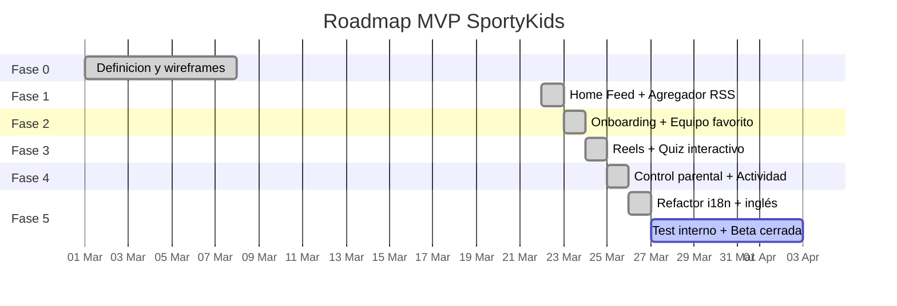

# Roadmap y decisiones tecnicas

## Estado del MVP

## Decisiones tecnicas tomadas

### 1. SQLite en vez de PostgreSQL para desarrollo
**Contexto**: El MVP necesita arrancar rapido sin infraestructura.
**Decision**: Usar SQLite via Prisma durante el desarrollo.
**Consecuencia**: No se necesita Docker ni base de datos externa. Migracion a PostgreSQL trivial (cambiar provider en schema.prisma).

### 2. Express en vez de Fastify
**Contexto**: Se necesita un servidor HTTP para la API REST.
**Decision**: Express 5 por su ecosistema y familiaridad.
**Trade-off**: Fastify seria mas rapido en benchmarks, pero Express tiene mejor documentacion y mas middleware disponible.

### 3. Next.js para la webapp
**Contexto**: La webapp necesita ser rapida y SEO-friendly.
**Decision**: Next.js 16 con App Router.
**Ventaja**: SSR disponible cuando se necesite, mismo ecosistema React que la app movil.

### 4. Expo para la app movil
**Contexto**: Necesitamos compilar para iOS y Android.
**Decision**: React Native con Expo (managed workflow).
**Ventaja**: Comparte logica con la webapp (hooks, tipos, API client).

### 5. Monorepo con npm workspaces
**Contexto**: Tres proyectos que comparten tipos y constantes.
**Decision**: npm workspaces nativo (sin Turborepo/Nx).
**Trade-off**: Menos features que Turborepo, pero sin dependencia adicional.

### 6. Sin autenticacion real en MVP
**Contexto**: El MVP prioriza velocidad de desarrollo.
**Decision**: Usuario se identifica por ID, sin login/password/JWT.
**Consecuencia**: Cualquier persona con el ID puede acceder al perfil. Aceptable para beta cerrada con 5-10 familias.

### 7. Feeds RSS como fuente de contenido
**Contexto**: Necesitamos noticias deportivas reales.
**Decision**: Consumir feeds RSS publicos de AS, Marca y Mundo Deportivo.
**Riesgo**: Las URLs de RSS pueden cambiar sin aviso. Marca ya dio 404 en algunos feeds.

### 8. PIN parental con SHA-256
**Contexto**: Los padres necesitan proteger la configuracion.
**Decision**: Hash SHA-256 del PIN de 4 digitos.
**Mejora futura**: Migrar a bcrypt con salt para mayor seguridad.

### 9. Identificadores en inglés con i18n
**Contexto**: El código inicial usaba identificadores en español (modelos, rutas, funciones). Esto dificultaba la colaboración internacional y la futura expansión a otros idiomas.
**Decision**: Refactorizar todos los identificadores del código a inglés (modelos Prisma, rutas API, nombres de ficheros, constantes, funciones) e implementar un sistema de i18n con ficheros de traducción (`es.json`, `en.json`).
**Consecuencia**: El código es más accesible para desarrolladores internacionales. La UI sigue mostrándose en español por defecto pero soporta múltiples idiomas. Los valores de deporte cambiaron (`futbol` -> `football`, `baloncesto` -> `basketball`, etc.).

## Deuda tecnica conocida

| Item | Prioridad | Descripcion |
|------|-----------|-------------|
| Autenticacion | Alta | Implementar JWT o sesiones reales |
| Tests | Alta | No hay tests unitarios ni de integracion |
| Hash del PIN | Media | Cambiar SHA-256 por bcrypt |
| Validacion server-side | Media | Las restricciones parentales se aplican solo en frontend |
| Imagenes de noticias | Baja | Muchas noticias no tienen imagen (feeds RSS limitados) |
| Reels con videos reales | Baja | Los reels son placeholder (YouTube embeds) |
| ~~Internacionalizacion~~ | ~~Baja~~ | ~~Solo en espanol, hardcoded~~ — **Resuelto**: sistema i18n implementado |

## Proximos pasos (post-MVP)

### Corto plazo (1-2 semanas)
- [ ] Test interno con 5-10 familias
- [ ] Corregir bugs reportados
- [ ] Mejorar deteccion de imagenes en RSS
- [ ] Añadir mas fuentes RSS (ESPN, Sport)
- [ ] Añadir mas idiomas al sistema i18n

### Medio plazo (1-2 meses)
- [ ] Autenticacion real con JWT
- [ ] Notificaciones push personalizadas
- [ ] Gamificacion (cromos, medallas, rachas)
- [ ] Dashboard de analytics para el equipo

### Largo plazo (3-6 meses)
- [ ] Integracion con APIs deportivas (resultados en vivo)
- [ ] Reels con videos reales (scraping o APIs)
- [ ] Quizzes generados automaticamente desde noticias
- [ ] Version premium con funcionalidades avanzadas
- [ ] Expansion a otros idiomas/paises
