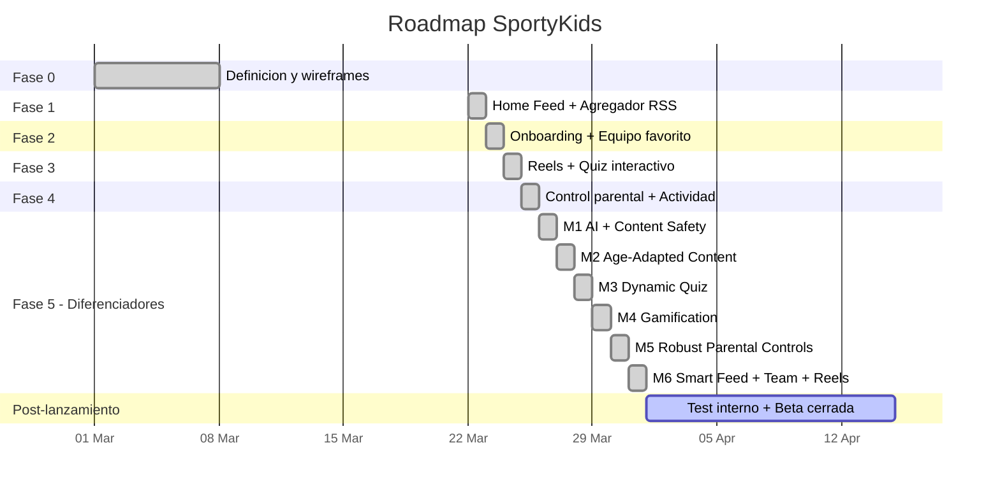

# Roadmap y decisiones tecnicas

## Estado del proyecto

## Fase 5: Diferenciadores (6 milestones completados)

### M1: Infraestructura AI + Seguridad de contenido
- Cliente AI multi-proveedor (`ai-client.ts`): Ollama (gratis, default), OpenRouter, Anthropic Claude
- Moderador de contenido (`content-moderator.ts`): clasifica noticias como safe/unsafe con fail-open
- 47 fuentes RSS en 8 deportes (antes 4 fuentes)
- Campo `safetyStatus` en NewsItem (pending/approved/rejected)
- Health check para disponibilidad del proveedor AI
- Fuentes RSS custom via API

### M2: Contenido adaptado por edad
- Servicio de resumenes (`summarizer.ts`): genera resumenes para 3 perfiles de edad (6-8, 9-11, 12-14)
- Modelo `NewsSummary` (unico por newsItemId + ageRange + locale)
- Endpoint `GET /api/news/:id/resumen?age=&locale=`
- Boton "Explica facil" en NewsCard + componente `AgeAdaptedSummary`

### M3: Quiz dinamico
- Generador de quiz (`quiz-generator.ts`): preguntas AI a partir de noticias
- Job diario (cron 06:00 UTC) con round-robin por deporte
- QuizQuestion extendido: `generatedAt`, `ageRange`, `expiresAt`, `isDaily`
- Endpoint `POST /api/quiz/generate` (trigger manual)
- Filtrado por edad y preguntas diarias
- Preguntas seed como fallback

### M4: Gamificacion
- 4 modelos nuevos: Sticker (36), UserSticker, Achievement (20), UserAchievement
- Servicio de gamificacion: rachas, asignacion de cromos, evaluacion de logros
- Puntos: +5 noticias, +3 reels, +10 quiz correcto, +50 perfecto (5/5), +2 login diario
- 6 endpoints bajo `/api/gamification/`
- Pagina de coleccion con filtros por deporte, grid de cromos, logros
- Check-in diario al abrir la app

### M5: Control parental robusto
- Middleware `parental-guard.ts` en rutas de news/reels/quiz (enforcement server-side)
- bcrypt para PIN (migracion transparente desde SHA-256)
- Sesiones con token (TTL 5 minutos)
- Onboarding de 5 pasos (paso 5: PIN + formatos + tiempo)
- Tracking de actividad con duracion (`sendBeacon`)
- Panel parental con 5 pestanas (Perfil, Contenido, Restricciones, Actividad, PIN)
- ActivityLog extendido: `durationSeconds`, `contentId`, `sport`

### M6: Smart Feed + Team + Reels
- Feed ranker (score: +5 equipo, +3 deporte, filtro fuentes no seguidas)
- 3 modos de vista del feed: Headlines, Cards, Explain
- Modelo `TeamStats` (15 equipos seed) + `GET /api/teams/:name/stats`
- Pagina de equipo con tarjeta de estadisticas (V/E/D, posicion, goleador, proximo partido)
- Reels: layout grid con miniaturas YouTube, like/share
- Preferencias de notificacion (MVP: almacenadas pero no enviadas)
- Reel extendido: `videoType`, `aspectRatio`, `previewGifUrl`
- App movil con paridad completa: 27 funciones API, daily check-in, coleccion, onboarding 5 pasos

## Decisiones tecnicas tomadas

### 1. SQLite en vez de PostgreSQL para desarrollo
**Contexto**: El MVP necesita arrancar rapido sin infraestructura.
**Decision**: Usar SQLite via Prisma durante el desarrollo.
**Consecuencia**: No se necesita Docker ni base de datos externa. Migracion a PostgreSQL trivial (cambiar provider en schema.prisma).

### 2. Express en vez de Fastify
**Contexto**: Se necesita un servidor HTTP para la API REST.
**Decision**: Express 5 por su ecosistema y familiaridad.
**Trade-off**: Fastify seria mas rapido en benchmarks, pero Express tiene mejor documentacion y mas middleware disponible.

### 3. Next.js para la webapp
**Contexto**: La webapp necesita ser rapida y SEO-friendly.
**Decision**: Next.js 16 con App Router.
**Ventaja**: SSR disponible cuando se necesite, mismo ecosistema React que la app movil.

### 4. Expo para la app movil
**Contexto**: Necesitamos compilar para iOS y Android.
**Decision**: React Native con Expo SDK 54 (managed workflow).
**Ventaja**: Comparte logica con la webapp (hooks, tipos, API client).

### 5. Monorepo con npm workspaces
**Contexto**: Tres proyectos que comparten tipos y constantes.
**Decision**: npm workspaces nativo (sin Turborepo/Nx).
**Trade-off**: Menos features que Turborepo, pero sin dependencia adicional.

### 6. Sin autenticacion real en MVP
**Contexto**: El MVP prioriza velocidad de desarrollo.
**Decision**: Usuario se identifica por ID, sin login/password/JWT.
**Consecuencia**: Cualquier persona con el ID puede acceder al perfil. Aceptable para beta cerrada con 5-10 familias.

### 7. Feeds RSS como fuente de contenido
**Contexto**: Necesitamos noticias deportivas reales.
**Decision**: Consumir 47 feeds RSS publicos de multiples fuentes deportivas.
**Riesgo**: Las URLs de RSS pueden cambiar sin aviso. Algunas fuentes son intermitentes.

### 8. PIN parental con bcrypt
**Contexto**: Los padres necesitan proteger la configuracion.
**Decision**: Hash bcrypt del PIN de 4 digitos con migracion transparente desde SHA-256.
**Mejora**: Sesiones con token temporal (5 min TTL) para UX fluida.

### 9. Identificadores en ingles con i18n
**Contexto**: El codigo inicial usaba identificadores en espanol. Esto dificultaba la colaboracion internacional.
**Decision**: Refactorizar todos los identificadores a ingles e implementar sistema de i18n.
**Consecuencia**: El codigo es mas accesible. La UI soporta multiples idiomas.

### 10. AI multi-proveedor con fail-open
**Contexto**: Necesitamos IA para moderacion, resumenes y quizzes, pero no queremos depender de un solo proveedor.
**Decision**: Cliente AI abstracto que soporta Ollama (gratis/local), OpenRouter y Anthropic.
**Consecuencia**: En desarrollo se usa Ollama sin coste. En produccion se puede cambiar a OpenRouter/Anthropic. Si la IA falla, el sistema sigue funcionando (fail-open).

### 11. Enforcement parental en servidor
**Contexto**: Las restricciones parentales solo se aplicaban en frontend, facilmente evitables.
**Decision**: Middleware `parental-guard.ts` que enforce restricciones en el backend.
**Consecuencia**: Seguridad real: el servidor bloquea requests a formatos/deportes no permitidos y controla el tiempo diario.

### 12. Gamificacion con cromos y logros
**Contexto**: Necesitamos engagement y retencion para ninos.
**Decision**: Sistema de puntos, rachas, 36 cromos coleccionables y 20 logros.
**Consecuencia**: Mayor motivacion para uso diario. Check-in diario otorga puntos y mantiene racha.

## Deuda tecnica conocida

| Item | Prioridad | Descripcion |
|------|-----------|-------------|
| Autenticacion | Alta | Implementar JWT o sesiones reales |
| Tests | Alta | No hay tests unitarios ni de integracion |
| Notificaciones push | Media | Solo se almacenan preferencias, no se envian |
| Imagenes de noticias | Baja | Muchas noticias no tienen imagen (feeds RSS limitados) |
| Reels con videos reales | Baja | Los reels son placeholder (YouTube embeds) |
| API_BASE mobile | Baja | Hardcodeado en cada screen (deberia centralizarse) |
| Rutas API inconsistentes | Baja | Mezcla de espanol e ingles en rutas |
| ~~Hash del PIN~~ | ~~Media~~ | ~~SHA-256 por bcrypt~~ — **Resuelto** (M5) |
| ~~Validacion server-side~~ | ~~Media~~ | ~~Restricciones solo en frontend~~ — **Resuelto** (M5) |
| ~~Internacionalizacion~~ | ~~Baja~~ | ~~Solo en espanol~~ — **Resuelto** |
| ~~Gamificacion~~ | ~~Media~~ | ~~Sin engagement/retencion~~ — **Resuelto** (M4) |
| ~~Quiz estaticos~~ | ~~Media~~ | ~~Solo preguntas del seed~~ — **Resuelto** (M3) |

## Proximos pasos (post-Fase 5)

### Corto plazo (1-2 semanas)
- [ ] Test interno con 5-10 familias
- [ ] Corregir bugs reportados
- [ ] Mejorar deteccion de imagenes en RSS
- [ ] Tests automatizados (unitarios + integracion)
- [ ] Anadir mas idiomas al sistema i18n

### Medio plazo (1-2 meses)
- [ ] Autenticacion real con JWT
- [ ] Notificaciones push reales (Firebase/APNs)
- [ ] Dashboard de analytics para el equipo
- [ ] CI/CD pipeline
- [ ] Migracion a PostgreSQL
- [ ] Rate limiting y headers de seguridad

### Largo plazo (3-6 meses)
- [ ] Integracion con APIs deportivas (resultados en vivo para TeamStats)
- [ ] Reels con videos reales (scraping o APIs)
- [ ] Version premium con funcionalidades avanzadas
- [ ] Expansion a otros idiomas/paises
- [ ] Autenticacion biometrica para control parental
- [ ] Auditoria de seguridad completa
